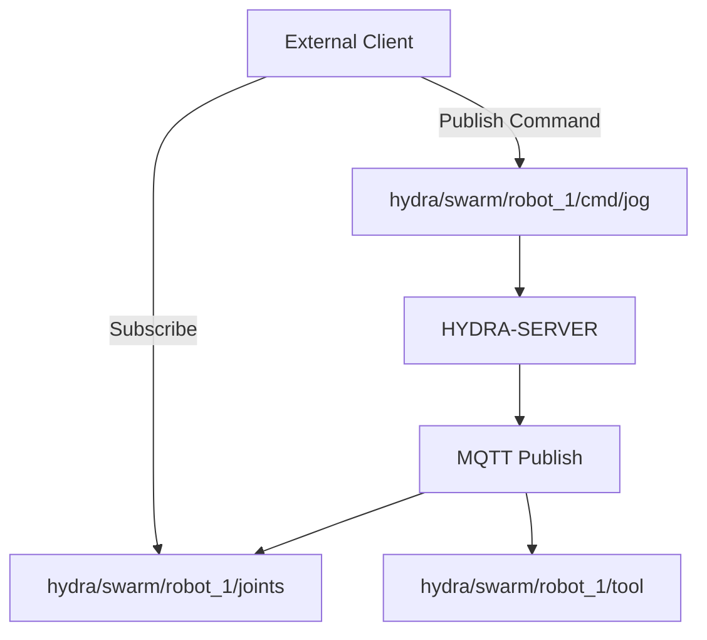

<p align="center">
  
</p>

# 📡 HYDRA-UMC-MQTT-BROKER

<p align="center">🇺🇸 <b>English</b> | <a href="README_spa.md">🇪🇸 Español</a> | <a href="README_fra.md">🇫🇷 Français</a> | <a href="README_ita.md">🇮🇹 Italiano</a> | <a href="README_deu.md">🇩🇪 Deutsch</a> | <a href="README_zho.md">🇨🇳 简体中文</a> | <a href="README_jpn.md">🇯🇵 日本語</a></p>

### 🚀 Lightweight Telemetry Bridge for IoT and External Integrations

<p align="left">
  
  
  
</p>

---

## 1. 🛠️ TECHNICAL OVERVIEW

**HYDRA-UMC-MQTT-BROKER** provides a lightweight, asynchronous messaging interface for the HYDRA-UMC ecosystem. It allows external IoT devices, dashboards, and home automation systems (like Home Assistant) to subscribe to robot telemetry and publish commands.

It implements the MQTT v5 standard, offering high-efficiency data distribution with minimal overhead, making it ideal for mobile apps or low-bandwidth remote monitoring.

### Key Features:
* 📡 **Pub/Sub Telemetry:** Sub-millisecond distribution of joint angles, tool states, and system health.
* 🛠️ **Discovery Support:** Integrated mDNS and Home Assistant auto-discovery for easy setup.
* 🔐 **Topic Security:** Real, verifiable per-client-ID-prefix ACL for reading and writing specific robot topics - a wildcard SUBSCRIBE can never grant broader access than its rule. *(implemented)*
* 🪪 **Client Authentication:** Optional real MQTT username/password CONNECT authentication (`MQTT_AUTH_JSON`) gives the ACL a verified session identity. *(implemented; pair it with ACL)*
* 📏 **Payload Size Limit:** A real, opt-in cap on PUBLISH payload size, configurable via `MAX_PAYLOAD_BYTES`. *(implemented)*
* ⚡ **Websockets Support:** Integrated MQTT-over-WebSockets for browser-based clients.

---

## 2. 🔄 MQTT TOPIC STRUCTURE



---

## 3. 🧱 ARCHITECTURE & DESIGN DECISIONS

* **Why this is a sibling, not a submodule, of HYDRA-UMC-GATEWAY-INDUSTRIAL.** Each protocol adapter is a separately deployable/restartable process - a broker issue never takes down the OPC-UA or MTConnect adapters running alongside it.
* **Why a real MQTT broker, not just a client publishing to an external one.** Owning the broker means this cell's own event stream (robot state changes, alarms) is available to any MQTT subscriber on the factory network without depending on a separate, externally-managed broker being reachable.
* **Why the entry point only prints identity/version, exits after a health-check listener comes up.** Andamiaje (scaffolding) stage, same reasoning as the parent's own README - a real broker is long-running by nature.
* **How this fits the rest of the ecosystem.** A sibling service under HYDRA-UMC-GATEWAY-INDUSTRIAL - bridges HYDRA-UMC-SERVER's own event stream onto real MQTT topics.
* **A real bug was found and fixed here: the broker never actually accepted clients.** Aedes 1.x moved persistence/mqemitter setup into an explicit async `broker.listen()` step (a real API change from the 0.x factory-function shape); without it, a real `CONNECT` reached the broker over a real TCP socket but hung silently until the client's own connack timeout fired - the broker looked "up" (the port accepted sockets) but no client could ever complete a session. Found via a real `mqtt` client timing out in this project's own tests, not by inspection. `tests/server.test.ts` now connects a real MQTT client library against a real broker over a real socket - CONNECT, PUBLISH delivery, topic isolation, and retained messages are all exercised for real.
* **Why the topic ACL checks subscription *scope*, not just filter overlap.** A client's own SUBSCRIBE request is itself a filter and can carry `+`/`#` wildcards - naively checking "does the requested filter overlap the allowed one" would let a client subscribe with a broader wildcard (e.g. `hydra/robots/#`) than its rule actually grants (e.g. `hydra/robots/+/status`) and silently see topics it was never authorized for. `src/acl.ts`'s `isSubscriptionWithinScope()` does a real, segment-by-segment check instead - proven with real tests, including one where a robot's own wildcard SUBSCRIBE attempt to escalate its scope is denied.
* **Why a denied PUBLISH closes the whole connection, not just NACKs one message.** This is Aedes's own real behavior (verified by running a real client against it, not assumed from the docs) - `authorizePublish` returning an error destroys the client's connection. The ACL/payload-limit design here works with that, not around it: a client that keeps getting disconnected for violating its ACL is a clear, loud signal to fix that device's config, not a silently-dropped message it might never notice.
* **Why ACL/payload-limit config lives in env vars (`MQTT_ACL_JSON`/`MAX_PAYLOAD_BYTES`), not a config file.** Matches this project's existing `PORT` convention (see `.env.example`) and how it's actually deployed (systemd/Docker environment, not a mounted file) - `parseAclConfig()` fails startup loudly on malformed JSON rather than silently running unprotected.

---

## 📂 DIRECTORY STRUCTURE

```text
HYDRA-UMC-MQTT-BROKER/
├── src/         # Source code (Node/TypeScript - Broker, Bridge, Security)
├── docs/        # Documentation and topic catalog
├── build/       # Compiled output (npm run build)
├── images/      # Media and diagrams
├── scripts/     # Utility scripts (bump-version.mjs)
└── README.md
```

Pure network service, no dedicated hardware of its own - `hardware/`,
`firmware/` and `os/` are omitted under the repository structure policy.

---

## 🛠️ DEVELOPMENT ENVIRONMENT

### Requirements
- [Node.js](https://nodejs.org/) (v18 or higher recommended)
- npm

### Installation
```bash
npm install
```

### Development Mode
Runs the broker directly with `tsx` (no bundler):
- **Windows:** double-click `dev.bat` or run `npm run dev`
- **Linux/Mac:** run `./dev.sh` or `npm run dev`

### Production Build
Bundles the broker into a single deployable file with esbuild:
- **Windows:** double-click `build.bat` or run `npm run build`
- **Linux/Mac:** run `./build.sh` or `npm run build`

Then start it with:
```bash
npm start
```

The broker listens on `0.0.0.0:1883` (plain MQTT/TCP, the IANA-registered
default port) - point any MQTT client (`mosquitto_sub`, Home Assistant,
MQTT Explorer, ...) at `<host>:1883`.

### Versioning
Every real `npm run build` bumps `package.json`'s own `version`
automatically (`scripts/bump-version.mjs`, wired as the first step of the
`build` script) - a base-10 "odometer": patch +1 per build, rolling over
into minor (and minor into major) past 9 rather than ever reaching a
two-digit segment (`0.0.9` -> `0.1.0`, not `0.0.10`).

---

## 🚀 ROADMAP
* **Phase 1:** OPC-UA Pub/Sub implementation for high-speed data exchange and legacy protocol bridging.
* **Phase 2:** MQTT Broker cluster for massive IoT device management and high concurrency.
* **Phase 3:** MTConnect adapter support for multi-vendor CNC and PLC machinery integration.
* **Phase 4:** Support for Sparkplug B specification for industrial IoT alignment and unified telemetry bridge.

---

## 🔗 Related Projects

This project is part of a larger robotics ecosystem by the same author (JuanenRac / Electro Hobby 3D), spanning firmware, control software, AI nodes, and fleet tooling. Worth knowing about, since a request might actually be about one of these rather than this repository.

### Family

**Parent:** **[HYDRA-UMC-GATEWAY-INDUSTRIAL](https://github.com/JuanenRac/HYDRA-UMC-GATEWAY-INDUSTRIAL)** — the integration parent this MQTT adapter plugs into.

**Siblings:**
- **[HYDRA-UMC-OPCUA-SERVER](https://github.com/JuanenRac/HYDRA-UMC-OPCUA-SERVER)** — sibling protocol adapter, same parent.
- **[HYDRA-UMC-MTCONNECT-ADAPTER](https://github.com/JuanenRac/HYDRA-UMC-MTCONNECT-ADAPTER)** — sibling protocol adapter, same parent.

### Directly Related (outside the family)

- **[HYDRA-UMC-SERVER](https://github.com/JuanenRac/HYDRA-UMC-SERVER)** — the source of the state this adapter exposes.

### Rest of the Ecosystem

**HYDRA-UMC platform** — the multi-robot micro-factory cell
- **[HYDRA-UMC](https://github.com/JuanenRac/HYDRA-UMC)** — the CM5 + STM32H745 motherboard orchestrating up to 8 robot arms.
- **[HYDRA-UMC-SERVER](https://github.com/JuanenRac/HYDRA-UMC-SERVER)** — the Express/WebSocket backend every control client talks to.
- **[HYDRA-UMC-STUDIO](https://github.com/JuanenRac/HYDRA-UMC-STUDIO)** — web-based control dashboard, multi-robot 3D visualization.
- **[HYDRA-UMC-ANDROID-CONTROL](https://github.com/JuanenRac/HYDRA-UMC-ANDROID-CONTROL)** — Android control app over Wi-Fi/Bluetooth.
- **[HYDRA-UMC-IOS-CONTROL](https://github.com/JuanenRac/HYDRA-UMC-IOS-CONTROL)** — iOS/iPadOS control app built in Flutter.
- **[HYDRA-UMC-SUITE](https://github.com/JuanenRac/HYDRA-UMC-SUITE)** — desktop swarm command center (Python/PySide6).
- **[HYDRA-UMC-EDITOR-URDF](https://github.com/JuanenRac/HYDRA-UMC-EDITOR-URDF)** — desktop URDF model editor for the robot catalog.
- **[HYDRA-UMC-DSI](https://github.com/JuanenRac/HYDRA-UMC-DSI)** — native touch UI for the onboard DSI touchscreen.

**URTC platform** — the tool head controller every HYDRA-UMC robot arm carries
- **[URTC](https://github.com/JuanenRac/URTC)** — CAN bus tool head controller, 25 tool profiles.
- **[URTC-FLASHER](https://github.com/JuanenRac/URTC-FLASHER)** — desktop CAN-OTA + SWD/JTAG flashing tool.
- **[URTC-TESTER](https://github.com/JuanenRac/URTC-TESTER)** — desktop live CAN-bus diagnostic tool.
- **[URTC-WEB-STUDIO](https://github.com/JuanenRac/URTC-WEB-STUDIO)** — browser-based alternative via Web Serial API.

**🎥 Vision AI Node (Hailo-8)**
- [HYDRA-UMC-VISION-NODE](https://github.com/JuanenRac/HYDRA-UMC-VISION-NODE)
- [HYDRA-UMC-VISION-STREAMER](https://github.com/JuanenRac/HYDRA-UMC-VISION-STREAMER)
- [HYDRA-UMC-DETECTION-HEF](https://github.com/JuanenRac/HYDRA-UMC-DETECTION-HEF)
- [HYDRA-UMC-SAFETY-ZONES](https://github.com/JuanenRac/HYDRA-UMC-SAFETY-ZONES)
- [HYDRA-UMC-VISUAL-SERVOING-API](https://github.com/JuanenRac/HYDRA-UMC-VISUAL-SERVOING-API)

**🧠 Cognitive AI Node (Hailo-10)**
- [HYDRA-UMC-COGNITIVE-NODE](https://github.com/JuanenRac/HYDRA-UMC-COGNITIVE-NODE)
- [HYDRA-UMC-VLA-ENGINE](https://github.com/JuanenRac/HYDRA-UMC-VLA-ENGINE)
- [HYDRA-UMC-VOICE-UI](https://github.com/JuanenRac/HYDRA-UMC-VOICE-UI)
- [HYDRA-UMC-SEMANTIC-PLANNER](https://github.com/JuanenRac/HYDRA-UMC-SEMANTIC-PLANNER)
- [HYDRA-UMC-DOCS-QA](https://github.com/JuanenRac/HYDRA-UMC-DOCS-QA)

**🐝 Orchestration & Swarm**
- [HYDRA-UMC-ORCHESTRATOR](https://github.com/JuanenRac/HYDRA-UMC-ORCHESTRATOR)
- [HYDRA-UMC-SWARM-SYNC](https://github.com/JuanenRac/HYDRA-UMC-SWARM-SYNC)
- [HYDRA-UMC-PATH-PLANNER-3D](https://github.com/JuanenRac/HYDRA-UMC-PATH-PLANNER-3D)
- [HYDRA-UMC-JOB-DISPATCHER](https://github.com/JuanenRac/HYDRA-UMC-JOB-DISPATCHER)
- [HYDRA-UMC-NODE-HEALING](https://github.com/JuanenRac/HYDRA-UMC-NODE-HEALING)

**🎮 Digital Twin & Simulation**
- [HYDRA-UMC-TWIN](https://github.com/JuanenRac/HYDRA-UMC-TWIN)
- [HYDRA-UMC-PHYSICS-REPLICA](https://github.com/JuanenRac/HYDRA-UMC-PHYSICS-REPLICA)
- [HYDRA-UMC-HIL-BRIDGE](https://github.com/JuanenRac/HYDRA-UMC-HIL-BRIDGE)
- [HYDRA-UMC-SYNTHETIC-DATA-GEN](https://github.com/JuanenRac/HYDRA-UMC-SYNTHETIC-DATA-GEN)

**📊 Data & Analytics**
- [HYDRA-UMC-DATALAKE](https://github.com/JuanenRac/HYDRA-UMC-DATALAKE)
- [HYDRA-UMC-TELEMETRY-COLLECTOR](https://github.com/JuanenRac/HYDRA-UMC-TELEMETRY-COLLECTOR)
- [HYDRA-UMC-ANOMALY-DETECTOR](https://github.com/JuanenRac/HYDRA-UMC-ANOMALY-DETECTOR)
- [HYDRA-UMC-PRODUCTION-REPORTS](https://github.com/JuanenRac/HYDRA-UMC-PRODUCTION-REPORTS)

**🛠️ Complementary Tools**
- [URTC-SMART-RACK](https://github.com/JuanenRac/URTC-SMART-RACK)
- [URTC-VISION-TOOL](https://github.com/JuanenRac/URTC-VISION-TOOL)
- [HYDRA-UMC-WATCH](https://github.com/JuanenRac/HYDRA-UMC-WATCH)
- [HYDRA-UMC-TOOL-CLI](https://github.com/JuanenRac/HYDRA-UMC-TOOL-CLI)
- [HYDRA-UMC-DASHBOARD-AI](https://github.com/JuanenRac/HYDRA-UMC-DASHBOARD-AI)


## 👤 AUTHOR
**JuanenRac** (Electro Hobby 3D)
📧 electrohobby3d@gmail.com

## 📜 LICENSE
GPL-3.0 - See LICENSE for details.

## 🛠️ BUILD & RUN

Use the non-versioning build check before a release build:

| Action | Windows | Linux / macOS |
|---|---|---|
| Build check (no version or CHANGELOG change) | `build-test.bat` | `./build-test.sh` |
| Run / development (when provided) | `run*.bat` or `dev*.bat` | `./run*.sh` or `./dev*.sh` |

`build-test.bat` and `build-test.sh` compile or validate the project stack without incrementing `hydra-umc.project.json` or modifying `CHANGELOG.md`. They may create normal compiler output only. Existing `build*.bat`, `build*.sh`, `run*` and `dev*` scripts retain their project-specific, versioned or runtime behavior; use them when that behavior is required.
