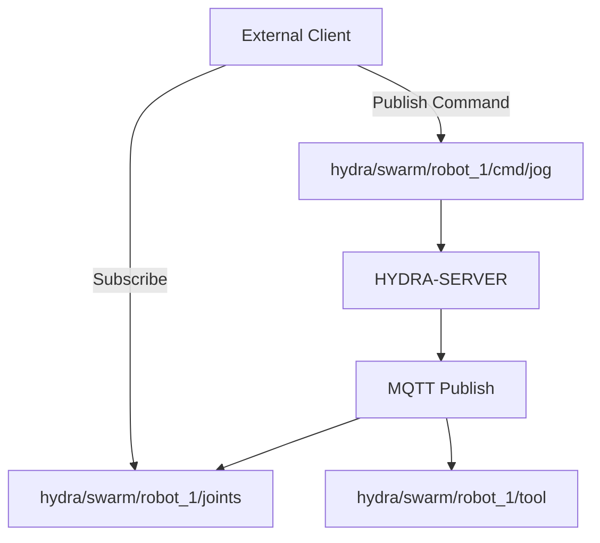

<p align="center">
  
</p>

# 📡 HYDRA-UMC-MQTT-BROKER

<p align="center">🇺🇸 <b>English</b> | <a href="README_spa.md">🇪🇸 Español</a> | <a href="README_fra.md">🇫🇷 Français</a> | <a href="README_ita.md">🇮🇹 Italiano</a> | <a href="README_deu.md">🇩🇪 Deutsch</a> | <a href="README_zho.md">🇨🇳 简体中文</a> | <a href="README_jpn.md">🇯🇵 日本語</a></p>

### 🚀 Lightweight Telemetry Bridge for IoT and External Integrations

<p align="left">
  
  
  
</p>

---

## 1. 🛠️ TECHNICAL OVERVIEW

**HYDRA-UMC-MQTT-BROKER** provides a lightweight, asynchronous messaging interface for the HYDRA-UMC ecosystem. It allows external IoT devices, dashboards, and home automation systems (like Home Assistant) to subscribe to robot telemetry and publish commands.

It implements the MQTT 3.1.1 standard (via Aedes, verified live - see Architecture below), offering high-efficiency data distribution with minimal overhead, making it ideal for mobile apps or low-bandwidth remote monitoring.

### Key Features:
* 🔌 **External Machine Bridges:** `HYDRA-UMC-BRIDGE-CNC`/`-LASER`/`-OPENPNP`/`-PRINTER3D`/`-ROS2` each reach this broker over their own `hydra/bridges/<name>/...` topics - see `docs/BRIDGE_TOPICS.md`. *(implemented)*
* 📡 **Pub/Sub Telemetry:** Sub-millisecond distribution of joint angles, tool states, and system health.
* 🛠️ **Discovery Support:** Integrated mDNS and Home Assistant auto-discovery for easy setup.
* 🔐 **Topic Security:** Real, verifiable per-client-ID-prefix ACL for reading and writing specific robot topics - a wildcard SUBSCRIBE can never grant broader access than its rule. *(implemented)*
* 🪪 **Client Authentication:** Optional real MQTT username/password CONNECT authentication (`MQTT_AUTH_JSON`) gives the ACL a verified session identity. *(implemented; pair it with ACL)*
* 📏 **Payload Size Limit:** A real, opt-in cap on PUBLISH payload size, configurable via `MAX_PAYLOAD_BYTES`. *(implemented)*
* ⚡ **Websockets Support:** Integrated MQTT-over-WebSockets for browser-based clients.

---

## 2. 🔄 MQTT TOPIC STRUCTURE



---

## 3. 🧱 ARCHITECTURE & DESIGN DECISIONS

* **Why this is a sibling, not a submodule, of HYDRA-UMC-GATEWAY-INDUSTRIAL.** Each protocol adapter is a separately deployable/restartable process - a broker issue never takes down the OPC-UA or MTConnect adapters running alongside it.
* **Why a real MQTT broker, not just a client publishing to an external one.** Owning the broker means this cell's own event stream (robot state changes, alarms) is available to any MQTT subscriber on the factory network without depending on a separate, externally-managed broker being reachable.
* **Why the entry point only prints identity/version, exits after a health-check listener comes up.** Andamiaje (scaffolding) stage, same reasoning as the parent's own README - a real broker is long-running by nature.
* **How this fits the rest of the ecosystem.** A sibling service under HYDRA-UMC-GATEWAY-INDUSTRIAL - bridges HYDRA-UMC-SERVER's own event stream onto real MQTT topics.
* **A real bug was found and fixed here: the broker never actually accepted clients.** Aedes 1.x moved persistence/mqemitter setup into an explicit async `broker.listen()` step (a real API change from the 0.x factory-function shape); without it, a real `CONNECT` reached the broker over a real TCP socket but hung silently until the client's own connack timeout fired - the broker looked "up" (the port accepted sockets) but no client could ever complete a session. Found via a real `mqtt` client timing out in this project's own tests, not by inspection. `tests/server.test.ts` now connects a real MQTT client library against a real broker over a real socket - CONNECT, PUBLISH delivery, topic isolation, and retained messages are all exercised for real.
* **Why the topic ACL checks subscription *scope*, not just filter overlap.** A client's own SUBSCRIBE request is itself a filter and can carry `+`/`#` wildcards - naively checking "does the requested filter overlap the allowed one" would let a client subscribe with a broader wildcard (e.g. `hydra/robots/#`) than its rule actually grants (e.g. `hydra/robots/+/status`) and silently see topics it was never authorized for. `src/acl.ts`'s `isSubscriptionWithinScope()` does a real, segment-by-segment check instead - proven with real tests, including one where a robot's own wildcard SUBSCRIBE attempt to escalate its scope is denied.
* **Why a denied PUBLISH closes the whole connection, not just NACKs one message.** This is Aedes's own real behavior (verified by running a real client against it, not assumed from the docs) - `authorizePublish` returning an error destroys the client's connection. The ACL/payload-limit design here works with that, not around it: a client that keeps getting disconnected for violating its ACL is a clear, loud signal to fix that device's config, not a silently-dropped message it might never notice.
* **Why ACL/payload-limit config lives in env vars (`MQTT_ACL_JSON`/`MAX_PAYLOAD_BYTES`), not a config file.** Matches this project's existing `PORT` convention (see `.env.example`) and how it's actually deployed (systemd/Docker environment, not a mounted file) - `parseAclConfig()` fails startup loudly on malformed JSON rather than silently running unprotected.
* **Why this broker speaks MQTT 3.1.1, not MQTT v5.** `aedes@1.1.1` (the pinned dependency) only implements MQTT 3.1/3.1.1 - verified live by connecting a real `mqtt` client with `protocolVersion: 5`, which the broker actively refuses (`Connection refused: Unacceptable protocol version`), and confirmed against Aedes's own upstream docs (MQTT 5.0 support lives on a separate, unreleased branch). Every client in this ecosystem (`mqtt_transport.py` bridges, `Vda5050Publisher`, this repo's own tests) already only ever negotiates 3.1.1, so this is a documentation correction, not a behavior change.

---

## 📂 DIRECTORY STRUCTURE

```text
HYDRA-UMC-MQTT-BROKER/
├── src/         # Source code (Node/TypeScript - Broker, Bridge, Security)
├── tests/       # Vitest suite - ACL, auth, and broker/bridge behavior
├── docs/        # Documentation and topic catalog
├── build/       # Compiled output (npm run build)
├── images/      # Media and diagrams
├── scripts/     # Utility scripts (bump-version.mjs)
├── tools/       # ci_validate.py - manifest/CHANGELOG/docs validation used by CI
└── README.md
```

Pure network service, no dedicated hardware of its own - `hardware/`,
`firmware/` and `os/` are omitted under the repository structure policy.

---

## 🛠️ DEVELOPMENT ENVIRONMENT

### Requirements
- [Node.js](https://nodejs.org/) (v18 or higher recommended)
- npm

### Installation
```bash
npm install
```

### Development Mode
Runs the broker directly with `tsx` (no bundler):
- **Windows:** double-click `dev.bat` or run `npm run dev`
- **Linux/Mac:** run `./dev.sh` or `npm run dev`

### Production Build
Bundles the broker into a single deployable file with esbuild:
- **Windows:** double-click `build.bat` or run `npm run build`
- **Linux/Mac:** run `./build.sh` or `npm run build`

Then start it with:
```bash
npm start
```

The broker listens on `0.0.0.0:1883` (plain MQTT/TCP, the IANA-registered
default port) - point any MQTT client (`mosquitto_sub`, Home Assistant,
MQTT Explorer, ...) at `<host>:1883`.

### Versioning
Every real `npm run build` bumps `package.json`'s own `version`
automatically (`scripts/bump-version.mjs`, wired as the first step of the
`build` script) - a base-10 "odometer": patch +1 per build, rolling over
into minor (and minor into major) past 9 rather than ever reaching a
two-digit segment (`0.0.9` -> `0.1.0`, not `0.0.10`).

---

## 🚀 ROADMAP
* **Phase 1:** OPC-UA Pub/Sub implementation for high-speed data exchange and legacy protocol bridging.
* **Phase 2:** MQTT Broker cluster for massive IoT device management and high concurrency.
* **Phase 3:** MTConnect adapter support for multi-vendor CNC and PLC machinery integration.
* **Phase 4:** Support for Sparkplug B specification for industrial IoT alignment and unified telemetry bridge.

---

## 🔗 Related Projects

This project is part of the HYDRA-UMC robotics ecosystem by the same author (JuanenRac / Electro Hobby 3D). Worth knowing about, since a request might actually be about one of these rather than this repository.

**Parent Project**
- **[HYDRA-UMC-GATEWAY-INDUSTRIAL](https://github.com/JuanenRac/HYDRA-UMC-GATEWAY-INDUSTRIAL)** — integration hub relaying to industrial protocols, with a real command allowlist/backpressure layer; the parent this repo is one specific protocol adapter of, within its own industrial gateway.

**Sibling Projects** — the other protocol adapters of HYDRA-UMC-GATEWAY-INDUSTRIAL's own industrial gateway
- **[HYDRA-UMC-OPCUA-SERVER](https://github.com/JuanenRac/HYDRA-UMC-OPCUA-SERVER)** — real OPC-UA address space, verified with a real binary-protocol client session.
- **[HYDRA-UMC-MTCONNECT-ADAPTER](https://github.com/JuanenRac/HYDRA-UMC-MTCONNECT-ADAPTER)** — real MTConnect `/probe` and `/current` XML endpoints with degraded-mode output.

**Directly Related**
- **[HYDRA-UMC-SERVER](https://github.com/JuanenRac/HYDRA-UMC-SERVER)** — the real headless backend (REST/WebSocket) every control client actually talks to — the source of the state this adapter exposes.
- **[HYDRA-UMC-BRIDGE-CNC](https://github.com/JuanenRac/HYDRA-UMC-BRIDGE-CNC)** — high-level CNC-cell coordinator with real GRBL status/control-byte access — ships its own `mqtt_transport.py` reaching this broker over its own `hydra/bridges/<name>/...` topics; see this repo's own `docs/BRIDGE_TOPICS.md` for the real, shared topic catalog.
- **[HYDRA-UMC-BRIDGE-LASER](https://github.com/JuanenRac/HYDRA-UMC-BRIDGE-LASER)** — laser-cell safety coordinator reading 3 real key/enclosure/interlock GPIO safeguards — ships its own `mqtt_transport.py` reaching this broker over its own `hydra/bridges/<name>/...` topics; see this repo's own `docs/BRIDGE_TOPICS.md` for the real, shared topic catalog.
- **[HYDRA-UMC-BRIDGE-OPENPNP](https://github.com/JuanenRac/HYDRA-UMC-BRIDGE-OPENPNP)** — safe high-level board-flow coordinator for OpenPnP pick-and-place — ships its own `mqtt_transport.py` reaching this broker over its own `hydra/bridges/<name>/...` topics; see this repo's own `docs/BRIDGE_TOPICS.md` for the real, shared topic catalog.
- **[HYDRA-UMC-BRIDGE-PRINTER3D](https://github.com/JuanenRac/HYDRA-UMC-BRIDGE-PRINTER3D)** — safe coordination boundary for Moonraker/Klipper 3D printers, with real gated job commands — ships its own `mqtt_transport.py` reaching this broker over its own `hydra/bridges/<name>/...` topics; see this repo's own `docs/BRIDGE_TOPICS.md` for the real, shared topic catalog.
- **[HYDRA-UMC-BRIDGE-ROS2](https://github.com/JuanenRac/HYDRA-UMC-BRIDGE-ROS2)** — safety coordinator with a real, lazily-imported rclpy ROS 2 transport — ships its own `mqtt_transport.py` reaching this broker over its own `hydra/bridges/<name>/...` topics; see this repo's own `docs/BRIDGE_TOPICS.md` for the real, shared topic catalog.
- **[HYDRA-UMC-BRIDGE-AMR](https://github.com/JuanenRac/HYDRA-UMC-BRIDGE-AMR)** — coordination boundary for AGV/AMR fleets via a real VDA 5050 MQTT publisher — a different real client of this same broker: `Vda5050Publisher` sends gated dispatches as real VDA 5050 `order`/`instantActions` messages, on VDA 5050's own topic shape rather than the `hydra/bridges/...` scheme the other bridges use.

**Also Part of the Ecosystem**

*Core Hardware & Platform*
- **[HYDRA-UMC](https://github.com/JuanenRac/HYDRA-UMC)** — the physical robot-arm motherboard: CM5 host + dual-core STM32H745, orchestrating up to 8 tool arms over CAN-OTA/SPI-OTA.
- **[HYDRA-UMC-OS](https://github.com/JuanenRac/HYDRA-UMC-OS)** — reproducible Raspberry Pi OS product layer for the CM5: read-only agent, validated config/profiles, WiFi first-contact provisioning.
- **[HYDRA-UMC-SDK](https://github.com/JuanenRac/HYDRA-UMC-SDK)** — the shared JSON-Schema contract and safety-gate boundary every bridge validates its commands against.

*Core Backend & Clients*
- **[HYDRA-UMC-STUDIO](https://github.com/JuanenRac/HYDRA-UMC-STUDIO)** — web control dashboard with real-time multi-robot 3D visualization.
- **[HYDRA-UMC-SUITE](https://github.com/JuanenRac/HYDRA-UMC-SUITE)** — desktop (PySide6) swarm command center for multiple servers at once, packaged as a standalone executable.
- **[HYDRA-UMC-ANDROID-CONTROL](https://github.com/JuanenRac/HYDRA-UMC-ANDROID-CONTROL)** — native Android control app with biometric login and a paired Wear OS companion.
- **[HYDRA-UMC-IOS-CONTROL](https://github.com/JuanenRac/HYDRA-UMC-IOS-CONTROL)** — iOS/iPadOS control app (Flutter) with real-time WebSocket sync.
- **[HYDRA-UMC-DSI](https://github.com/JuanenRac/HYDRA-UMC-DSI)** — native touch UI for the onboard 7" DSI touchscreen, embedded on the CM5 itself.
- **[HYDRA-UMC-EDITOR-URDF](https://github.com/JuanenRac/HYDRA-UMC-EDITOR-URDF)** — desktop graphical URDF creator/editor that pushes finished models into STUDIO's own catalog.
- **[HYDRA-UMC-BRIDGE-DROIDS](https://github.com/JuanenRac/HYDRA-UMC-BRIDGE-DROIDS)** — coordination boundary for legged/humanoid droids, with a real Boston Dynamics Spot command sender.
- **[HYDRA-UMC-BRIDGE-UAV](https://github.com/JuanenRac/HYDRA-UMC-BRIDGE-UAV)** — coordination boundary for camera-equipped UAVs, with a real MAVLink command sender.

*URTC Tool Platform*
- **[URTC](https://github.com/JuanenRac/URTC)** — firmware for the physical Universal Robot Tool Controller PCB, 25+ tool profiles over CAN bus.
- **[URTC-FLASHER](https://github.com/JuanenRac/URTC-FLASHER)** — desktop GUI flashing tool for URTC boards, CAN-OTA plus full-chip SWD/JTAG.
- **[URTC-TESTER](https://github.com/JuanenRac/URTC-TESTER)** — desktop live CAN-bus diagnostic tool for URTC boards, one panel per tool profile.
- **[URTC-WEB-STUDIO](https://github.com/JuanenRac/URTC-WEB-STUDIO)** — browser-based alternative to URTC-TESTER via the Web Serial API, no local install needed.

*Vision AI Node (Hailo-8)*
- **[HYDRA-UMC-VISION-NODE](https://github.com/JuanenRac/HYDRA-UMC-VISION-NODE)** — integration hub for the Hailo-8 vision pipeline, with a real per-stage hardware-readiness check.
- **[HYDRA-UMC-DETECTION-HEF](https://github.com/JuanenRac/HYDRA-UMC-DETECTION-HEF)** — real compiled-model registry with Hailo-architecture/checksum safe-load verification.
- **[HYDRA-UMC-VISION-STREAMER](https://github.com/JuanenRac/HYDRA-UMC-VISION-STREAMER)** — real GStreamer pipeline + MediaMTX config generator with a real HailoRT integration boundary.
- **[HYDRA-UMC-VISUAL-SERVOING-API](https://github.com/JuanenRac/HYDRA-UMC-VISUAL-SERVOING-API)** — real Position-Based Visual Servoing correction law, safety-gated on upstream zone state.
- **[HYDRA-UMC-SAFETY-ZONES](https://github.com/JuanenRac/HYDRA-UMC-SAFETY-ZONES)** — real zone-breach checking and E-STOP requesting, with calibration-freshness enforcement.

*Cognitive AI Node (Hailo-10)*
- **[HYDRA-UMC-COGNITIVE-NODE](https://github.com/JuanenRac/HYDRA-UMC-COGNITIVE-NODE)** — integration hub for the Hailo-10 cognitive pipeline (LLM/VLA/voice orchestration).
- **[HYDRA-UMC-VLA-ENGINE](https://github.com/JuanenRac/HYDRA-UMC-VLA-ENGINE)** — real action-token encoding/decoding and trajectory generation for a Vision-Language-Action model.
- **[HYDRA-UMC-VOICE-UI](https://github.com/JuanenRac/HYDRA-UMC-VOICE-UI)** — real voice front-end (VAD + intent parser) with a bounded, confirmation-gated Watch relay.
- **[HYDRA-UMC-SEMANTIC-PLANNER](https://github.com/JuanenRac/HYDRA-UMC-SEMANTIC-PLANNER)** — real rule-based task decomposition and semantic error recovery over MCU error codes.
- **[HYDRA-UMC-DOCS-QA](https://github.com/JuanenRac/HYDRA-UMC-DOCS-QA)** — real stdlib-only TF-IDF document search over this ecosystem's own Markdown docs.

*Orchestration & Swarm*
- **[HYDRA-UMC-ORCHESTRATOR](https://github.com/JuanenRac/HYDRA-UMC-ORCHESTRATOR)** — integration hub with a real gRPC/Protobuf health-report contract and mission state machine.
- **[HYDRA-UMC-JOB-DISPATCHER](https://github.com/JuanenRac/HYDRA-UMC-JOB-DISPATCHER)** — real priority-based job queue with deduplication, over a real HTTP API.
- **[HYDRA-UMC-NODE-HEALING](https://github.com/JuanenRac/HYDRA-UMC-NODE-HEALING)** — real gRPC-based fleet health watchdog with retry/backoff and identity-mismatch detection.
- **[HYDRA-UMC-PATH-PLANNER-3D](https://github.com/JuanenRac/HYDRA-UMC-PATH-PLANNER-3D)** — real RRT-based 3D path planner with real obstacle/workspace collision validation.
- **[HYDRA-UMC-SWARM-SYNC](https://github.com/JuanenRac/HYDRA-UMC-SWARM-SYNC)** — real CRDT LWW-Element-Map state sync, property-tested for multi-cell convergence.

*Digital Twin & Simulation*
- **[HYDRA-UMC-TWIN](https://github.com/JuanenRac/HYDRA-UMC-TWIN)** — integration hub for the digital-twin engine, with a real version-compatibility sync contract.
- **[HYDRA-UMC-HIL-BRIDGE](https://github.com/JuanenRac/HYDRA-UMC-HIL-BRIDGE)** — real hardware-in-the-loop safety interlock routing commands between simulation and real hardware.
- **[HYDRA-UMC-PHYSICS-REPLICA](https://github.com/JuanenRac/HYDRA-UMC-PHYSICS-REPLICA)** — real forward kinematics and joint-limit validation over a real URDF subset.
- **[HYDRA-UMC-SYNTHETIC-DATA-GEN](https://github.com/JuanenRac/HYDRA-UMC-SYNTHETIC-DATA-GEN)** — real procedural 2D scene generator with YOLO/COCO annotation export.

*Data & Analytics*
- **[HYDRA-UMC-DATALAKE](https://github.com/JuanenRac/HYDRA-UMC-DATALAKE)** — real sqlite3-backed time-series store with a real ingest/query HTTP API.
- **[HYDRA-UMC-ANOMALY-DETECTOR](https://github.com/JuanenRac/HYDRA-UMC-ANOMALY-DETECTOR)** — real FFT + statistical baseline anomaly detector with drift monitoring.
- **[HYDRA-UMC-PRODUCTION-REPORTS](https://github.com/JuanenRac/HYDRA-UMC-PRODUCTION-REPORTS)** — real OEE/availability calculation over DATALAKE history, with reproducible CSV export.
- **[HYDRA-UMC-TELEMETRY-COLLECTOR](https://github.com/JuanenRac/HYDRA-UMC-TELEMETRY-COLLECTOR)** — real CAN/WebSocket ingestion pipeline into DATALAKE, with sequence deduplication.

*Complementary Tools & Ecosystem Operations*
- **[HYDRA-UMC-DASHBOARD-AI](https://github.com/JuanenRac/HYDRA-UMC-DASHBOARD-AI)** — Smart Summaries and Anomaly Highlighting panels over DATALAKE/ANOMALY-DETECTOR, with an honest statistical fallback.
- **[HYDRA-UMC-TOOL-CLI](https://github.com/JuanenRac/HYDRA-UMC-TOOL-CLI)** — fleet CLI with a real, stable exit-code contract, a genuine live client of HYDRA-UMC-SERVER's own API.
- **[HYDRA-UMC-WATCH](https://github.com/JuanenRac/HYDRA-UMC-WATCH)** — WearOS companion app with real haptic alerts and a paired-phone voice relay.
- **[URTC-SMART-RACK](https://github.com/JuanenRac/URTC-SMART-RACK)** — firmware for a board-mounting rack with real tool-ID decoding and Smart Idle pre-heating logic.
- **[URTC-VISION-TOOL](https://github.com/JuanenRac/URTC-VISION-TOOL)** — firmware plus a real Python vision companion for a thermal/RGB inspection tool head.
- **[HYDRA-UMC-UPDATER](https://github.com/JuanenRac/HYDRA-UMC-UPDATER)** — administrative desktop tool that discovers, clones and updates every repo in this ecosystem.


---

## 📚 Documentation & Community

- **[CONTRIBUTING.md](CONTRIBUTING.md)** — tech stack and coding guidelines for a pull request.
- **[CODE_OF_CONDUCT.md](CODE_OF_CONDUCT.md)** — the standards of behavior expected in this community.
- **[SECURITY.md](SECURITY.md)** — how to report a vulnerability, and this project's own real security focus areas.
- **[SUPPORT.md](SUPPORT.md)** — where to ask questions and report bugs.
- **[LICENSE.md](LICENSE.md)** — this project's own license.

## 👤 AUTHOR
**JuanenRac** (Electro Hobby 3D)
📧 electrohobby3d@gmail.com
📺 [youtube.com/@electrohobby3d](https://youtube.com/@electrohobby3d)

## 📜 LICENSE
GPL-3.0 - See LICENSE for details.
