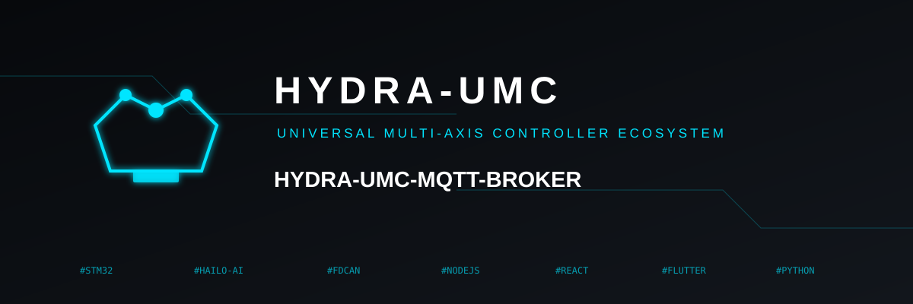
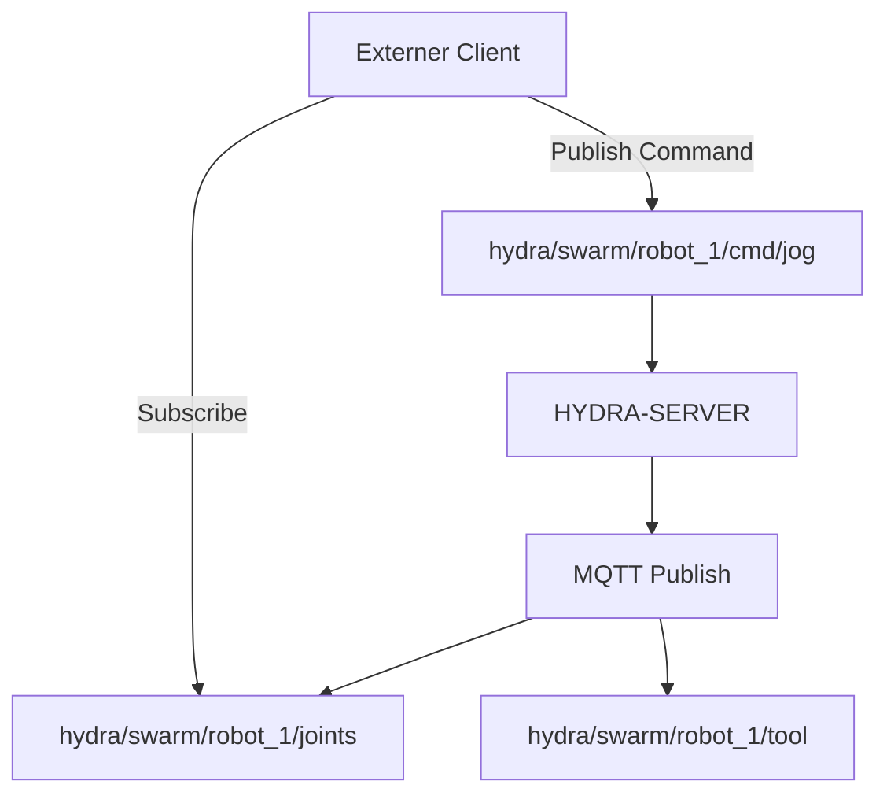

<p align="center">
  
</p>

# 📡 HYDRA-UMC-MQTT-BROKER

<p align="center"><a href="README.md">🇺🇸 English</a> | <a href="README_spa.md">🇪🇸 Español</a> | <a href="README_fra.md">🇫🇷 Français</a> | <a href="README_ita.md">🇮🇹 Italiano</a> | 🇩🇪 <b>Deutsch</b> | <a href="README_zho.md">🇨🇳 简体中文</a> | <a href="README_jpn.md">🇯🇵 日本語</a></p>

### 🚀 Leichtgewichtige Telemetrie-Brücke für IoT und externe Integrationen

<p align="left">
  
  
  
</p>

---

## 1. 🛠️ TECHNISCHER ÜBERBLICK

**HYDRA-UMC-MQTT-BROKER** bietet eine leichtgewichtige, asynchrone Messaging-Schnittstelle für das HYDRA-UMC-Ökosystem. Er ermöglicht es externen IoT-Geräten, Dashboards und Hausautomationssystemen (wie Home Assistant), Robotertelemetrie zu abonnieren und Befehle zu veröffentlichen.

Er implementiert den MQTT v5-Standard und bietet eine hocheffiziente Datenverteilung mit minimalem Overhead, was ihn ideal für mobile Apps oder die Fernüberwachung mit geringer Bandbreite macht.

### Hauptmerkmale:
* 📡 **Pub/Sub-Telemetrie:** Verteilung von Gelenkwinkeln, Werkzeugzuständen und Systemstatus in weniger als einer Millisekunde.
* 🛠️ **Discovery-Unterstützung:** Integriertes mDNS und Home Assistant Auto-Discovery für eine einfache Einrichtung.
* 🔐 **Topic-Sicherheit:** Feingranulare Zugriffskontrolle (ACL) für das Lesen und Schreiben spezifischer Roboter-Topics.
* ⚡ **Websockets-Unterstützung:** Integriertes MQTT-over-WebSockets für browserbasierte Clients.

---

## 2. 🔄 MQTT-TOPIC-STRUKTUR



---

## 3. 🧱 ARCHITEKTUR & DESIGNENTSCHEIDUNGEN

* **Warum es Geschwister, kein Submodul, von HYDRA-UMC-GATEWAY-INDUSTRIAL ist.** Jeder Protokolladapter ist ein separat bereitstellbarer/neustartbarer Prozess - ein Broker-Problem legt nie die daneben laufenden OPC-UA- oder MTConnect-Adapter lahm.
* **Warum ein echter MQTT-Broker statt nur eines Clients, der zu einem externen veröffentlicht.** Den Broker zu besitzen bedeutet, dass der eigene Ereignisstrom dieser Zelle (Roboterzustandsänderungen, Alarme) für jeden MQTT-Abonnenten im Fabriknetzwerk verfügbar ist, ohne davon abzuhängen, dass ein separat verwalteter externer Broker erreichbar ist.
* **Warum der Einstiegspunkt nur Identität/Version ausgibt und nach dem Start eines Health-Check-Listeners beendet wird.** Andamiaje-Stadium, gleicher Grund wie im eigenen README des Elternteils - ein echter Broker ist von Natur aus langlaufend.
* **Wie sich das ins restliche Ökosystem einfügt.** Ein Geschwisterdienst unter HYDRA-UMC-GATEWAY-INDUSTRIAL - verbindet den eigenen Ereignisstrom von HYDRA-UMC-SERVER mit echten MQTT-Topics.
* **Hier wurde ein echter Bug gefunden und behoben: Der Broker akzeptierte in Wirklichkeit nie Clients.** Aedes 1.x hat die Persistenz-/mqemitter-Einrichtung in einen expliziten asynchronen Schritt `broker.listen()` verlagert (eine echte API-Änderung gegenüber der Factory-Form der 0.x); ohne diesen erreichte ein echtes `CONNECT` den Broker über einen echten TCP-Socket, blieb aber still hängen, bis das eigene Connack-Timeout des Clients auslöste - der Broker wirkte "aktiv" (der Port akzeptierte Verbindungen), aber kein Client konnte je eine Sitzung abschließen. Gefunden durch einen echten `mqtt`-Client, der in den eigenen Tests dieses Projekts in ein Timeout lief, nicht durch Inspektion. `tests/server.test.ts` verbindet nun eine echte MQTT-Client-Bibliothek mit einem echten Broker über einen echten Socket - CONNECT, PUBLISH-Zustellung, Topic-Isolierung und Retained-Nachrichten, alles wirklich getestet.

---

## 📂 VERZEICHNISSTRUKTUR

```text
HYDRA-UMC-MQTT-BROKER/
├── src/         # Quellcode (Node/TypeScript - Broker, Bridge, Sicherheit)
├── docs/        # Dokumentation und Topic-Katalog
├── build/       # Kompilierte Ausgabe (npm run build)
├── images/      # Medien und Diagramme
├── scripts/     # Utility-Skripte (bump-version.mjs)
└── README.md
```

Reiner Netzwerkdienst ohne eigene Hardware - `hardware/`, `firmware/` und
`os/` wurden aus der ursprünglichen Projektvorlage entfernt (siehe die
Bereinigungsregel in `SONNET/5.PLAN_EJECUCION_32_PROYECTOS_NUEVOS.txt`,
interne Dokumentation des Ökosystems, angewendet auf dieses gesamte Paket).

---

## 🛠️ ENTWICKLUNGSUMGEBUNG

### Voraussetzungen
- [Node.js](https://nodejs.org/) (v18 oder höher empfohlen)
- npm

### Installation
```bash
npm install
```

### Entwicklungsmodus
Startet den Broker direkt mit `tsx` (ohne Bundler):
- **Windows:** Doppelklick auf `dev.bat` oder `npm run dev` ausführen
- **Linux/Mac:** `./dev.sh` oder `npm run dev` ausführen

### Produktions-Build
Bündelt den Broker mit esbuild in eine einzige einsetzbare Datei:
- **Windows:** Doppelklick auf `build.bat` oder `npm run build` ausführen
- **Linux/Mac:** `./build.sh` oder `npm run build` ausführen

Dann starten mit:
```bash
npm start
```

Der Broker lauscht auf `0.0.0.0:1883` (reines MQTT/TCP, der von der IANA
registrierte Standardport) - jeden MQTT-Client (`mosquitto_sub`, Home
Assistant, MQTT Explorer, ...) auf `<host>:1883` richten.

### Versionierung
Jeder echte `npm run build` erhöht automatisch die `version` in
`package.json` (`scripts/bump-version.mjs`, erster Schritt des
`build`-Skripts) - ein "Kilometerzähler" auf Basis 10: patch +1 pro Build,
mit Übertrag auf minor (und von minor auf major) über 9 hinaus, anstatt
je ein zweistelliges Segment zu erreichen (`0.0.9` -> `0.1.0`, nicht
`0.0.10`).

---

## 🚀 ROADMAP
* **Phase 1:** OPC-UA Pub/Sub-Implementierung für Hochgeschwindigkeitsdatenaustausch und Legacy-Protokoll-Bridging.
* **Phase 2:** MQTT-Broker-Cluster für massives IoT-Gerätemanagement und hohe Parallelität.
* **Phase 3:** MTConnect-Adapterunterstützung für die Integration von CNC- und SPS-Maschinen verschiedener Hersteller.
* **Phase 4:** Unterstützung der Sparkplug B-Spezifikation für die industrielle IoT-Ausrichtung und einheitliche Telemetrie-Brücke.

---

## 🔗 Verwandte Projekte

Dieses Projekt ist Teil eines größeren Robotik-Ökosystems desselben Autors (JuanenRac / Electro Hobby 3D), das Firmware, Steuerungssoftware, KI-Knoten und Flotten-Tools umfasst. Gut zu wissen, denn eine Anfrage könnte tatsächlich eines dieser Projekte betreffen statt dieses Repository.

### Familie

**Elternteil:** **[HYDRA-UMC-GATEWAY-INDUSTRIAL](https://github.com/JuanenRac/HYDRA-UMC-GATEWAY-INDUSTRIAL)** — der Integrations-Elternteil, an den dieser MQTT-Adapter andockt.

**Geschwister:**
- **[HYDRA-UMC-OPCUA-SERVER](https://github.com/JuanenRac/HYDRA-UMC-OPCUA-SERVER)** — Geschwister-Protokolladapter, gleicher Elternteil.
- **[HYDRA-UMC-MTCONNECT-ADAPTER](https://github.com/JuanenRac/HYDRA-UMC-MTCONNECT-ADAPTER)** — Geschwister-Protokolladapter, gleicher Elternteil.

### Direkte Beziehung (außerhalb der Familie)

- **[HYDRA-UMC-SERVER](https://github.com/JuanenRac/HYDRA-UMC-SERVER)** — die Quelle des von diesem Adapter bereitgestellten Zustands.

### Restliches Ökosystem

**HYDRA-UMC-Plattform** — die Multi-Roboter-Mikrofabrikzelle
- **[HYDRA-UMC](https://github.com/JuanenRac/HYDRA-UMC)** — das CM5 + STM32H745-Motherboard, das bis zu 8 Roboterarme orchestriert.
- **[HYDRA-UMC-SERVER](https://github.com/JuanenRac/HYDRA-UMC-SERVER)** — das Express/WebSocket-Backend, mit dem jeder Steuerungsclient spricht.
- **[HYDRA-UMC-STUDIO](https://github.com/JuanenRac/HYDRA-UMC-STUDIO)** — webbasiertes Steuerungs-Dashboard, Multi-Roboter-3D-Visualisierung.
- **[HYDRA-UMC-ANDROID-CONTROL](https://github.com/JuanenRac/HYDRA-UMC-ANDROID-CONTROL)** — Android-Steuerungs-App über Wi-Fi/Bluetooth.
- **[HYDRA-UMC-IOS-CONTROL](https://github.com/JuanenRac/HYDRA-UMC-IOS-CONTROL)** — iOS/iPadOS-Steuerungs-App, gebaut in Flutter.
- **[HYDRA-UMC-SUITE](https://github.com/JuanenRac/HYDRA-UMC-SUITE)** — Desktop-Schwarm-Kommandozentrale (Python/PySide6).
- **[HYDRA-UMC-EDITOR-URDF](https://github.com/JuanenRac/HYDRA-UMC-EDITOR-URDF)** — Desktop-URDF-Modelleditor für den Roboterkatalog.
- **[HYDRA-UMC-DSI](https://github.com/JuanenRac/HYDRA-UMC-DSI)** — native Touch-UI für den eingebauten DSI-Touchscreen.

**URTC-Plattform** — der Werkzeugkopf-Controller, den jeder HYDRA-UMC-Roboterarm trägt
- **[URTC](https://github.com/JuanenRac/URTC)** — CAN-Bus-Werkzeugkopf-Controller, 25 Werkzeugprofile.
- **[URTC-FLASHER](https://github.com/JuanenRac/URTC-FLASHER)** — Desktop-Tool für CAN-OTA + SWD/JTAG-Flashing.
- **[URTC-TESTER](https://github.com/JuanenRac/URTC-TESTER)** — Desktop-Tool für Live-CAN-Bus-Diagnose.
- **[URTC-WEB-STUDIO](https://github.com/JuanenRac/URTC-WEB-STUDIO)** — browserbasierte Alternative über die Web-Serial-API.

**🎥 Vision AI Node (Hailo-8)**
- [HYDRA-UMC-VISION-NODE](https://github.com/JuanenRac/HYDRA-UMC-VISION-NODE)
- [HYDRA-UMC-VISION-STREAMER](https://github.com/JuanenRac/HYDRA-UMC-VISION-STREAMER)
- [HYDRA-UMC-DETECTION-HEF](https://github.com/JuanenRac/HYDRA-UMC-DETECTION-HEF)
- [HYDRA-UMC-SAFETY-ZONES](https://github.com/JuanenRac/HYDRA-UMC-SAFETY-ZONES)
- [HYDRA-UMC-VISUAL-SERVOING-API](https://github.com/JuanenRac/HYDRA-UMC-VISUAL-SERVOING-API)

**🧠 Cognitive AI Node (Hailo-10)**
- [HYDRA-UMC-COGNITIVE-NODE](https://github.com/JuanenRac/HYDRA-UMC-COGNITIVE-NODE)
- [HYDRA-UMC-VLA-ENGINE](https://github.com/JuanenRac/HYDRA-UMC-VLA-ENGINE)
- [HYDRA-UMC-VOICE-UI](https://github.com/JuanenRac/HYDRA-UMC-VOICE-UI)
- [HYDRA-UMC-SEMANTIC-PLANNER](https://github.com/JuanenRac/HYDRA-UMC-SEMANTIC-PLANNER)
- [HYDRA-UMC-DOCS-QA](https://github.com/JuanenRac/HYDRA-UMC-DOCS-QA)

**🐝 Orchestration & Swarm**
- [HYDRA-UMC-ORCHESTRATOR](https://github.com/JuanenRac/HYDRA-UMC-ORCHESTRATOR)
- [HYDRA-UMC-SWARM-SYNC](https://github.com/JuanenRac/HYDRA-UMC-SWARM-SYNC)
- [HYDRA-UMC-PATH-PLANNER-3D](https://github.com/JuanenRac/HYDRA-UMC-PATH-PLANNER-3D)
- [HYDRA-UMC-JOB-DISPATCHER](https://github.com/JuanenRac/HYDRA-UMC-JOB-DISPATCHER)
- [HYDRA-UMC-NODE-HEALING](https://github.com/JuanenRac/HYDRA-UMC-NODE-HEALING)

**🎮 Digital Twin & Simulation**
- [HYDRA-UMC-TWIN](https://github.com/JuanenRac/HYDRA-UMC-TWIN)
- [HYDRA-UMC-PHYSICS-REPLICA](https://github.com/JuanenRac/HYDRA-UMC-PHYSICS-REPLICA)
- [HYDRA-UMC-HIL-BRIDGE](https://github.com/JuanenRac/HYDRA-UMC-HIL-BRIDGE)
- [HYDRA-UMC-SYNTHETIC-DATA-GEN](https://github.com/JuanenRac/HYDRA-UMC-SYNTHETIC-DATA-GEN)

**📊 Data & Analytics**
- [HYDRA-UMC-DATALAKE](https://github.com/JuanenRac/HYDRA-UMC-DATALAKE)
- [HYDRA-UMC-TELEMETRY-COLLECTOR](https://github.com/JuanenRac/HYDRA-UMC-TELEMETRY-COLLECTOR)
- [HYDRA-UMC-ANOMALY-DETECTOR](https://github.com/JuanenRac/HYDRA-UMC-ANOMALY-DETECTOR)
- [HYDRA-UMC-PRODUCTION-REPORTS](https://github.com/JuanenRac/HYDRA-UMC-PRODUCTION-REPORTS)

**🛠️ Complementary Tools**
- [URTC-SMART-RACK](https://github.com/JuanenRac/URTC-SMART-RACK)
- [URTC-VISION-TOOL](https://github.com/JuanenRac/URTC-VISION-TOOL)
- [HYDRA-UMC-WATCH](https://github.com/JuanenRac/HYDRA-UMC-WATCH)
- [HYDRA-UMC-TOOL-CLI](https://github.com/JuanenRac/HYDRA-UMC-TOOL-CLI)
- [HYDRA-UMC-DASHBOARD-AI](https://github.com/JuanenRac/HYDRA-UMC-DASHBOARD-AI)


## 👤 AUTOR
**JuanenRac** (Electro Hobby 3D)
📧 electrohobby3d@gmail.com

## 📜 LIZENZ
GPL-3.0 - Siehe LICENSE für Details.
