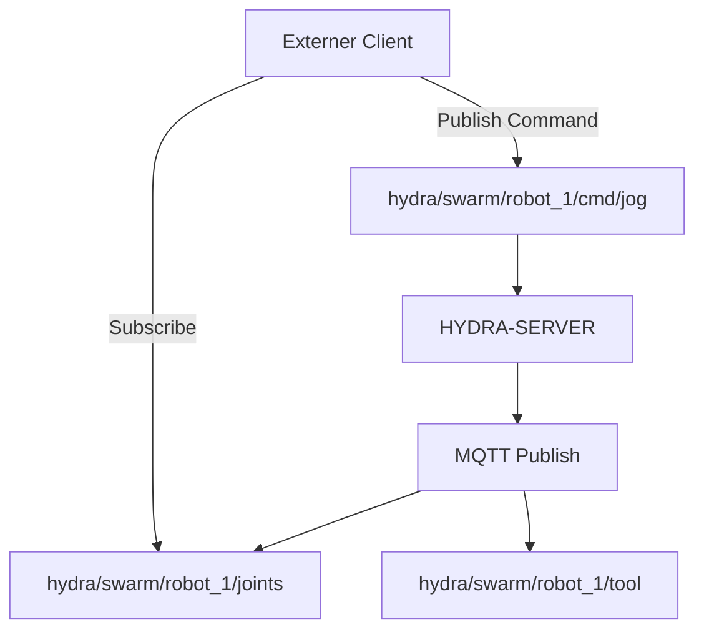

<p align="center">
  
</p>

# 📡 HYDRA-UMC-MQTT-BROKER

<p align="center"><a href="README.md">🇺🇸 English</a> | <a href="README_spa.md">🇪🇸 Español</a> | <a href="README_fra.md">🇫🇷 Français</a> | <a href="README_ita.md">🇮🇹 Italiano</a> | 🇩🇪 <b>Deutsch</b> | <a href="README_zho.md">🇨🇳 简体中文</a> | <a href="README_jpn.md">🇯🇵 日本語</a></p>

### 🚀 Leichtgewichtige Telemetrie-Brücke für IoT und externe Integrationen

<p align="left">
  
  
  
</p>

---

## 1. 🛠️ TECHNISCHER ÜBERBLICK

**HYDRA-UMC-MQTT-BROKER** bietet eine leichtgewichtige, asynchrone Messaging-Schnittstelle für das HYDRA-UMC-Ökosystem. Er ermöglicht es externen IoT-Geräten, Dashboards und Hausautomationssystemen (wie Home Assistant), Robotertelemetrie zu abonnieren und Befehle zu veröffentlichen.

Er implementiert den MQTT-3.1.1-Standard (via Aedes, live verifiziert - siehe Architektur unten) und bietet eine hocheffiziente Datenverteilung mit minimalem Overhead, was ihn ideal für mobile Apps oder die Fernüberwachung mit geringer Bandbreite macht.

### Hauptmerkmale:
* 🔌 **Externe Maschinenbrücken:** `HYDRA-UMC-BRIDGE-CNC`/`-LASER`/`-OPENPNP`/`-PRINTER3D`/`-ROS2` erreichen diesen Broker jeweils über ihre eigenen `hydra/bridges/<name>/...`-Topics - siehe `docs/BRIDGE_TOPICS.md`. *(implementiert)*
* 📡 **Pub/Sub-Telemetrie:** Verteilung von Gelenkwinkeln, Werkzeugzuständen und Systemstatus in weniger als einer Millisekunde.
* 🛠️ **Discovery-Unterstützung:** mDNS und Home Assistant Auto-Discovery für eine einfache Einrichtung. *(geplant - noch nicht implementiert; `src/server.ts` ist heute ein reiner TCP-Listener, ohne jeden Discovery-Dienst)*
* 🔐 **Topic-Sicherheit:** Echte, verifizierbare ACL pro Client-ID-Präfix für das Lesen und Schreiben spezifischer Roboter-Topics - ein SUBSCRIBE mit Platzhalter kann nie einen breiteren Zugriff gewähren als seine Regel. *(implementiert)*
* 🪪 **Client-Authentifizierung:** Optionale echte MQTT-Benutzername/Passwort-Authentifizierung beim CONNECT (`MQTT_AUTH_JSON`) gibt der ACL eine verifizierte Sitzungsidentität. *(implementiert; mit ACL kombinieren)*
* 📏 **Payload-Größenbegrenzung:** Eine echte, optionale Obergrenze für die PUBLISH-Payload-Größe, konfigurierbar über `MAX_PAYLOAD_BYTES`. *(implementiert)*
* ⚡ **Websockets-Unterstützung:** MQTT-over-WebSockets für browserbasierte Clients. *(geplant - noch nicht implementiert; heute ist nur reines TCP auf Port 1883 verdrahtet, siehe `package.json` - noch keine `ws`/Websocket-Abhängigkeit)*

---

## 2. 🔄 MQTT-TOPIC-STRUKTUR



**Ehrlichkeitshinweis:** die oben gezeigte `hydra/swarm/...`-Topic-Form
illustriert die *angestrebte* Form, sobald der eigene Zustand von
HYDRA-UMC-SERVER an MQTT angebunden wird - diese Anbindung ist noch
nicht verdrahtet (der eigene Kopfkommentar von `src/server.ts` sagt es:
"lands once that wiring is defined"), also veröffentlicht heute nichts
unter `hydra/swarm/...`. Die Topics, die heute real und verdrahtet sind,
sind der `hydra/bridges/<name>/...`-Namensraum der 5 externen
Maschinenbrücken (siehe `docs/BRIDGE_TOPICS.md`) und die eigene
VDA-5050-Topic-Form von HYDRA-UMC-BRIDGE-AMR.

---

## 3. 🧱 ARCHITEKTUR & DESIGNENTSCHEIDUNGEN

* **Warum es Geschwister, kein Submodul, von HYDRA-UMC-GATEWAY-INDUSTRIAL ist.** Jeder Protokolladapter ist ein separat bereitstellbarer/neustartbarer Prozess - ein Broker-Problem legt nie die daneben laufenden OPC-UA- oder MTConnect-Adapter lahm.
* **Warum ein echter MQTT-Broker statt nur eines Clients, der zu einem externen veröffentlicht.** Den Broker zu besitzen bedeutet, dass der eigene Ereignisstrom dieser Zelle (Roboterzustandsänderungen, Alarme) für jeden MQTT-Abonnenten im Fabriknetzwerk verfügbar ist, ohne davon abzuhängen, dass ein separat verwalteter externer Broker erreichbar ist.
* **Warum der Einstiegspunkt nur Identität/Version ausgibt und nach dem Start eines Health-Check-Listeners beendet wird.** Andamiaje-Stadium, gleicher Grund wie im eigenen README des Elternteils - ein echter Broker ist von Natur aus langlaufend.
* **Wie sich das ins restliche Ökosystem einfügt.** Ein Geschwisterdienst unter HYDRA-UMC-GATEWAY-INDUSTRIAL - verbindet den eigenen Ereignisstrom von HYDRA-UMC-SERVER mit echten MQTT-Topics.
* **Hier wurde ein echter Bug gefunden und behoben: Der Broker akzeptierte in Wirklichkeit nie Clients.** Aedes 1.x hat die Persistenz-/mqemitter-Einrichtung in einen expliziten asynchronen Schritt `broker.listen()` verlagert (eine echte API-Änderung gegenüber der Factory-Form der 0.x); ohne diesen erreichte ein echtes `CONNECT` den Broker über einen echten TCP-Socket, blieb aber still hängen, bis das eigene Connack-Timeout des Clients auslöste - der Broker wirkte "aktiv" (der Port akzeptierte Verbindungen), aber kein Client konnte je eine Sitzung abschließen. Gefunden durch einen echten `mqtt`-Client, der in den eigenen Tests dieses Projekts in ein Timeout lief, nicht durch Inspektion. `tests/server.test.ts` verbindet nun eine echte MQTT-Client-Bibliothek mit einem echten Broker über einen echten Socket - CONNECT, PUBLISH-Zustellung, Topic-Isolierung und Retained-Nachrichten, alles wirklich getestet.
* **Warum die Topic-ACL den *Geltungsbereich* des Abonnements prüft, nicht nur die Filterüberschneidung.** Die eigene SUBSCRIBE-Anfrage eines Clients ist selbst ein Filter und kann `+`/`#`-Platzhalter enthalten - eine naive Prüfung, ob „der angeforderte Filter sich mit dem erlaubten überschneidet", würde einem Client erlauben, sich mit einem breiteren Platzhalter (z. B. `hydra/robots/#`) zu abonnieren, als seine Regel tatsächlich gewährt (z. B. `hydra/robots/+/status`), und stillschweigend Topics zu sehen, für die er nie autorisiert war. `src/acl.ts` führt mit seiner Funktion `isSubscriptionWithinScope()` stattdessen eine echte, segmentweise Prüfung durch - belegt mit echten Tests, darunter einer, bei dem der eigene Versuch eines Roboters, seinen Geltungsbereich per Platzhalter-SUBSCRIBE zu erweitern, abgelehnt wird.
* **Warum ein abgelehntes PUBLISH die gesamte Verbindung schließt, statt nur eine Nachricht per NACK abzulehnen.** Dies ist Aedes' eigenes echtes Verhalten (verifiziert durch das Ausführen eines echten Clients dagegen, nicht aus der Dokumentation angenommen) - `authorizePublish` zerstört durch die Rückgabe eines Fehlers die Verbindung des Clients. Das ACL-/Payload-Limit-Design hier arbeitet damit, nicht dagegen: Ein Client, der wegen Verstoßes gegen seine ACL immer wieder getrennt wird, ist ein klares, unübersehbares Signal, die Konfiguration dieses Geräts zu korrigieren, statt einer still verworfenen Nachricht, die er vielleicht nie bemerkt.
* **Warum die ACL-/Payload-Limit-Konfiguration in Umgebungsvariablen (`MQTT_ACL_JSON`/`MAX_PAYLOAD_BYTES`) liegt, nicht in einer Konfigurationsdatei.** Entspricht der bereits bestehenden `PORT`-Konvention dieses Projekts (siehe `.env.example`) und der Art, wie es tatsächlich bereitgestellt wird (systemd-/Docker-Umgebung, keine eingebundene Datei) - `parseAclConfig()` lässt den Start bei fehlerhaftem JSON laut fehlschlagen, statt still ungeschützt weiterzulaufen.
* **Warum dieser Broker MQTT 3.1.1 spricht, nicht MQTT v5.** `aedes@1.1.1` (die fixierte Abhängigkeit) implementiert nur MQTT 3.1/3.1.1 - live verifiziert durch Verbinden eines echten `mqtt`-Clients mit `protocolVersion: 5`, was der Broker aktiv verweigert (`Connection refused: Unacceptable protocol version`), und bestätigt durch Aedes' eigene Upstream-Dokumentation (MQTT-5.0-Unterstützung lebt auf einem separaten, unveröffentlichten Branch). Jeder Client in diesem Ökosystem (die `mqtt_transport.py`-Bridges, `Vda5050Publisher`, die eigenen Tests dieses Repos) handelt ohnehin schon nur 3.1.1 aus - das ist also eine Dokumentationskorrektur, keine Verhaltensänderung.

---

## 📂 VERZEICHNISSTRUKTUR

```text
HYDRA-UMC-MQTT-BROKER/
├── src/         # Quellcode (Node/TypeScript - Broker, Bridge, Sicherheit)
├── tests/       # Vitest-Suite - ACL, Authentifizierung und Broker-/Bridge-Verhalten
├── docs/        # Dokumentation und Topic-Katalog
├── build/       # Kompilierte Ausgabe (npm run build)
├── images/      # Medien und Diagramme
├── scripts/     # Utility-Skripte (bump-version.mjs)
├── tools/       # ci_validate.py - Manifest-/CHANGELOG-/Doku-Validierung, von der CI genutzt
└── README.md
```

Reiner Netzwerkdienst ohne eigene Hardware - `hardware/`, `firmware/` und
`os/` werden gemäß der Repository-Strukturpolitik ausgelassen.

---

## 🛠️ ENTWICKLUNGSUMGEBUNG

### Voraussetzungen
- [Node.js](https://nodejs.org/) (v18 oder höher empfohlen)
- npm

### Installation
```bash
npm install
```

### Entwicklungsmodus
Startet den Broker direkt mit `tsx` (ohne Bundler):
- **Windows:** Doppelklick auf `dev.bat` oder `npm run dev` ausführen
- **Linux/Mac:** `./dev.sh` oder `npm run dev` ausführen

### Produktions-Build
Bündelt den Broker mit esbuild in eine einzige einsetzbare Datei:
- **Windows:** Doppelklick auf `build.bat` oder `npm run build` ausführen
- **Linux/Mac:** `./build.sh` oder `npm run build` ausführen

Dann starten mit:
```bash
npm start
```

Der Broker lauscht auf `0.0.0.0:1883` (reines MQTT/TCP, der von der IANA
registrierte Standardport) - jeden MQTT-Client (`mosquitto_sub`, Home
Assistant, MQTT Explorer, ...) auf `<host>:1883` richten.

### Versionierung
Jeder echte `npm run build` erhöht automatisch die `version` in
`package.json` (`scripts/bump-version.mjs`, erster Schritt des
`build`-Skripts) - ein "Kilometerzähler" auf Basis 10: patch +1 pro Build,
mit Übertrag auf minor (und von minor auf major) über 9 hinaus, anstatt
je ein zweistelliges Segment zu erreichen (`0.0.9` -> `0.1.0`, nicht
`0.0.10`).

---

## 🚀 FAHRPLAN
* **Phase 1:** OPC-UA Pub/Sub-Implementierung für Hochgeschwindigkeitsdatenaustausch und Legacy-Protokoll-Bridging.
* **Phase 2:** MQTT-Broker-Cluster für massives IoT-Gerätemanagement und hohe Parallelität.
* **Phase 3:** MTConnect-Adapterunterstützung für die Integration von CNC- und SPS-Maschinen verschiedener Hersteller.
* **Phase 4:** Unterstützung der Sparkplug B-Spezifikation für die industrielle IoT-Ausrichtung und einheitliche Telemetrie-Brücke.

---

## 🔗 Verwandte Projekte

Dieses Projekt ist Teil des HYDRA-UMC-Robotik-Ökosystems desselben Autors (JuanenRac / Electro Hobby 3D). Gut zu wissen, da eine Anfrage eigentlich eines dieser Projekte betreffen könnte statt dieses Repositorys.

**Übergeordnetes Projekt**
- **[HYDRA-UMC-GATEWAY-INDUSTRIAL](https://github.com/JuanenRac/HYDRA-UMC-GATEWAY-INDUSTRIAL)** — Integrationsknoten, der zu Industrieprotokollen weiterleitet, mit einer echten Befehls-Allowlist-/Backpressure-Schicht; das übergeordnete Projekt, dessen spezifischer Protokolladapter dieses Repository innerhalb seines eigenen Industrie-Gateways ist.

**Geschwisterprojekte** — die übrigen Protokolladapter des eigenen Industrie-Gateways von HYDRA-UMC-GATEWAY-INDUSTRIAL
- **[HYDRA-UMC-OPCUA-SERVER](https://github.com/JuanenRac/HYDRA-UMC-OPCUA-SERVER)** — echter OPC-UA-Adressraum, verifiziert mit einer echten Binärprotokoll-Client-Session.
- **[HYDRA-UMC-MTCONNECT-ADAPTER](https://github.com/JuanenRac/HYDRA-UMC-MTCONNECT-ADAPTER)** — echte MTConnect-`/probe`- und `/current`-XML-Endpunkte mit Degraded-Mode-Ausgabe.

**Direkt verwandt**
- **[HYDRA-UMC-SERVER](https://github.com/JuanenRac/HYDRA-UMC-SERVER)** — das reale Headless-Backend (REST/WebSocket), mit dem jeder Steuerungsclient tatsächlich spricht — die Quelle des Zustands, den dieser Adapter offenlegt.
- **[HYDRA-UMC-BRIDGE-CNC](https://github.com/JuanenRac/HYDRA-UMC-BRIDGE-CNC)** — High-Level-Koordinator für CNC-Zellen mit echtem GRBL-Status-/Steuerbyte-Zugriff — bringt ihr eigenes `mqtt_transport.py` mit, das diesen Broker über die eigenen `hydra/bridges/<name>/...`-Topics erreicht; siehe die eigene `docs/BRIDGE_TOPICS.md` dieses Repositorys für den echten, gemeinsamen Topic-Katalog.
- **[HYDRA-UMC-BRIDGE-LASER](https://github.com/JuanenRac/HYDRA-UMC-BRIDGE-LASER)** — Sicherheitskoordinator für Laserzellen, liest 3 echte Schlüssel-/Gehäuse-/Verriegelungs-GPIO-Sicherungen — bringt ihr eigenes `mqtt_transport.py` mit, das diesen Broker über die eigenen `hydra/bridges/<name>/...`-Topics erreicht; siehe die eigene `docs/BRIDGE_TOPICS.md` dieses Repositorys für den echten, gemeinsamen Topic-Katalog.
- **[HYDRA-UMC-BRIDGE-OPENPNP](https://github.com/JuanenRac/HYDRA-UMC-BRIDGE-OPENPNP)** — sicherer High-Level-Koordinator für den Leiterplattenfluss von OpenPnP Pick-and-Place — bringt ihr eigenes `mqtt_transport.py` mit, das diesen Broker über die eigenen `hydra/bridges/<name>/...`-Topics erreicht; siehe die eigene `docs/BRIDGE_TOPICS.md` dieses Repositorys für den echten, gemeinsamen Topic-Katalog.
- **[HYDRA-UMC-BRIDGE-PRINTER3D](https://github.com/JuanenRac/HYDRA-UMC-BRIDGE-PRINTER3D)** — sichere Koordinationsschranke für Moonraker/Klipper-3D-Drucker, mit echten gesicherten Job-Befehlen — bringt ihr eigenes `mqtt_transport.py` mit, das diesen Broker über die eigenen `hydra/bridges/<name>/...`-Topics erreicht; siehe die eigene `docs/BRIDGE_TOPICS.md` dieses Repositorys für den echten, gemeinsamen Topic-Katalog.
- **[HYDRA-UMC-BRIDGE-ROS2](https://github.com/JuanenRac/HYDRA-UMC-BRIDGE-ROS2)** — Sicherheitskoordinator mit einem echten, träge importierten rclpy-ROS-2-Transport — bringt ihr eigenes `mqtt_transport.py` mit, das diesen Broker über die eigenen `hydra/bridges/<name>/...`-Topics erreicht; siehe die eigene `docs/BRIDGE_TOPICS.md` dieses Repositorys für den echten, gemeinsamen Topic-Katalog.
- **[HYDRA-UMC-BRIDGE-AMR](https://github.com/JuanenRac/HYDRA-UMC-BRIDGE-AMR)** — Koordinationsschranke für AGV-/AMR-Flotten über einen echten VDA-5050-MQTT-Publisher — ein anderer echter Client desselben Brokers: `Vda5050Publisher` sendet gesicherte Dispatches als echte VDA-5050-`order`/`instantActions`-Nachrichten, im eigenen Topic-Format von VDA 5050 statt im `hydra/bridges/...`-Schema der übrigen Bridges.

**Ebenfalls Teil des Ökosystems**

*Kern-Hardware & Plattform*
- **[HYDRA-UMC](https://github.com/JuanenRac/HYDRA-UMC)** — das physische Motherboard des Roboterarms: CM5-Host + Dual-Core-STM32H745, koordiniert bis zu 8 Werkzeugarme über CAN-OTA/SPI-OTA.
- **[HYDRA-UMC-OS](https://github.com/JuanenRac/HYDRA-UMC-OS)** — reproduzierbare Raspberry-Pi-OS-Produktschicht für den CM5: schreibgeschützter Agent, validierte Konfiguration/Profile, WiFi-Ersteinrichtung.
- **[HYDRA-UMC-SDK](https://github.com/JuanenRac/HYDRA-UMC-SDK)** — der gemeinsame JSON-Schema-Vertrag und die Sicherheitsschranke, gegen die jede Bridge ihre Befehle validiert.

*Kern-Backend & Clients*
- **[HYDRA-UMC-STUDIO](https://github.com/JuanenRac/HYDRA-UMC-STUDIO)** — Web-Steuerungs-Dashboard mit Echtzeit-3D-Visualisierung mehrerer Roboter.
- **[HYDRA-UMC-SUITE](https://github.com/JuanenRac/HYDRA-UMC-SUITE)** — Desktop-Schwarmleitstand (PySide6) für mehrere Server gleichzeitig, verpackt als eigenständige ausführbare Datei.
- **[HYDRA-UMC-ANDROID-CONTROL](https://github.com/JuanenRac/HYDRA-UMC-ANDROID-CONTROL)** — native Android-Steuerungs-App mit biometrischem Login und einer gekoppelten Wear-OS-Begleit-App.
- **[HYDRA-UMC-IOS-CONTROL](https://github.com/JuanenRac/HYDRA-UMC-IOS-CONTROL)** — iOS/iPadOS-Steuerungs-App (Flutter) mit Echtzeit-WebSocket-Synchronisierung.
- **[HYDRA-UMC-DSI](https://github.com/JuanenRac/HYDRA-UMC-DSI)** — native Touch-UI für das eingebaute 7"-DSI-Touchscreen, direkt auf dem CM5 eingebettet.
- **[HYDRA-UMC-EDITOR-URDF](https://github.com/JuanenRac/HYDRA-UMC-EDITOR-URDF)** — grafischer Desktop-URDF-Ersteller/-Editor, der fertige Modelle in STUDIOs eigenen Katalog überträgt.
- **[HYDRA-UMC-BRIDGE-DROIDS](https://github.com/JuanenRac/HYDRA-UMC-BRIDGE-DROIDS)** — Koordinationsschranke für laufende/humanoide Droiden, mit einem echten Boston-Dynamics-Spot-Befehlssender.
- **[HYDRA-UMC-BRIDGE-UAV](https://github.com/JuanenRac/HYDRA-UMC-BRIDGE-UAV)** — Koordinationsschranke für kameraausgestattete UAVs, mit einem echten MAVLink-Befehlssender.

*URTC-Werkzeugplattform*
- **[URTC](https://github.com/JuanenRac/URTC)** — Firmware für die physische Universal-Robot-Tool-Controller-Platine, 25+ Werkzeugprofile über CAN-Bus.
- **[URTC-FLASHER](https://github.com/JuanenRac/URTC-FLASHER)** — Desktop-GUI-Flash-Tool für URTC-Platinen, CAN-OTA plus Full-Chip-SWD/JTAG.
- **[URTC-TESTER](https://github.com/JuanenRac/URTC-TESTER)** — Desktop-Live-CAN-Bus-Diagnosetool für URTC-Platinen, ein Panel pro Werkzeugprofil.
- **[URTC-WEB-STUDIO](https://github.com/JuanenRac/URTC-WEB-STUDIO)** — browserbasierte Alternative zu URTC-TESTER über die Web-Serial-API, ohne lokale Installation.

*Vision-KI-Knoten (Hailo-8)*
- **[HYDRA-UMC-VISION-NODE](https://github.com/JuanenRac/HYDRA-UMC-VISION-NODE)** — Integrationsknoten für die Hailo-8-Vision-Pipeline, mit einer echten stufenweisen Hardware-Bereitschaftsprüfung.
- **[HYDRA-UMC-DETECTION-HEF](https://github.com/JuanenRac/HYDRA-UMC-DETECTION-HEF)** — echte Registry für kompilierte Modelle mit Hailo-Architektur-/Prüfsummen-Safe-Load-Verifizierung.
- **[HYDRA-UMC-VISION-STREAMER](https://github.com/JuanenRac/HYDRA-UMC-VISION-STREAMER)** — echter GStreamer-Pipeline- + MediaMTX-Konfigurationsgenerator mit einer echten HailoRT-Integrationsschranke.
- **[HYDRA-UMC-VISUAL-SERVOING-API](https://github.com/JuanenRac/HYDRA-UMC-VISUAL-SERVOING-API)** — echtes Position-Based-Visual-Servoing-Korrekturgesetz, sicherheitsgesteuert nach vorgelagertem Zonenstatus.
- **[HYDRA-UMC-SAFETY-ZONES](https://github.com/JuanenRac/HYDRA-UMC-SAFETY-ZONES)** — echte Zonenverletzungsprüfung und E-STOP-Anforderung, mit erzwungener Kalibrierungsaktualität.

*Kognitiver KI-Knoten (Hailo-10)*
- **[HYDRA-UMC-COGNITIVE-NODE](https://github.com/JuanenRac/HYDRA-UMC-COGNITIVE-NODE)** — Integrationsknoten für die Hailo-10-Cognitive-Pipeline (LLM-/VLA-/Sprach-Orchestrierung).
- **[HYDRA-UMC-VLA-ENGINE](https://github.com/JuanenRac/HYDRA-UMC-VLA-ENGINE)** — echte Aktions-Token-Kodierung/-Dekodierung und Trajektoriengenerierung für ein Vision-Language-Action-Modell.
- **[HYDRA-UMC-VOICE-UI](https://github.com/JuanenRac/HYDRA-UMC-VOICE-UI)** — echtes Sprach-Frontend (VAD + Intent-Parser) mit einem begrenzten, bestätigungsgesicherten Watch-Relay.
- **[HYDRA-UMC-SEMANTIC-PLANNER](https://github.com/JuanenRac/HYDRA-UMC-SEMANTIC-PLANNER)** — echte regelbasierte Aufgabenzerlegung und semantische Fehlerbehebung über MCU-Fehlercodes.
- **[HYDRA-UMC-DOCS-QA](https://github.com/JuanenRac/HYDRA-UMC-DOCS-QA)** — echte, nur auf der Standardbibliothek basierende TF-IDF-Dokumentensuche über die eigenen Markdown-Dokumente dieses Ökosystems.

*Orchestrierung & Schwarm*
- **[HYDRA-UMC-ORCHESTRATOR](https://github.com/JuanenRac/HYDRA-UMC-ORCHESTRATOR)** — Integrationsknoten mit einem echten gRPC/Protobuf-Health-Report-Vertrag und einer Missions-Zustandsmaschine.
- **[HYDRA-UMC-JOB-DISPATCHER](https://github.com/JuanenRac/HYDRA-UMC-JOB-DISPATCHER)** — echte prioritätsbasierte Job-Queue mit Deduplizierung, über eine echte HTTP-API.
- **[HYDRA-UMC-NODE-HEALING](https://github.com/JuanenRac/HYDRA-UMC-NODE-HEALING)** — echter gRPC-basierter Flotten-Health-Watchdog mit Retry/Backoff und Identitäts-Mismatch-Erkennung.
- **[HYDRA-UMC-PATH-PLANNER-3D](https://github.com/JuanenRac/HYDRA-UMC-PATH-PLANNER-3D)** — echter RRT-basierter 3D-Pfadplaner mit echter Hindernis-/Arbeitsraum-Kollisionsvalidierung.
- **[HYDRA-UMC-SWARM-SYNC](https://github.com/JuanenRac/HYDRA-UMC-SWARM-SYNC)** — echte CRDT-LWW-Element-Map-Zustandssynchronisation, eigenschaftsgetestet auf Multi-Zellen-Konvergenz.

*Digitaler Zwilling & Simulation*
- **[HYDRA-UMC-TWIN](https://github.com/JuanenRac/HYDRA-UMC-TWIN)** — Integrationsknoten für die Digital-Twin-Engine, mit einem echten Versionskompatibilitäts-Sync-Vertrag.
- **[HYDRA-UMC-HIL-BRIDGE](https://github.com/JuanenRac/HYDRA-UMC-HIL-BRIDGE)** — echte Hardware-in-the-Loop-Sicherheitsverriegelung, die Befehle zwischen Simulation und echter Hardware routet.
- **[HYDRA-UMC-PHYSICS-REPLICA](https://github.com/JuanenRac/HYDRA-UMC-PHYSICS-REPLICA)** — echte Vorwärtskinematik und Gelenkgrenzenvalidierung über eine echte URDF-Teilmenge.
- **[HYDRA-UMC-SYNTHETIC-DATA-GEN](https://github.com/JuanenRac/HYDRA-UMC-SYNTHETIC-DATA-GEN)** — echter prozeduraler 2D-Szenengenerator mit YOLO/COCO-Annotationsexport.

*Daten & Analytik*
- **[HYDRA-UMC-DATALAKE](https://github.com/JuanenRac/HYDRA-UMC-DATALAKE)** — echter sqlite3-gestützter Zeitreihenspeicher mit einer echten Ingest-/Abfrage-HTTP-API.
- **[HYDRA-UMC-ANOMALY-DETECTOR](https://github.com/JuanenRac/HYDRA-UMC-ANOMALY-DETECTOR)** — echter FFT- + statistischer Basislinien-Anomaliedetektor mit Drift-Überwachung.
- **[HYDRA-UMC-PRODUCTION-REPORTS](https://github.com/JuanenRac/HYDRA-UMC-PRODUCTION-REPORTS)** — echte OEE-/Verfügbarkeitsberechnung über den DATALAKE-Verlauf, mit reproduzierbarem CSV-Export.
- **[HYDRA-UMC-TELEMETRY-COLLECTOR](https://github.com/JuanenRac/HYDRA-UMC-TELEMETRY-COLLECTOR)** — echte CAN/WebSocket-Ingestion-Pipeline in DATALAKE, mit Sequenz-Deduplizierung.

*Ergänzende Tools & Ökosystembetrieb*
- **[HYDRA-UMC-DASHBOARD-AI](https://github.com/JuanenRac/HYDRA-UMC-DASHBOARD-AI)** — Smart-Summaries- und Anomaly-Highlighting-Panels über DATALAKE/ANOMALY-DETECTOR, mit einem ehrlichen statistischen Fallback.
- **[HYDRA-UMC-TOOL-CLI](https://github.com/JuanenRac/HYDRA-UMC-TOOL-CLI)** — Flotten-CLI mit einem echten, stabilen Exit-Code-Vertrag, ein echter Live-Client der eigenen API von HYDRA-UMC-SERVER.
- **[HYDRA-UMC-WATCH](https://github.com/JuanenRac/HYDRA-UMC-WATCH)** — WearOS-Begleit-App mit echten haptischen Alarmen und einem Sprach-Relay zum gekoppelten Telefon.
- **[URTC-SMART-RACK](https://github.com/JuanenRac/URTC-SMART-RACK)** — Firmware für ein Platinenmontagegestell mit echter Werkzeug-ID-Dekodierung und Smart-Idle-Vorheizlogik.
- **[URTC-VISION-TOOL](https://github.com/JuanenRac/URTC-VISION-TOOL)** — Firmware plus ein echter Python-Vision-Begleiter für einen Thermal-/RGB-Inspektionswerkzeugkopf.
- **[HYDRA-UMC-UPDATER](https://github.com/JuanenRac/HYDRA-UMC-UPDATER)** — administratives Desktop-Tool, das jedes Repository in diesem Ökosystem entdeckt, klont und aktualisiert.


---

## 📚 Dokumentation & Community

- **[docs/BRIDGE_TOPICS.md](docs/BRIDGE_TOPICS.md)** — der echte, geteilte `hydra/bridges/<name>/...`-Topic-Katalog, den jede externe Maschinenbrücke (CNC/Laser/OpenPnP/Printer3D/ROS2) tatsächlich gegen diesen Broker verwendet.
- **[CONTRIBUTING.md](CONTRIBUTING.md)** — Technologie-Stack und Coding-Richtlinien für einen Pull Request.
- **[CODE_OF_CONDUCT.md](CODE_OF_CONDUCT.md)** — die in dieser Community erwarteten Verhaltensstandards.
- **[SECURITY.md](SECURITY.md)** — wie man eine Schwachstelle meldet, und die echten Sicherheitsschwerpunkte dieses Projekts.
- **[SUPPORT.md](SUPPORT.md)** — wo man Fragen stellt und Fehler meldet.
- **[LICENSE.md](LICENSE.md)** — die eigene Lizenz dieses Projekts.

## 👤 AUTOR
**JuanenRac** (Electro Hobby 3D)
📧 electrohobby3d@gmail.com
📺 [youtube.com/@electrohobby3d](https://youtube.com/@electrohobby3d)

## 📜 LIZENZ
GPL-3.0 - Siehe LICENSE für Details.
