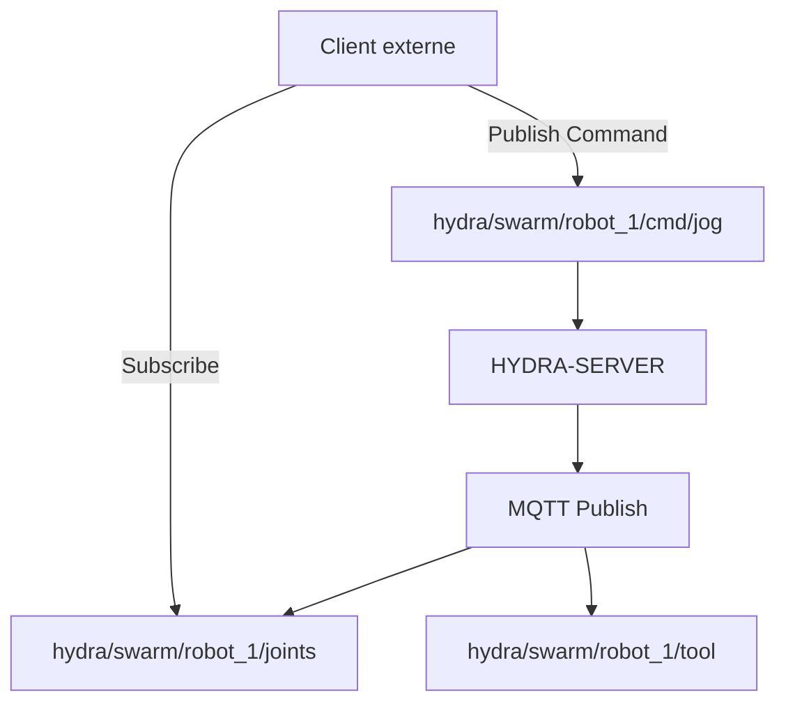

<p align="center">
  
</p>

# 📡 HYDRA-UMC-MQTT-BROKER

<p align="center"><a href="README.md">🇺🇸 English</a> | <a href="README_spa.md">🇪🇸 Español</a> | 🇫🇷 <b>Français</b> | <a href="README_ita.md">🇮🇹 Italiano</a> | <a href="README_deu.md">🇩🇪 Deutsch</a> | <a href="README_zho.md">🇨🇳 简体中文</a> | <a href="README_jpn.md">🇯🇵 日本語</a></p>

### 🚀 Pont de télémétrie léger pour l'IoT et les intégrations externes

<p align="left">
  
  
  
</p>

---

## 1. 🛠️ APERÇU TECHNIQUE

**HYDRA-UMC-MQTT-BROKER** fournit une interface de messagerie asynchrone et légère pour l'écosystème HYDRA-UMC. Il permet aux appareils IoT externes, aux tableaux de bord et aux systèmes domotiques (comme Home Assistant) de s'abonner à la télémétrie des robots et de publier des commandes.

Il implémente la norme MQTT v5, offrant une distribution de données haute efficacité avec un surdébit minimal, ce qui le rend idéal pour les applications mobiles ou la surveillance à distance à faible bande passante.

### Caractéristiques principales :
* 🔌 **Ponts de Machines Externes :** `HYDRA-UMC-BRIDGE-CNC`/`-LASER`/`-OPENPNP`/`-PRINTER3D`/`-ROS2` atteignent chacun ce broker via leurs propres topics `hydra/bridges/<name>/...` - voir `docs/BRIDGE_TOPICS.md`. *(implémenté)*
* 📡 **Télémétrie Pub/Sub :** Distribution en moins d'une milliseconde des angles d'articulation, des états des outils et de la santé du système.
* 🛠️ **Prise en charge de la découverte :** mDNS intégré et auto-découverte Home Assistant pour une configuration facile.
* 🔐 **Sécurité des sujets (Topics) :** ACL réelle et vérifiable par préfixe d'ID client pour la lecture et l'écriture de sujets robotiques spécifiques - un SUBSCRIBE avec caractère générique ne peut jamais accorder un accès plus large que sa règle. *(implémenté)*
* 🪪 **Authentification client :** L'authentification MQTT réelle et facultative par nom d'utilisateur/mot de passe au CONNECT (`MQTT_AUTH_JSON`) donne à l'ACL une identité de session vérifiée. *(implémentée ; à associer à l'ACL)*
* 📏 **Limite de taille de payload :** Une limite réelle et optionnelle sur la taille du payload PUBLISH, configurable via `MAX_PAYLOAD_BYTES`. *(implémenté)*
* ⚡ **Prise en charge des Websockets :** MQTT-over-WebSockets intégré pour les clients basés sur un navigateur.

---

## 2. 🔄 STRUCTURE DES SUJETS MQTT



---

## 3. 🧱 ARCHITECTURE & DÉCISIONS DE CONCEPTION

* **Pourquoi c'est un frère, pas un sous-module, de HYDRA-UMC-GATEWAY-INDUSTRIAL.** Chaque adaptateur de protocole est un processus déployable/redémarrable séparément - un problème de broker ne fait jamais tomber les adaptateurs OPC-UA ou MTConnect qui tournent à côté.
* **Pourquoi un vrai broker MQTT, pas juste un client publiant vers un broker externe.** Posséder le broker signifie que le propre flux d'événements de cette cellule (changements d'état robot, alarmes) est disponible pour tout abonné MQTT du réseau d'usine sans dépendre de l'accessibilité d'un broker externe géré séparément.
* **Pourquoi le point d'entrée n'imprime qu'identité/version, et se termine après la mise en place d'un listener de health-check.** Étape d'andamiaje, même raison que le propre README du parent - un vrai broker est de longue durée par nature.
* **Comment cela s'intègre dans le reste de l'écosystème.** Un service frère sous HYDRA-UMC-GATEWAY-INDUSTRIAL - relie le propre flux d'événements de HYDRA-UMC-SERVER à de vrais sujets MQTT.
* **Un vrai bug a été trouvé et corrigé ici : le broker n'acceptait en réalité jamais aucun client.** Aedes 1.x a déplacé la configuration de la persistance/mqemitter dans une étape asynchrone explicite `broker.listen()` (un vrai changement d'API par rapport à la forme factory de la 0.x) ; sans cela, un vrai `CONNECT` atteignait le broker via un vrai socket TCP mais restait bloqué silencieusement jusqu'à ce que le propre délai de connack du client expire - le broker semblait "actif" (le port acceptait les connexions) mais aucun client ne pouvait jamais terminer une session. Découvert via un vrai client `mqtt` expirant dans les propres tests de ce projet, pas par inspection. `tests/server.test.ts` connecte désormais une vraie bibliothèque cliente MQTT à un vrai broker via un vrai socket - CONNECT, livraison de PUBLISH, isolation des sujets et messages retenus, tout est testé pour de vrai.
* **Pourquoi l'ACL de sujets vérifie la *portée* de l'abonnement, pas seulement le chevauchement du filtre.** La propre requête SUBSCRIBE d'un client est elle-même un filtre et peut porter des caractères génériques `+`/`#` - vérifier naïvement si « le filtre demandé chevauche celui autorisé » permettrait à un client de s'abonner avec un caractère générique plus large (p. ex. `hydra/robots/#`) que ce que sa règle accorde réellement (p. ex. `hydra/robots/+/status`) et de voir silencieusement des sujets pour lesquels il n'a jamais été autorisé. `src/acl.ts`, avec sa fonction `isSubscriptionWithinScope()`, effectue à la place une vérification réelle, segment par segment - prouvé par de vrais tests, y compris un cas où la propre tentative d'un robot d'étendre sa portée via un SUBSCRIBE avec caractère générique est refusée.
* **Pourquoi un PUBLISH refusé ferme toute la connexion, plutôt que de simplement faire un NACK sur un seul message.** C'est le comportement réel propre d'Aedes (vérifié en exécutant un vrai client contre lui, pas supposé d'après la documentation) - `authorizePublish` renvoyant une erreur détruit la connexion du client. La conception de l'ACL/limite de payload ici travaille avec ce comportement, pas contre lui : un client qui continue d'être déconnecté pour violation de son ACL est un signal clair et net pour corriger la configuration de cet appareil, pas un message silencieusement abandonné qu'il pourrait ne jamais remarquer.
* **Pourquoi la configuration de l'ACL/limite de payload réside dans des variables d'environnement (`MQTT_ACL_JSON`/`MAX_PAYLOAD_BYTES`), pas dans un fichier de configuration.** Cela correspond à la convention `PORT` déjà existante de ce projet (voir `.env.example`) et à la façon dont il est réellement déployé (environnement systemd/Docker, pas un fichier monté) - `parseAclConfig()` fait échouer le démarrage de manière bruyante en cas de JSON malformé plutôt que de s'exécuter silencieusement sans protection.

---

## 📂 STRUCTURE DES RÉPERTOIRES

```text
HYDRA-UMC-MQTT-BROKER/
├── src/         # Code source (Node/TypeScript - Broker, Pont, Sécurité)
├── tests/       # Suite Vitest - ACL, authentification et comportement broker/pont
├── docs/        # Documentation et catalogue de sujets
├── build/       # Sortie compilée (npm run build)
├── images/      # Médias et diagrammes
├── scripts/     # Scripts utilitaires (bump-version.mjs)
├── tools/       # ci_validate.py - validation manifest/CHANGELOG/docs utilisée par la CI
└── README.md
```

Service réseau pur, sans matériel propre - `hardware/`, `firmware/` et
`os/` sont omis conformément à la politique de structure du dépôt.

---

## 🛠️ ENVIRONNEMENT DE DÉVELOPPEMENT

### Prérequis
- [Node.js](https://nodejs.org/) (v18 ou supérieur recommandé)
- npm

### Installation
```bash
npm install
```

### Mode Développement
Exécute le broker directement avec `tsx` (sans bundler) :
- **Windows :** double-cliquer sur `dev.bat` ou exécuter `npm run dev`
- **Linux/Mac :** exécuter `./dev.sh` ou `npm run dev`

### Build de Production
Regroupe le broker en un seul fichier déployable avec esbuild :
- **Windows :** double-cliquer sur `build.bat` ou exécuter `npm run build`
- **Linux/Mac :** exécuter `./build.sh` ou `npm run build`

Puis démarrez-le avec :
```bash
npm start
```

Le broker écoute sur `0.0.0.0:1883` (MQTT/TCP en clair, le port par défaut
enregistré par l'IANA) - pointez n'importe quel client MQTT
(`mosquitto_sub`, Home Assistant, MQTT Explorer, ...) vers `<host>:1883`.

### Gestion des versions
Chaque `npm run build` réel incrémente automatiquement le `version` de
`package.json` (`scripts/bump-version.mjs`, première étape du script
`build`) - un « compteur kilométrique » en base 10 : patch +1 par build,
avec report vers minor (et de minor vers major) au-delà de 9 plutôt que
d'atteindre un segment à deux chiffres (`0.0.9` -> `0.1.0`, pas `0.0.10`).

---

## 🚀 FEUILLE DE ROUTE
* **Phase 1 :** Implémentation d'OPC-UA Pub/Sub pour l'échange de données à haute vitesse et le pontage des protocoles hérités.
* **Phase 2 :** Cluster de brokers MQTT pour la gestion massive des appareils IoT et une haute simultanéité.
* **Phase 3 :** Prise en charge de l'adaptateur MTConnect pour l'intégration de machines CNC et d'automates multi-fournisseurs.
* **Phase 4 :** Prise en charge de la spécification Sparkplug B pour l'alignement de l'IoT industriel et pont de télémétrie unifié.

---

## 🔗 Projets Liés

Ce projet fait partie de l'écosystème robotique HYDRA-UMC du même auteur (JuanenRac / Electro Hobby 3D). Bon à savoir, car une demande pourrait en réalité concerner l'un de ceux-ci plutôt que ce dépôt.

**Projet Parent**
- **[HYDRA-UMC-GATEWAY-INDUSTRIAL](https://github.com/JuanenRac/HYDRA-UMC-GATEWAY-INDUSTRIAL)** — hub d'intégration relayant vers les protocoles industriels, avec une vraie couche de liste blanche de commandes/contre-pression ; le parent dont ce dépôt est un adaptateur de protocole spécifique, au sein de sa propre passerelle industrielle.

**Projets Frères** — les autres adaptateurs de protocole de la propre passerelle industrielle de HYDRA-UMC-GATEWAY-INDUSTRIAL
- **[HYDRA-UMC-OPCUA-SERVER](https://github.com/JuanenRac/HYDRA-UMC-OPCUA-SERVER)** — vrai espace d'adressage OPC-UA, vérifié avec une vraie session client du protocole binaire.
- **[HYDRA-UMC-MTCONNECT-ADAPTER](https://github.com/JuanenRac/HYDRA-UMC-MTCONNECT-ADAPTER)** — vrais points de terminaison XML MTConnect `/probe` et `/current`, avec sortie en mode dégradé.

**Directement Liés**
- **[HYDRA-UMC-SERVER](https://github.com/JuanenRac/HYDRA-UMC-SERVER)** — le vrai backend headless (REST/WebSocket) auquel parle réellement chaque client de contrôle — la source de l'état que cet adaptateur expose.
- **[HYDRA-UMC-BRIDGE-CNC](https://github.com/JuanenRac/HYDRA-UMC-BRIDGE-CNC)** — coordinateur haut niveau pour cellules CNC avec accès réel au statut/octets de contrôle GRBL — embarque son propre `mqtt_transport.py` atteignant ce broker via ses propres topics `hydra/bridges/<nom>/...` ; voir le propre `docs/BRIDGE_TOPICS.md` de ce dépôt pour le catalogue de topics réel et partagé.
- **[HYDRA-UMC-BRIDGE-LASER](https://github.com/JuanenRac/HYDRA-UMC-BRIDGE-LASER)** — coordinateur de sécurité pour cellules laser lisant 3 vraies sécurités GPIO de clé/enceinte/verrouillage — embarque son propre `mqtt_transport.py` atteignant ce broker via ses propres topics `hydra/bridges/<nom>/...` ; voir le propre `docs/BRIDGE_TOPICS.md` de ce dépôt pour le catalogue de topics réel et partagé.
- **[HYDRA-UMC-BRIDGE-OPENPNP](https://github.com/JuanenRac/HYDRA-UMC-BRIDGE-OPENPNP)** — coordinateur haut niveau sûr pour le flux de cartes du pick-and-place OpenPnP — embarque son propre `mqtt_transport.py` atteignant ce broker via ses propres topics `hydra/bridges/<nom>/...` ; voir le propre `docs/BRIDGE_TOPICS.md` de ce dépôt pour le catalogue de topics réel et partagé.
- **[HYDRA-UMC-BRIDGE-PRINTER3D](https://github.com/JuanenRac/HYDRA-UMC-BRIDGE-PRINTER3D)** — frontière de coordination sûre pour imprimantes 3D Moonraker/Klipper, avec de vraies commandes de tâche contrôlées — embarque son propre `mqtt_transport.py` atteignant ce broker via ses propres topics `hydra/bridges/<nom>/...` ; voir le propre `docs/BRIDGE_TOPICS.md` de ce dépôt pour le catalogue de topics réel et partagé.
- **[HYDRA-UMC-BRIDGE-ROS2](https://github.com/JuanenRac/HYDRA-UMC-BRIDGE-ROS2)** — coordinateur de sécurité avec un vrai transport ROS 2 rclpy à importation paresseuse — embarque son propre `mqtt_transport.py` atteignant ce broker via ses propres topics `hydra/bridges/<nom>/...` ; voir le propre `docs/BRIDGE_TOPICS.md` de ce dépôt pour le catalogue de topics réel et partagé.
- **[HYDRA-UMC-BRIDGE-AMR](https://github.com/JuanenRac/HYDRA-UMC-BRIDGE-AMR)** — frontière de coordination pour les flottes AGV/AMR via un éditeur MQTT VDA 5050 réel — un autre vrai client de ce même broker : `Vda5050Publisher` envoie des dispatches validés comme de vrais messages VDA 5050 `order`/`instantActions`, selon la propre forme de topic de VDA 5050 plutôt que le schéma `hydra/bridges/...` utilisé par les autres bridges.

**Fait Également Partie de l'Écosystème**

*Matériel & Plateforme de Base*
- **[HYDRA-UMC](https://github.com/JuanenRac/HYDRA-UMC)** — la carte mère physique du bras robotique : hôte CM5 + coprocesseur STM32H745 double cœur, coordonnant jusqu'à 8 bras-outils via CAN-OTA/SPI-OTA.
- **[HYDRA-UMC-OS](https://github.com/JuanenRac/HYDRA-UMC-OS)** — couche produit reproductible sur Raspberry Pi OS pour le CM5 : agent en lecture seule, config/profils validés, provisionnement WiFi de premier contact.
- **[HYDRA-UMC-SDK](https://github.com/JuanenRac/HYDRA-UMC-SDK)** — le contrat JSON-Schema partagé et la barrière de sécurité contre laquelle chaque bridge valide ses commandes.

*Backend Central & Clients*
- **[HYDRA-UMC-STUDIO](https://github.com/JuanenRac/HYDRA-UMC-STUDIO)** — tableau de bord de contrôle web avec visualisation 3D multi-robot en temps réel.
- **[HYDRA-UMC-SUITE](https://github.com/JuanenRac/HYDRA-UMC-SUITE)** — centre de commande d'essaim de bureau (PySide6) pour plusieurs serveurs à la fois, empaqueté en exécutable autonome.
- **[HYDRA-UMC-ANDROID-CONTROL](https://github.com/JuanenRac/HYDRA-UMC-ANDROID-CONTROL)** — application de contrôle Android native avec connexion biométrique et un compagnon Wear OS jumelé.
- **[HYDRA-UMC-IOS-CONTROL](https://github.com/JuanenRac/HYDRA-UMC-IOS-CONTROL)** — application de contrôle iOS/iPadOS (Flutter) avec synchronisation WebSocket en temps réel.
- **[HYDRA-UMC-DSI](https://github.com/JuanenRac/HYDRA-UMC-DSI)** — interface tactile native pour l'écran tactile DSI 7" embarqué, intégrée directement sur le CM5.
- **[HYDRA-UMC-EDITOR-URDF](https://github.com/JuanenRac/HYDRA-UMC-EDITOR-URDF)** — créateur/éditeur graphique de bureau pour URDF qui envoie les modèles terminés vers le propre catalogue de STUDIO.
- **[HYDRA-UMC-BRIDGE-DROIDS](https://github.com/JuanenRac/HYDRA-UMC-BRIDGE-DROIDS)** — frontière de coordination pour droïdes à pattes/humanoïdes, avec un véritable émetteur de commandes Boston Dynamics Spot.
- **[HYDRA-UMC-BRIDGE-UAV](https://github.com/JuanenRac/HYDRA-UMC-BRIDGE-UAV)** — frontière de coordination pour UAV équipés de caméra, avec un véritable émetteur de commandes MAVLink.

*Plateforme d'Outils URTC*
- **[URTC](https://github.com/JuanenRac/URTC)** — firmware pour la carte physique Universal Robot Tool Controller, plus de 25 profils d'outil sur bus CAN.
- **[URTC-FLASHER](https://github.com/JuanenRac/URTC-FLASHER)** — outil de bureau à interface graphique pour flasher les cartes URTC, CAN-OTA plus SWD/JTAG puce complète.
- **[URTC-TESTER](https://github.com/JuanenRac/URTC-TESTER)** — outil de bureau de diagnostic CAN-bus en direct pour cartes URTC, un panneau par profil d'outil.
- **[URTC-WEB-STUDIO](https://github.com/JuanenRac/URTC-WEB-STUDIO)** — alternative basée navigateur à URTC-TESTER via la Web Serial API, sans installation locale.

*Nœud IA de Vision (Hailo-8)*
- **[HYDRA-UMC-VISION-NODE](https://github.com/JuanenRac/HYDRA-UMC-VISION-NODE)** — hub d'intégration pour le pipeline de vision Hailo-8, avec une vraie vérification de disponibilité matérielle par étape.
- **[HYDRA-UMC-DETECTION-HEF](https://github.com/JuanenRac/HYDRA-UMC-DETECTION-HEF)** — registre réel de modèles compilés avec vérification de chargement sécurisé par architecture Hailo/checksum.
- **[HYDRA-UMC-VISION-STREAMER](https://github.com/JuanenRac/HYDRA-UMC-VISION-STREAMER)** — générateur réel de pipeline GStreamer + config MediaMTX, avec une vraie frontière d'intégration HailoRT.
- **[HYDRA-UMC-VISUAL-SERVOING-API](https://github.com/JuanenRac/HYDRA-UMC-VISUAL-SERVOING-API)** — vraie loi de correction Position-Based Visual Servoing, verrouillée sur l'état de zone en amont.
- **[HYDRA-UMC-SAFETY-ZONES](https://github.com/JuanenRac/HYDRA-UMC-SAFETY-ZONES)** — vraie vérification de violation de zone et demande d'E-STOP, avec application de la fraîcheur de calibration.

*Nœud IA Cognitif (Hailo-10)*
- **[HYDRA-UMC-COGNITIVE-NODE](https://github.com/JuanenRac/HYDRA-UMC-COGNITIVE-NODE)** — hub d'intégration pour le pipeline cognitif Hailo-10 (orchestration LLM/VLA/voix).
- **[HYDRA-UMC-VLA-ENGINE](https://github.com/JuanenRac/HYDRA-UMC-VLA-ENGINE)** — vrai encodage/décodage de jetons d'action et génération de trajectoire pour un modèle Vision-Language-Action.
- **[HYDRA-UMC-VOICE-UI](https://github.com/JuanenRac/HYDRA-UMC-VOICE-UI)** — vrai front-end vocal (VAD + analyseur d'intention) avec un relais Watch borné et soumis à confirmation.
- **[HYDRA-UMC-SEMANTIC-PLANNER](https://github.com/JuanenRac/HYDRA-UMC-SEMANTIC-PLANNER)** — vraie décomposition de tâches basée sur des règles et récupération sémantique d'erreurs sur les codes d'erreur MCU.
- **[HYDRA-UMC-DOCS-QA](https://github.com/JuanenRac/HYDRA-UMC-DOCS-QA)** — vraie recherche documentaire TF-IDF (bibliothèque standard uniquement) sur les propres documents Markdown de cet écosystème.

*Orchestration & Essaim*
- **[HYDRA-UMC-ORCHESTRATOR](https://github.com/JuanenRac/HYDRA-UMC-ORCHESTRATOR)** — hub d'intégration avec un vrai contrat de rapport de santé gRPC/Protobuf et une machine à états de mission.
- **[HYDRA-UMC-JOB-DISPATCHER](https://github.com/JuanenRac/HYDRA-UMC-JOB-DISPATCHER)** — vraie file de tâches basée sur la priorité avec déduplication, via une vraie API HTTP.
- **[HYDRA-UMC-NODE-HEALING](https://github.com/JuanenRac/HYDRA-UMC-NODE-HEALING)** — vrai chien de garde de santé de flotte basé sur gRPC, avec retry/backoff et détection d'incohérence d'identité.
- **[HYDRA-UMC-PATH-PLANNER-3D](https://github.com/JuanenRac/HYDRA-UMC-PATH-PLANNER-3D)** — vrai planificateur de trajectoire 3D basé sur RRT, avec vraie validation des collisions obstacle/espace de travail.
- **[HYDRA-UMC-SWARM-SYNC](https://github.com/JuanenRac/HYDRA-UMC-SWARM-SYNC)** — vraie synchronisation d'état CRDT LWW-Element-Map, testée par propriétés pour la convergence multi-cellule.

*Jumeau Numérique & Simulation*
- **[HYDRA-UMC-TWIN](https://github.com/JuanenRac/HYDRA-UMC-TWIN)** — hub d'intégration pour le moteur de jumeau numérique, avec un vrai contrat de synchronisation par compatibilité de version.
- **[HYDRA-UMC-HIL-BRIDGE](https://github.com/JuanenRac/HYDRA-UMC-HIL-BRIDGE)** — vrai verrouillage de sécurité hardware-in-the-loop routant les commandes entre simulation et matériel réel.
- **[HYDRA-UMC-PHYSICS-REPLICA](https://github.com/JuanenRac/HYDRA-UMC-PHYSICS-REPLICA)** — vraie cinématique directe et validation des limites articulaires sur un vrai sous-ensemble URDF.
- **[HYDRA-UMC-SYNTHETIC-DATA-GEN](https://github.com/JuanenRac/HYDRA-UMC-SYNTHETIC-DATA-GEN)** — vrai générateur procédural de scènes 2D avec export d'annotations YOLO/COCO.

*Données & Analytique*
- **[HYDRA-UMC-DATALAKE](https://github.com/JuanenRac/HYDRA-UMC-DATALAKE)** — vrai magasin de séries temporelles basé sur sqlite3, avec une vraie API HTTP d'ingestion/requête.
- **[HYDRA-UMC-ANOMALY-DETECTOR](https://github.com/JuanenRac/HYDRA-UMC-ANOMALY-DETECTOR)** — vrai détecteur d'anomalies FFT + ligne de base statistique, avec surveillance de dérive.
- **[HYDRA-UMC-PRODUCTION-REPORTS](https://github.com/JuanenRac/HYDRA-UMC-PRODUCTION-REPORTS)** — vrai calcul OEE/disponibilité sur l'historique de DATALAKE, avec export CSV reproductible.
- **[HYDRA-UMC-TELEMETRY-COLLECTOR](https://github.com/JuanenRac/HYDRA-UMC-TELEMETRY-COLLECTOR)** — vrai pipeline d'ingestion CAN/WebSocket vers DATALAKE, avec déduplication par séquence.

*Outils Complémentaires & Opérations de l'Écosystème*
- **[HYDRA-UMC-DASHBOARD-AI](https://github.com/JuanenRac/HYDRA-UMC-DASHBOARD-AI)** — panneaux Smart Summaries et Anomaly Highlighting sur DATALAKE/ANOMALY-DETECTOR, avec un repli statistique honnête.
- **[HYDRA-UMC-TOOL-CLI](https://github.com/JuanenRac/HYDRA-UMC-TOOL-CLI)** — CLI de flotte avec un vrai contrat de codes de sortie stable, un vrai client en direct de la propre API de HYDRA-UMC-SERVER.
- **[HYDRA-UMC-WATCH](https://github.com/JuanenRac/HYDRA-UMC-WATCH)** — application compagnon WearOS avec de vraies alertes haptiques et un relais vocal vers le téléphone jumelé.
- **[URTC-SMART-RACK](https://github.com/JuanenRac/URTC-SMART-RACK)** — firmware pour un rack de montage de cartes avec décodage réel d'ID d'outil et logique de préchauffage Smart Idle.
- **[URTC-VISION-TOOL](https://github.com/JuanenRac/URTC-VISION-TOOL)** — firmware plus un vrai compagnon de vision Python pour une tête d'outil d'inspection thermique/RGB.
- **[HYDRA-UMC-UPDATER](https://github.com/JuanenRac/HYDRA-UMC-UPDATER)** — outil administratif de bureau qui découvre, clone et met à jour chaque dépôt de cet écosystème.


---

## 📚 Documentation & Communauté

- **[CONTRIBUTING.md](CONTRIBUTING.md)** — pile technologique et lignes directrices de codage pour une pull request.
- **[CODE_OF_CONDUCT.md](CODE_OF_CONDUCT.md)** — les normes de comportement attendues dans cette communauté.
- **[SECURITY.md](SECURITY.md)** — comment signaler une vulnérabilité, et les véritables axes de sécurité de ce projet.
- **[SUPPORT.md](SUPPORT.md)** — où poser des questions et signaler des bugs.
- **[LICENSE.md](LICENSE.md)** — la licence propre de ce projet.

## 👤 AUTEUR
**JuanenRac** (Electro Hobby 3D)
📧 electrohobby3d@gmail.com
📺 [youtube.com/@electrohobby3d](https://youtube.com/@electrohobby3d)

## 📜 LICENCE
GPL-3.0 - Voir le fichier LICENSE pour plus de détails.
