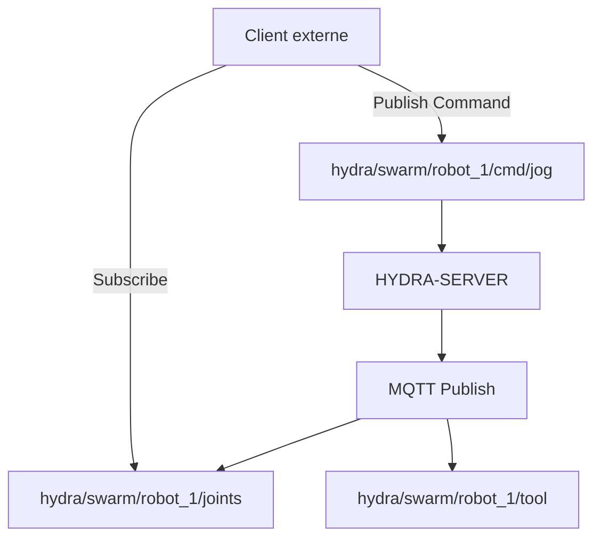

<p align="center">
  
</p>

# 📡 HYDRA-UMC-MQTT-BROKER

<p align="center"><a href="README.md">🇺🇸 English</a> | <a href="README_spa.md">🇪🇸 Español</a> | 🇫🇷 <b>Français</b> | <a href="README_ita.md">🇮🇹 Italiano</a> | <a href="README_deu.md">🇩🇪 Deutsch</a> | <a href="README_zho.md">🇨🇳 简体中文</a> | <a href="README_jpn.md">🇯🇵 日本語</a></p>

### 🚀 Pont de télémétrie léger pour l'IoT et les intégrations externes

<p align="left">
  
  
  
</p>

---

## 1. 🛠️ APERÇU TECHNIQUE

**HYDRA-UMC-MQTT-BROKER** fournit une interface de messagerie asynchrone et légère pour l'écosystème HYDRA-UMC. Il permet aux appareils IoT externes, aux tableaux de bord et aux systèmes domotiques (comme Home Assistant) de s'abonner à la télémétrie des robots et de publier des commandes.

Il implémente la norme MQTT v5, offrant une distribution de données haute efficacité avec un surdébit minimal, ce qui le rend idéal pour les applications mobiles ou la surveillance à distance à faible bande passante.

### Caractéristiques principales :
* 📡 **Télémétrie Pub/Sub :** Distribution en moins d'une milliseconde des angles d'articulation, des états des outils et de la santé du système.
* 🛠️ **Prise en charge de la découverte :** mDNS intégré et auto-découverte Home Assistant pour une configuration facile.
* 🔐 **Sécurité des sujets (Topics) :** Contrôle d'accès granulaire (ACL) pour la lecture et l'écriture de sujets robotiques spécifiques.
* ⚡ **Prise en charge des Websockets :** MQTT-over-WebSockets intégré pour les clients basés sur un navigateur.

---

## 2. 🔄 STRUCTURE DES SUJETS MQTT



---

## 3. 🧱 ARCHITECTURE & DÉCISIONS DE CONCEPTION

* **Pourquoi c'est un frère, pas un sous-module, de HYDRA-UMC-GATEWAY-INDUSTRIAL.** Chaque adaptateur de protocole est un processus déployable/redémarrable séparément - un problème de broker ne fait jamais tomber les adaptateurs OPC-UA ou MTConnect qui tournent à côté.
* **Pourquoi un vrai broker MQTT, pas juste un client publiant vers un broker externe.** Posséder le broker signifie que le propre flux d'événements de cette cellule (changements d'état robot, alarmes) est disponible pour tout abonné MQTT du réseau d'usine sans dépendre de l'accessibilité d'un broker externe géré séparément.
* **Pourquoi le point d'entrée n'imprime qu'identité/version, et se termine après la mise en place d'un listener de health-check.** Étape d'andamiaje, même raison que le propre README du parent - un vrai broker est de longue durée par nature.
* **Comment cela s'intègre dans le reste de l'écosystème.** Un service frère sous HYDRA-UMC-GATEWAY-INDUSTRIAL - relie le propre flux d'événements de HYDRA-UMC-SERVER à de vrais sujets MQTT.
* **Un vrai bug a été trouvé et corrigé ici : le broker n'acceptait en réalité jamais aucun client.** Aedes 1.x a déplacé la configuration de la persistance/mqemitter dans une étape asynchrone explicite `broker.listen()` (un vrai changement d'API par rapport à la forme factory de la 0.x) ; sans cela, un vrai `CONNECT` atteignait le broker via un vrai socket TCP mais restait bloqué silencieusement jusqu'à ce que le propre délai de connack du client expire - le broker semblait "actif" (le port acceptait les connexions) mais aucun client ne pouvait jamais terminer une session. Découvert via un vrai client `mqtt` expirant dans les propres tests de ce projet, pas par inspection. `tests/server.test.ts` connecte désormais une vraie bibliothèque cliente MQTT à un vrai broker via un vrai socket - CONNECT, livraison de PUBLISH, isolation des sujets et messages retenus, tout est testé pour de vrai.

---

## 📂 STRUCTURE DES RÉPERTOIRES

```text
HYDRA-UMC-MQTT-BROKER/
├── src/         # Code source (Node/TypeScript - Broker, Pont, Sécurité)
├── docs/        # Documentation et catalogue de sujets
├── build/       # Sortie compilée (npm run build)
├── images/      # Médias et diagrammes
├── scripts/     # Scripts utilitaires (bump-version.mjs)
└── README.md
```

Service réseau pur, sans matériel propre - `hardware/`, `firmware/` et
`os/` ont été élagués du modèle de projet d'origine (voir la règle
d'élagage dans `SONNET/5.PLAN_EJECUCION_32_PROYECTOS_NUEVOS.txt`,
documentation interne de l'écosystème, appliquée à tout ce lot).

---

## 🛠️ ENVIRONNEMENT DE DÉVELOPPEMENT

### Prérequis
- [Node.js](https://nodejs.org/) (v18 ou supérieur recommandé)
- npm

### Installation
```bash
npm install
```

### Mode Développement
Exécute le broker directement avec `tsx` (sans bundler) :
- **Windows :** double-cliquer sur `dev.bat` ou exécuter `npm run dev`
- **Linux/Mac :** exécuter `./dev.sh` ou `npm run dev`

### Build de Production
Regroupe le broker en un seul fichier déployable avec esbuild :
- **Windows :** double-cliquer sur `build.bat` ou exécuter `npm run build`
- **Linux/Mac :** exécuter `./build.sh` ou `npm run build`

Puis démarrez-le avec :
```bash
npm start
```

Le broker écoute sur `0.0.0.0:1883` (MQTT/TCP en clair, le port par défaut
enregistré par l'IANA) - pointez n'importe quel client MQTT
(`mosquitto_sub`, Home Assistant, MQTT Explorer, ...) vers `<host>:1883`.

### Gestion des versions
Chaque `npm run build` réel incrémente automatiquement le `version` de
`package.json` (`scripts/bump-version.mjs`, première étape du script
`build`) - un « compteur kilométrique » en base 10 : patch +1 par build,
avec report vers minor (et de minor vers major) au-delà de 9 plutôt que
d'atteindre un segment à deux chiffres (`0.0.9` -> `0.1.0`, pas `0.0.10`).

---

## 🚀 ROADMAP
* **Phase 1 :** Implémentation d'OPC-UA Pub/Sub pour l'échange de données à haute vitesse et le pontage des protocoles hérités.
* **Phase 2 :** Cluster de brokers MQTT pour la gestion massive des appareils IoT et une haute simultanéité.
* **Phase 3 :** Prise en charge de l'adaptateur MTConnect pour l'intégration de machines CNC et d'automates multi-fournisseurs.
* **Phase 4 :** Prise en charge de la spécification Sparkplug B pour l'alignement de l'IoT industriel et pont de télémétrie unifié.

---

## 🔗 Projets Liés

Ce projet fait partie d'un écosystème robotique plus large du même auteur (JuanenRac / Electro Hobby 3D), couvrant firmware, logiciel de contrôle, nœuds IA et outillage de flotte. Bon à savoir, car une demande pourrait en réalité concerner l'un de ces projets plutôt que ce dépôt.

### Famille

**Parent :** **[HYDRA-UMC-GATEWAY-INDUSTRIAL](https://github.com/JuanenRac/HYDRA-UMC-GATEWAY-INDUSTRIAL)** — le parent d'intégration auquel se connecte cet adaptateur MQTT.

**Frères et sœurs :**
- **[HYDRA-UMC-OPCUA-SERVER](https://github.com/JuanenRac/HYDRA-UMC-OPCUA-SERVER)** — adaptateur de protocole frère, même parent.
- **[HYDRA-UMC-MTCONNECT-ADAPTER](https://github.com/JuanenRac/HYDRA-UMC-MTCONNECT-ADAPTER)** — adaptateur de protocole frère, même parent.

### Relation Directe (hors de la famille)

- **[HYDRA-UMC-SERVER](https://github.com/JuanenRac/HYDRA-UMC-SERVER)** — la source de l'état exposé par cet adaptateur.

### Reste de l'Écosystème

**Plateforme HYDRA-UMC** — la cellule de micro-usine multi-robot
- **[HYDRA-UMC](https://github.com/JuanenRac/HYDRA-UMC)** — la carte mère CM5 + STM32H745 orchestrant jusqu'à 8 bras robotiques.
- **[HYDRA-UMC-SERVER](https://github.com/JuanenRac/HYDRA-UMC-SERVER)** — le backend Express/WebSocket auquel parle chaque client de contrôle.
- **[HYDRA-UMC-STUDIO](https://github.com/JuanenRac/HYDRA-UMC-STUDIO)** — tableau de bord de contrôle web, visualisation 3D multi-robot.
- **[HYDRA-UMC-ANDROID-CONTROL](https://github.com/JuanenRac/HYDRA-UMC-ANDROID-CONTROL)** — application de contrôle Android via Wi-Fi/Bluetooth.
- **[HYDRA-UMC-IOS-CONTROL](https://github.com/JuanenRac/HYDRA-UMC-IOS-CONTROL)** — application de contrôle iOS/iPadOS construite en Flutter.
- **[HYDRA-UMC-SUITE](https://github.com/JuanenRac/HYDRA-UMC-SUITE)** — centre de commande d'essaim de bureau (Python/PySide6).
- **[HYDRA-UMC-EDITOR-URDF](https://github.com/JuanenRac/HYDRA-UMC-EDITOR-URDF)** — éditeur de modèles URDF de bureau pour le catalogue de robots.
- **[HYDRA-UMC-DSI](https://github.com/JuanenRac/HYDRA-UMC-DSI)** — interface tactile native pour l'écran DSI embarqué.

**Plateforme URTC** — le contrôleur de tête d'outil que porte chaque bras HYDRA-UMC
- **[URTC](https://github.com/JuanenRac/URTC)** — contrôleur de tête d'outil sur bus CAN, 25 profils d'outil.
- **[URTC-FLASHER](https://github.com/JuanenRac/URTC-FLASHER)** — outil de bureau de flashage CAN-OTA + SWD/JTAG.
- **[URTC-TESTER](https://github.com/JuanenRac/URTC-TESTER)** — outil de bureau de diagnostic CAN en direct.
- **[URTC-WEB-STUDIO](https://github.com/JuanenRac/URTC-WEB-STUDIO)** — alternative basée navigateur via l'API Web Serial.

**🎥 Vision AI Node (Hailo-8)**
- [HYDRA-UMC-VISION-NODE](https://github.com/JuanenRac/HYDRA-UMC-VISION-NODE)
- [HYDRA-UMC-VISION-STREAMER](https://github.com/JuanenRac/HYDRA-UMC-VISION-STREAMER)
- [HYDRA-UMC-DETECTION-HEF](https://github.com/JuanenRac/HYDRA-UMC-DETECTION-HEF)
- [HYDRA-UMC-SAFETY-ZONES](https://github.com/JuanenRac/HYDRA-UMC-SAFETY-ZONES)
- [HYDRA-UMC-VISUAL-SERVOING-API](https://github.com/JuanenRac/HYDRA-UMC-VISUAL-SERVOING-API)

**🧠 Cognitive AI Node (Hailo-10)**
- [HYDRA-UMC-COGNITIVE-NODE](https://github.com/JuanenRac/HYDRA-UMC-COGNITIVE-NODE)
- [HYDRA-UMC-VLA-ENGINE](https://github.com/JuanenRac/HYDRA-UMC-VLA-ENGINE)
- [HYDRA-UMC-VOICE-UI](https://github.com/JuanenRac/HYDRA-UMC-VOICE-UI)
- [HYDRA-UMC-SEMANTIC-PLANNER](https://github.com/JuanenRac/HYDRA-UMC-SEMANTIC-PLANNER)
- [HYDRA-UMC-DOCS-QA](https://github.com/JuanenRac/HYDRA-UMC-DOCS-QA)

**🐝 Orchestration & Swarm**
- [HYDRA-UMC-ORCHESTRATOR](https://github.com/JuanenRac/HYDRA-UMC-ORCHESTRATOR)
- [HYDRA-UMC-SWARM-SYNC](https://github.com/JuanenRac/HYDRA-UMC-SWARM-SYNC)
- [HYDRA-UMC-PATH-PLANNER-3D](https://github.com/JuanenRac/HYDRA-UMC-PATH-PLANNER-3D)
- [HYDRA-UMC-JOB-DISPATCHER](https://github.com/JuanenRac/HYDRA-UMC-JOB-DISPATCHER)
- [HYDRA-UMC-NODE-HEALING](https://github.com/JuanenRac/HYDRA-UMC-NODE-HEALING)

**🎮 Digital Twin & Simulation**
- [HYDRA-UMC-TWIN](https://github.com/JuanenRac/HYDRA-UMC-TWIN)
- [HYDRA-UMC-PHYSICS-REPLICA](https://github.com/JuanenRac/HYDRA-UMC-PHYSICS-REPLICA)
- [HYDRA-UMC-HIL-BRIDGE](https://github.com/JuanenRac/HYDRA-UMC-HIL-BRIDGE)
- [HYDRA-UMC-SYNTHETIC-DATA-GEN](https://github.com/JuanenRac/HYDRA-UMC-SYNTHETIC-DATA-GEN)

**📊 Data & Analytics**
- [HYDRA-UMC-DATALAKE](https://github.com/JuanenRac/HYDRA-UMC-DATALAKE)
- [HYDRA-UMC-TELEMETRY-COLLECTOR](https://github.com/JuanenRac/HYDRA-UMC-TELEMETRY-COLLECTOR)
- [HYDRA-UMC-ANOMALY-DETECTOR](https://github.com/JuanenRac/HYDRA-UMC-ANOMALY-DETECTOR)
- [HYDRA-UMC-PRODUCTION-REPORTS](https://github.com/JuanenRac/HYDRA-UMC-PRODUCTION-REPORTS)

**🛠️ Complementary Tools**
- [URTC-SMART-RACK](https://github.com/JuanenRac/URTC-SMART-RACK)
- [URTC-VISION-TOOL](https://github.com/JuanenRac/URTC-VISION-TOOL)
- [HYDRA-UMC-WATCH](https://github.com/JuanenRac/HYDRA-UMC-WATCH)
- [HYDRA-UMC-TOOL-CLI](https://github.com/JuanenRac/HYDRA-UMC-TOOL-CLI)
- [HYDRA-UMC-DASHBOARD-AI](https://github.com/JuanenRac/HYDRA-UMC-DASHBOARD-AI)


## 👤 AUTEUR
**JuanenRac** (Electro Hobby 3D)
📧 electrohobby3d@gmail.com

## 📜 LICENCE
GPL-3.0 - Voir le fichier LICENSE pour plus de détails.

## Projets associés

> Canonical public ecosystem relationship map.

**Direct integrations:**
[HYDRA-UMC-OS](https://github.com/JuanenRac/HYDRA-UMC-OS) · [HYDRA-UMC-SDK](https://github.com/JuanenRac/HYDRA-UMC-SDK) · [HYDRA-UMC-SERVER](https://github.com/JuanenRac/HYDRA-UMC-SERVER) · [URTC](https://github.com/JuanenRac/URTC) · [HYDRA-UMC-GATEWAY-INDUSTRIAL](https://github.com/JuanenRac/HYDRA-UMC-GATEWAY-INDUSTRIAL) · [HYDRA-UMC-OPCUA-SERVER](https://github.com/JuanenRac/HYDRA-UMC-OPCUA-SERVER) · [HYDRA-UMC-MTCONNECT-ADAPTER](https://github.com/JuanenRac/HYDRA-UMC-MTCONNECT-ADAPTER)

**Platform and contracts:**
[HYDRA-UMC-OS](https://github.com/JuanenRac/HYDRA-UMC-OS) · [HYDRA-UMC-SDK](https://github.com/JuanenRac/HYDRA-UMC-SDK)

**Rest of the ecosystem:**
All remaining public repositories are grouped by the seven ecosystem layers in the [JuanenRac ecosystem dashboard](https://juanenrac.github.io/JuanenRac/).
