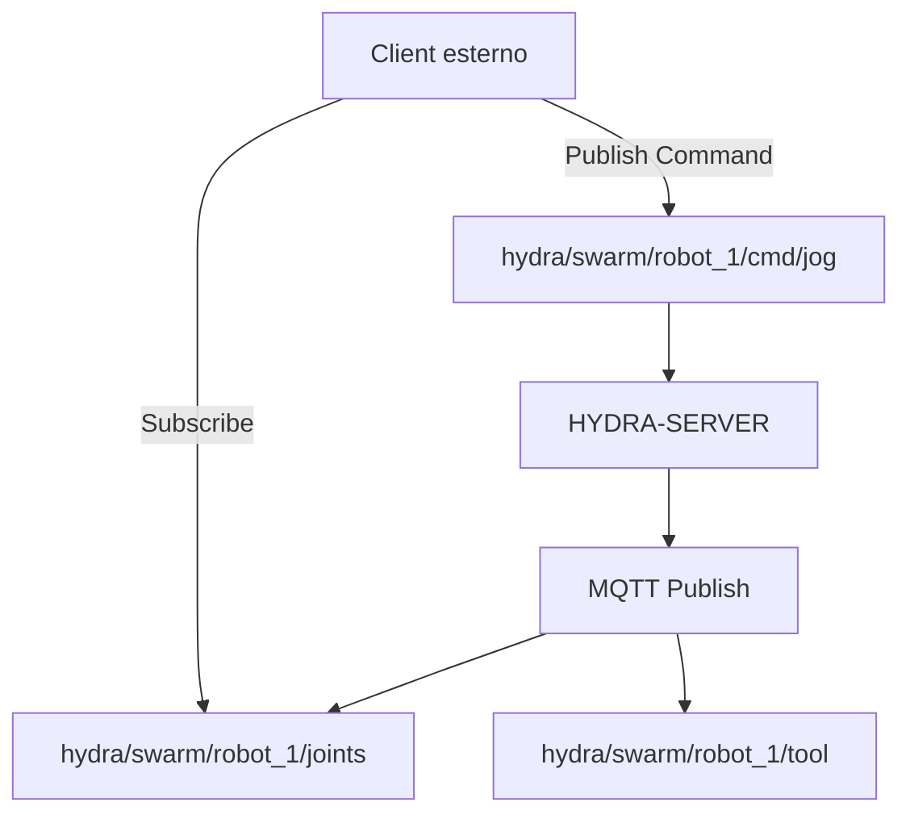

<p align="center">
  
</p>

# 📡 HYDRA-UMC-MQTT-BROKER

<p align="center"><a href="README.md">🇺🇸 English</a> | <a href="README_spa.md">🇪🇸 Español</a> | <a href="README_fra.md">🇫🇷 Français</a> | 🇮🇹 <b>Italiano</b> | <a href="README_deu.md">🇩🇪 Deutsch</a> | <a href="README_zho.md">🇨🇳 简体中文</a> | <a href="README_jpn.md">🇯🇵 日本語</a></p>

### 🚀 Bridge di telemetria leggero per IoT e integrazioni esterne

<p align="left">
  
  
  
</p>

---

## 1. 🛠️ PANORAMICA TECNICA

**HYDRA-UMC-MQTT-BROKER** fornisce un'interfaccia di messaggistica asincrona e leggera per l'ecosistema HYDRA-UMC. Consente a dispositivi IoT esterni, dashboard e sistemi di automazione domestica (come Home Assistant) di sottoscriversi alla telemetria del robot e pubblicare comandi.

Implementa lo standard MQTT 3.1.1 (via Aedes, verificato dal vivo - vedi Architettura più sotto), offrendo una distribuzione dei dati ad alta efficienza con un sovraccarico minimo, rendendolo ideale per app mobili o monitoraggio remoto a bassa larghezza di banda.

### Caratteristiche principali:
* 🔌 **Ponti per Macchine Esterne:** `HYDRA-UMC-BRIDGE-CNC`/`-LASER`/`-OPENPNP`/`-PRINTER3D`/`-ROS2` raggiungono ciascuno questo broker tramite i propri topic `hydra/bridges/<name>/...` - vedi `docs/BRIDGE_TOPICS.md`. *(implementato)*
* 📡 **Telemetria Pub/Sub:** Distribuzione in meno di un millisecondo di angoli dei giunti, stati degli strumenti e salute del sistema.
* 🛠️ **Supporto alla scoperta:** mDNS e auto-scoperta di Home Assistant per una facile configurazione. *(pianificato - non ancora implementato; `src/server.ts` oggi è un semplice listener TCP, senza alcun servizio di discovery)*
* 🔐 **Sicurezza dei topic:** ACL reale e verificabile per prefisso di ID client per la lettura e la scrittura di topic robotici specifici - una SUBSCRIBE con carattere jolly non può mai concedere un accesso più ampio della propria regola. *(implementato)*
* 🪪 **Autenticazione del client:** L'autenticazione MQTT reale e facoltativa con nome utente/password durante CONNECT (`MQTT_AUTH_JSON`) fornisce all'ACL un'identità di sessione verificata. *(implementata; da abbinare all'ACL)*
* 📏 **Limite sulla dimensione del payload:** Un limite reale e opzionale sulla dimensione del payload di PUBLISH, configurabile tramite `MAX_PAYLOAD_BYTES`. *(implementato)*
* ⚡ **Supporto Websocket:** MQTT-over-WebSockets per client basati su browser. *(pianificato - non ancora implementato; oggi è cablato solo TCP semplice sulla porta 1883, vedi `package.json` - ancora nessuna dipendenza `ws`/websocket)*

---

## 2. 🔄 STRUTTURA DEI TOPIC MQTT



**Nota di onestà:** lo schema di topic `hydra/swarm/...` sopra illustra
la forma *prevista* una volta che lo stato proprio di HYDRA-UMC-SERVER
sarà collegato a MQTT - quel collegamento non è ancora cablato (il
commento di intestazione di `src/server.ts` lo dice: "lands once that
wiring is defined"), quindi oggi nulla pubblica su `hydra/swarm/...`. I
topic reali e cablati oggi sono lo spazio dei nomi
`hydra/bridges/<name>/...` dei 5 ponti macchina esterni (vedi
`docs/BRIDGE_TOPICS.md`) e lo schema di topic VDA 5050 proprio di
HYDRA-UMC-BRIDGE-AMR.

---

## 3. 🧱 ARCHITETTURA E DECISIONI DI PROGETTAZIONE

* **Perché è fratello, non un sottomodulo, di HYDRA-UMC-GATEWAY-INDUSTRIAL.** Ogni adattatore di protocollo è un processo distribuibile/riavviabile separatamente - un problema del broker non abbatte mai gli adattatori OPC-UA o MTConnect che girano accanto.
* **Perché un vero broker MQTT, non solo un client che pubblica verso uno esterno.** Possedere il broker significa che il flusso di eventi proprio di questa cella (cambi di stato robot, allarmi) è disponibile per qualsiasi sottoscrittore MQTT sulla rete di fabbrica senza dipendere dal fatto che un broker esterno, gestito separatamente, sia raggiungibile.
* **Perché il punto di ingresso stampa solo identità/versione, e termina dopo che un listener di health-check si avvia.** Fase di andamiaje, stesso motivo del README proprio del genitore - un vero broker è di lunga durata per natura.
* **Come si inserisce nel resto dell'ecosistema.** Un servizio fratello sotto HYDRA-UMC-GATEWAY-INDUSTRIAL - collega il flusso di eventi proprio di HYDRA-UMC-SERVER a veri topic MQTT.
* **Qui è stato trovato e risolto un bug reale: il broker non accettava mai davvero i client.** Aedes 1.x ha spostato la configurazione di persistenza/mqemitter in un passaggio asincrono esplicito `broker.listen()` (un vero cambiamento di API rispetto alla forma factory della 0.x); senza di esso, un `CONNECT` reale raggiungeva il broker tramite un socket TCP reale ma rimaneva bloccato silenziosamente finché non scattava il timeout di connack del client stesso - il broker sembrava "attivo" (la porta accettava connessioni) ma nessun client poteva mai completare una sessione. Trovato tramite un client `mqtt` reale che andava in timeout nei test propri di questo progetto, non per ispezione. `tests/server.test.ts` ora connette una vera libreria client MQTT a un vero broker tramite un vero socket - CONNECT, consegna di PUBLISH, isolamento dei topic e messaggi retained, tutto testato per davvero.
* **Perché l'ACL dei topic verifica l'*ambito* della sottoscrizione, non solo la sovrapposizione del filtro.** La richiesta SUBSCRIBE di un client è essa stessa un filtro e può contenere caratteri jolly `+`/`#` - verificare ingenuamente se "il filtro richiesto si sovrappone a quello consentito" permetterebbe a un client di sottoscriversi con un carattere jolly più ampio (ad es. `hydra/robots/#`) di quanto la sua regola effettivamente conceda (ad es. `hydra/robots/+/status`) e vedere silenziosamente topic per cui non è mai stato autorizzato. `src/acl.ts`, con la sua funzione `isSubscriptionWithinScope()`, esegue invece un controllo reale, segmento per segmento - dimostrato con test reali, incluso uno in cui il tentativo di un robot di ampliare il proprio ambito tramite una SUBSCRIBE con carattere jolly viene negato.
* **Perché una PUBLISH negata chiude l'intera connessione, invece di limitarsi a un NACK su un singolo messaggio.** Questo è il comportamento reale proprio di Aedes (verificato eseguendo un client reale contro di esso, non presunto dalla documentazione) - `authorizePublish`, restituendo un errore, distrugge la connessione del client. Il design dell'ACL/limite di payload qui lavora con questo comportamento, non contro di esso: un client che continua a essere disconnesso per violazione della propria ACL è un segnale chiaro ed evidente per correggere la configurazione di quel dispositivo, non un messaggio scartato in silenzio che potrebbe non notare mai.
* **Perché la configurazione dell'ACL/limite di payload risiede in variabili d'ambiente (`MQTT_ACL_JSON`/`MAX_PAYLOAD_BYTES`), non in un file di configurazione.** Corrisponde alla convenzione `PORT` già esistente in questo progetto (vedi `.env.example`) e al modo in cui viene effettivamente distribuito (ambiente systemd/Docker, non un file montato) - `parseAclConfig()` fa fallire l'avvio in modo rumoroso in caso di JSON malformato invece di funzionare silenziosamente senza protezione.
* **Perché questo broker parla MQTT 3.1.1, non MQTT v5.** `aedes@1.1.1` (la dipendenza fissata) implementa solo MQTT 3.1/3.1.1 - verificato dal vivo connettendo un client `mqtt` reale con `protocolVersion: 5`, che il broker rifiuta attivamente (`Connection refused: Unacceptable protocol version`), e confermato dalla documentazione upstream di Aedes stessa (il supporto MQTT 5.0 vive su un branch separato, non rilasciato). Ogni client di questo ecosistema (i bridge `mqtt_transport.py`, `Vda5050Publisher`, i test propri di questo repo) negozia già solo la 3.1.1, quindi questa è una correzione di documentazione, non un cambiamento di comportamento.

---

## 📂 STRUTTURA DELLE CARTELLE

```text
HYDRA-UMC-MQTT-BROKER/
├── src/         # Codice sorgente (Node/TypeScript - Broker, Bridge, Sicurezza)
├── tests/       # Suite Vitest - ACL, autenticazione e comportamento di broker/bridge
├── docs/        # Documentazione e catalogo dei topic
├── build/       # Output compilato (npm run build)
├── images/      # Media e diagrammi
├── scripts/     # Script di utilità (bump-version.mjs)
├── tools/       # ci_validate.py - validazione manifest/CHANGELOG/docs usata dalla CI
└── README.md
```

Servizio di rete puro, senza hardware proprio - `hardware/`, `firmware/`
e `os/` sono omesse secondo la politica della struttura del repository.

---

## 🛠️ AMBIENTE DI SVILUPPO

### Requisiti
- [Node.js](https://nodejs.org/) (v18 o superiore consigliato)
- npm

### Installazione
```bash
npm install
```

### Modalità Sviluppo
Esegue il broker direttamente con `tsx` (senza bundler):
- **Windows:** doppio clic su `dev.bat` oppure eseguire `npm run dev`
- **Linux/Mac:** eseguire `./dev.sh` oppure `npm run dev`

### Build di Produzione
Impacchetta il broker in un unico file distribuibile con esbuild:
- **Windows:** doppio clic su `build.bat` oppure eseguire `npm run build`
- **Linux/Mac:** eseguire `./build.sh` oppure `npm run build`

Poi avvialo con:
```bash
npm start
```

Il broker resta in ascolto su `0.0.0.0:1883` (MQTT/TCP in chiaro, la porta
predefinita registrata IANA) - punta qualsiasi client MQTT
(`mosquitto_sub`, Home Assistant, MQTT Explorer, ...) a `<host>:1883`.

### Versionamento
Ogni `npm run build` reale incrementa automaticamente il `version` di
`package.json` (`scripts/bump-version.mjs`, primo passo dello script
`build`) - un "contachilometri" in base 10: patch +1 per build, con
riporto a minor (e da minor a major) oltre il 9 invece di raggiungere mai
un segmento a due cifre (`0.0.9` -> `0.1.0`, non `0.0.10`).

---

## 🚀 TABELLA DI MARCIA
* **Fase 1:** Implementazione di OPC-UA Pub/Sub per lo scambio di dati ad alta velocità e bridging di protocolli legacy.
* **Fase 2:** Cluster MQTT Broker per la gestione massiva di dispositivi IoT e alta concorrenza.
* **Fase 3:** Supporto per l'adattatore MTConnect per l'integrazione di macchinari CNC e PLC multi-vendor.
* **Fase 4:** Supporto per la specifica Sparkplug B per l'allineamento con l'IoT industriale e bridge di telemetria unificato.

---

## 🔗 Progetti Correlati

Questo progetto fa parte dell'ecosistema robotico HYDRA-UMC dello stesso autore (JuanenRac / Electro Hobby 3D). Vale la pena conoscerlo, poiché una richiesta potrebbe in realtà riguardare uno di questi invece di questo repository.

**Progetto Padre**
- **[HYDRA-UMC-GATEWAY-INDUSTRIAL](https://github.com/JuanenRac/HYDRA-UMC-GATEWAY-INDUSTRIAL)** — hub di integrazione che inoltra ai protocolli industriali, con un vero livello di allowlist dei comandi/backpressure; il genitore di cui questo repository è un adattatore di protocollo specifico, all'interno del proprio gateway industriale.

**Progetti Fratelli** — gli altri adattatori di protocollo del gateway industriale proprio di HYDRA-UMC-GATEWAY-INDUSTRIAL
- **[HYDRA-UMC-OPCUA-SERVER](https://github.com/JuanenRac/HYDRA-UMC-OPCUA-SERVER)** — vero spazio di indirizzi OPC-UA, verificato con una vera sessione client del protocollo binario.
- **[HYDRA-UMC-MTCONNECT-ADAPTER](https://github.com/JuanenRac/HYDRA-UMC-MTCONNECT-ADAPTER)** — veri endpoint XML `/probe` e `/current` di MTConnect, con output in modalità degradata.

**Direttamente Correlati**
- **[HYDRA-UMC-SERVER](https://github.com/JuanenRac/HYDRA-UMC-SERVER)** — il vero backend headless (REST/WebSocket) con cui parla davvero ogni client di controllo — la fonte dello stato che questo adattatore espone.
- **[HYDRA-UMC-BRIDGE-CNC](https://github.com/JuanenRac/HYDRA-UMC-BRIDGE-CNC)** — coordinatore ad alto livello per celle CNC con accesso reale a stato/byte di controllo GRBL — include il proprio `mqtt_transport.py` che raggiunge questo broker attraverso i propri topic `hydra/bridges/<nome>/...`; vedi il proprio `docs/BRIDGE_TOPICS.md` di questo repository per il catalogo di topic reale e condiviso.
- **[HYDRA-UMC-BRIDGE-LASER](https://github.com/JuanenRac/HYDRA-UMC-BRIDGE-LASER)** — coordinatore di sicurezza per celle laser che legge 3 salvaguardie GPIO reali di chiave/involucro/interblocco — include il proprio `mqtt_transport.py` che raggiunge questo broker attraverso i propri topic `hydra/bridges/<nome>/...`; vedi il proprio `docs/BRIDGE_TOPICS.md` di questo repository per il catalogo di topic reale e condiviso.
- **[HYDRA-UMC-BRIDGE-OPENPNP](https://github.com/JuanenRac/HYDRA-UMC-BRIDGE-OPENPNP)** — coordinatore ad alto livello sicuro per il flusso schede del pick-and-place OpenPnP — include il proprio `mqtt_transport.py` che raggiunge questo broker attraverso i propri topic `hydra/bridges/<nome>/...`; vedi il proprio `docs/BRIDGE_TOPICS.md` di questo repository per il catalogo di topic reale e condiviso.
- **[HYDRA-UMC-BRIDGE-PRINTER3D](https://github.com/JuanenRac/HYDRA-UMC-BRIDGE-PRINTER3D)** — barriera di coordinamento sicura per stampanti 3D Moonraker/Klipper, con comandi di lavoro reali e controllati — include il proprio `mqtt_transport.py` che raggiunge questo broker attraverso i propri topic `hydra/bridges/<nome>/...`; vedi il proprio `docs/BRIDGE_TOPICS.md` di questo repository per il catalogo di topic reale e condiviso.
- **[HYDRA-UMC-BRIDGE-ROS2](https://github.com/JuanenRac/HYDRA-UMC-BRIDGE-ROS2)** — coordinatore di sicurezza con un vero trasporto ROS 2 rclpy, importato in modo lazy — include il proprio `mqtt_transport.py` che raggiunge questo broker attraverso i propri topic `hydra/bridges/<nome>/...`; vedi il proprio `docs/BRIDGE_TOPICS.md` di questo repository per il catalogo di topic reale e condiviso.
- **[HYDRA-UMC-BRIDGE-AMR](https://github.com/JuanenRac/HYDRA-UMC-BRIDGE-AMR)** — barriera di coordinamento per flotte AGV/AMR tramite un publisher MQTT VDA 5050 reale — un diverso client reale dello stesso broker: `Vda5050Publisher` invia dispatch già validati come veri messaggi VDA 5050 `order`/`instantActions`, nella forma di topic propria di VDA 5050 invece dello schema `hydra/bridges/...` usato dagli altri bridge.

**Fa Anche Parte dell'Ecosistema**

*Hardware e Piattaforma di Base*
- **[HYDRA-UMC](https://github.com/JuanenRac/HYDRA-UMC)** — la scheda madre fisica del braccio robotico: host CM5 + coprocessore STM32H745 dual-core, che coordina fino a 8 bracci utensile via CAN-OTA/SPI-OTA.
- **[HYDRA-UMC-OS](https://github.com/JuanenRac/HYDRA-UMC-OS)** — livello prodotto riproducibile su Raspberry Pi OS per il CM5: agente in sola lettura, config/profili validati, provisioning WiFi al primo contatto.
- **[HYDRA-UMC-SDK](https://github.com/JuanenRac/HYDRA-UMC-SDK)** — il contratto JSON-Schema condiviso e la barriera di sicurezza contro cui ogni bridge valida i propri comandi.

*Backend Centrale e Client*
- **[HYDRA-UMC-STUDIO](https://github.com/JuanenRac/HYDRA-UMC-STUDIO)** — dashboard di controllo web con visualizzazione 3D multi-robot in tempo reale.
- **[HYDRA-UMC-SUITE](https://github.com/JuanenRac/HYDRA-UMC-SUITE)** — centro di comando sciame desktop (PySide6) per più server contemporaneamente, pacchettizzato come eseguibile standalone.
- **[HYDRA-UMC-ANDROID-CONTROL](https://github.com/JuanenRac/HYDRA-UMC-ANDROID-CONTROL)** — app di controllo nativa per Android con login biometrico e un companion Wear OS abbinato.
- **[HYDRA-UMC-IOS-CONTROL](https://github.com/JuanenRac/HYDRA-UMC-IOS-CONTROL)** — app di controllo per iOS/iPadOS (Flutter) con sincronizzazione WebSocket in tempo reale.
- **[HYDRA-UMC-DSI](https://github.com/JuanenRac/HYDRA-UMC-DSI)** — interfaccia touch nativa per il touchscreen DSI da 7" a bordo, incorporata direttamente nel CM5.
- **[HYDRA-UMC-EDITOR-URDF](https://github.com/JuanenRac/HYDRA-UMC-EDITOR-URDF)** — creatore/editor grafico desktop di URDF che invia i modelli finiti al catalogo di STUDIO.
- **[HYDRA-UMC-BRIDGE-DROIDS](https://github.com/JuanenRac/HYDRA-UMC-BRIDGE-DROIDS)** — barriera di coordinamento per droidi con zampe/umanoidi, con un vero mittente di comandi per Boston Dynamics Spot.
- **[HYDRA-UMC-BRIDGE-UAV](https://github.com/JuanenRac/HYDRA-UMC-BRIDGE-UAV)** — barriera di coordinamento per UAV dotati di fotocamera, con un vero mittente di comandi MAVLink.

*Piattaforma Strumenti URTC*
- **[URTC](https://github.com/JuanenRac/URTC)** — firmware per la scheda fisica dell'Universal Robot Tool Controller, oltre 25 profili utensile su bus CAN.
- **[URTC-FLASHER](https://github.com/JuanenRac/URTC-FLASHER)** — strumento desktop con GUI per il flashing delle schede URTC, CAN-OTA più SWD/JTAG a chip intero.
- **[URTC-TESTER](https://github.com/JuanenRac/URTC-TESTER)** — strumento desktop di diagnostica CAN-bus dal vivo per schede URTC, un pannello per profilo utensile.
- **[URTC-WEB-STUDIO](https://github.com/JuanenRac/URTC-WEB-STUDIO)** — alternativa basata su browser a URTC-TESTER tramite la Web Serial API, senza installazione locale.

*Nodo IA Visione (Hailo-8)*
- **[HYDRA-UMC-VISION-NODE](https://github.com/JuanenRac/HYDRA-UMC-VISION-NODE)** — hub di integrazione per la pipeline di visione Hailo-8, con un vero controllo di prontezza hardware per fase.
- **[HYDRA-UMC-DETECTION-HEF](https://github.com/JuanenRac/HYDRA-UMC-DETECTION-HEF)** — registro reale di modelli compilati con verifica di caricamento sicuro per architettura Hailo/checksum.
- **[HYDRA-UMC-VISION-STREAMER](https://github.com/JuanenRac/HYDRA-UMC-VISION-STREAMER)** — generatore reale di pipeline GStreamer + config MediaMTX, con una vera barriera di integrazione HailoRT.
- **[HYDRA-UMC-VISUAL-SERVOING-API](https://github.com/JuanenRac/HYDRA-UMC-VISUAL-SERVOING-API)** — vera legge di correzione Position-Based Visual Servoing, con cancello di sicurezza sullo stato di zona a monte.
- **[HYDRA-UMC-SAFETY-ZONES](https://github.com/JuanenRac/HYDRA-UMC-SAFETY-ZONES)** — vero controllo di violazione zona e richiesta E-STOP, con imposizione della freschezza di calibrazione.

*Nodo IA Cognitivo (Hailo-10)*
- **[HYDRA-UMC-COGNITIVE-NODE](https://github.com/JuanenRac/HYDRA-UMC-COGNITIVE-NODE)** — hub di integrazione per la pipeline cognitiva Hailo-10 (orchestrazione LLM/VLA/voce).
- **[HYDRA-UMC-VLA-ENGINE](https://github.com/JuanenRac/HYDRA-UMC-VLA-ENGINE)** — vera codifica/decodifica di token d'azione e generazione di traiettoria per un modello Vision-Language-Action.
- **[HYDRA-UMC-VOICE-UI](https://github.com/JuanenRac/HYDRA-UMC-VOICE-UI)** — vero front-end vocale (VAD + parser di intenti) con un relay verso Watch limitato e soggetto a conferma.
- **[HYDRA-UMC-SEMANTIC-PLANNER](https://github.com/JuanenRac/HYDRA-UMC-SEMANTIC-PLANNER)** — vera scomposizione dei task basata su regole e recupero semantico degli errori sui codici errore MCU.
- **[HYDRA-UMC-DOCS-QA](https://github.com/JuanenRac/HYDRA-UMC-DOCS-QA)** — vera ricerca documentale TF-IDF (solo libreria standard) sui documenti Markdown di questo ecosistema.

*Orchestrazione e Sciame*
- **[HYDRA-UMC-ORCHESTRATOR](https://github.com/JuanenRac/HYDRA-UMC-ORCHESTRATOR)** — hub di integrazione con un vero contratto di health-report gRPC/Protobuf e una macchina a stati di missione.
- **[HYDRA-UMC-JOB-DISPATCHER](https://github.com/JuanenRac/HYDRA-UMC-JOB-DISPATCHER)** — vera coda di lavori basata su priorità con deduplicazione, su una vera API HTTP.
- **[HYDRA-UMC-NODE-HEALING](https://github.com/JuanenRac/HYDRA-UMC-NODE-HEALING)** — vero watchdog di salute della flotta basato su gRPC, con retry/backoff e rilevamento di discrepanza d'identità.
- **[HYDRA-UMC-PATH-PLANNER-3D](https://github.com/JuanenRac/HYDRA-UMC-PATH-PLANNER-3D)** — vero pianificatore di percorsi 3D basato su RRT, con vera validazione delle collisioni ostacolo/spazio di lavoro.
- **[HYDRA-UMC-SWARM-SYNC](https://github.com/JuanenRac/HYDRA-UMC-SWARM-SYNC)** — vera sincronizzazione di stato CRDT LWW-Element-Map, con property test per la convergenza multi-cella.

*Gemello Digitale e Simulazione*
- **[HYDRA-UMC-TWIN](https://github.com/JuanenRac/HYDRA-UMC-TWIN)** — hub di integrazione per il motore di gemello digitale, con un vero contratto di sincronizzazione per compatibilità di versione.
- **[HYDRA-UMC-HIL-BRIDGE](https://github.com/JuanenRac/HYDRA-UMC-HIL-BRIDGE)** — vero interblocco di sicurezza hardware-in-the-loop che instrada i comandi tra simulazione e hardware reale.
- **[HYDRA-UMC-PHYSICS-REPLICA](https://github.com/JuanenRac/HYDRA-UMC-PHYSICS-REPLICA)** — vera cinematica diretta e validazione dei limiti articolari su un vero sottoinsieme URDF.
- **[HYDRA-UMC-SYNTHETIC-DATA-GEN](https://github.com/JuanenRac/HYDRA-UMC-SYNTHETIC-DATA-GEN)** — vero generatore procedurale di scene 2D con esportazione di annotazioni YOLO/COCO.

*Dati e Analisi*
- **[HYDRA-UMC-DATALAKE](https://github.com/JuanenRac/HYDRA-UMC-DATALAKE)** — vero archivio di serie temporali basato su sqlite3, con una vera API HTTP di ingestione/query.
- **[HYDRA-UMC-ANOMALY-DETECTOR](https://github.com/JuanenRac/HYDRA-UMC-ANOMALY-DETECTOR)** — vero rilevatore di anomalie FFT + baseline statistica, con monitoraggio della deriva.
- **[HYDRA-UMC-PRODUCTION-REPORTS](https://github.com/JuanenRac/HYDRA-UMC-PRODUCTION-REPORTS)** — vero calcolo OEE/disponibilità sullo storico di DATALAKE, con esportazione CSV riproducibile.
- **[HYDRA-UMC-TELEMETRY-COLLECTOR](https://github.com/JuanenRac/HYDRA-UMC-TELEMETRY-COLLECTOR)** — vera pipeline di ingestione CAN/WebSocket verso DATALAKE, con deduplicazione per sequenza.

*Strumenti Complementari e Operazioni dell'Ecosistema*
- **[HYDRA-UMC-DASHBOARD-AI](https://github.com/JuanenRac/HYDRA-UMC-DASHBOARD-AI)** — pannelli Smart Summaries e Anomaly Highlighting su DATALAKE/ANOMALY-DETECTOR, con un fallback statistico onesto.
- **[HYDRA-UMC-TOOL-CLI](https://github.com/JuanenRac/HYDRA-UMC-TOOL-CLI)** — CLI di flotta con un vero e stabile contratto di exit-code, un client live reale della stessa API di HYDRA-UMC-SERVER.
- **[HYDRA-UMC-WATCH](https://github.com/JuanenRac/HYDRA-UMC-WATCH)** — app companion WearOS con avvisi aptici reali e un relay vocale verso il telefono abbinato.
- **[URTC-SMART-RACK](https://github.com/JuanenRac/URTC-SMART-RACK)** — firmware per un rack di montaggio schede con decodifica reale dell'ID utensile e logica di preriscaldamento Smart Idle.
- **[URTC-VISION-TOOL](https://github.com/JuanenRac/URTC-VISION-TOOL)** — firmware più un vero companion di visione Python per una testa utensile di ispezione termica/RGB.
- **[HYDRA-UMC-UPDATER](https://github.com/JuanenRac/HYDRA-UMC-UPDATER)** — strumento amministrativo desktop che scopre, clona e aggiorna ogni repository di questo ecosistema.


---

## 📚 Documentazione e Comunità

- **[docs/BRIDGE_TOPICS.md](docs/BRIDGE_TOPICS.md)** — il catalogo reale e condiviso di topic `hydra/bridges/<name>/...` che ogni ponte macchina esterno (CNC/Laser/OpenPnP/Printer3D/ROS2) usa davvero contro questo broker.
- **[CONTRIBUTING.md](CONTRIBUTING.md)** — stack tecnologico e linee guida di codifica per una pull request.
- **[CODE_OF_CONDUCT.md](CODE_OF_CONDUCT.md)** — gli standard di comportamento attesi in questa comunità.
- **[SECURITY.md](SECURITY.md)** — come segnalare una vulnerabilità, e le reali aree di attenzione sulla sicurezza di questo progetto.
- **[SUPPORT.md](SUPPORT.md)** — dove porre domande e segnalare bug.
- **[LICENSE.md](LICENSE.md)** — la licenza propria di questo progetto.

## 👤 AUTORE
**JuanenRac** (Electro Hobby 3D)
📧 electrohobby3d@gmail.com
📺 [youtube.com/@electrohobby3d](https://youtube.com/@electrohobby3d)

## 📜 LICENZA
GPL-3.0 - Vedere LICENSE per i dettagli.
