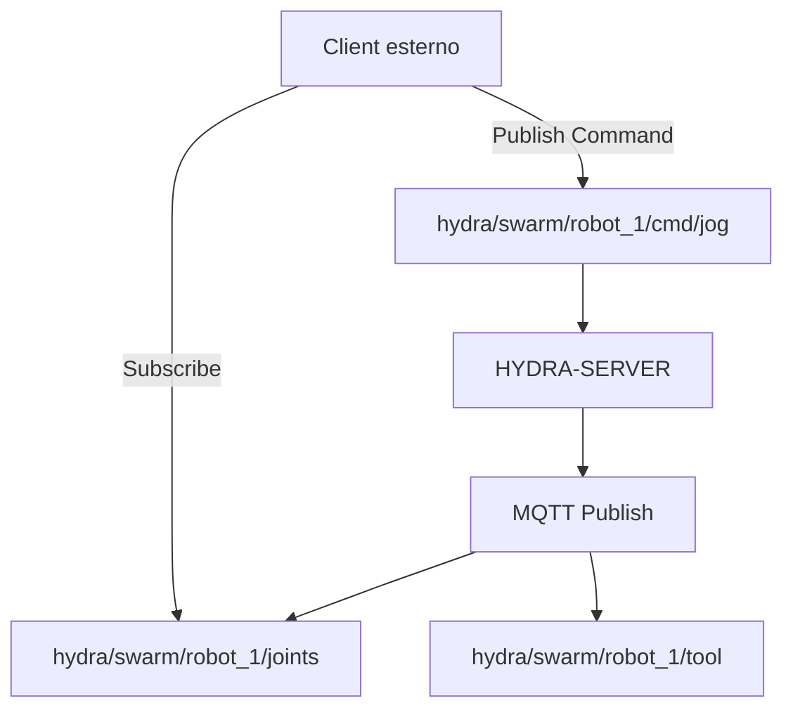

<p align="center">
  
</p>

# 📡 HYDRA-UMC-MQTT-BROKER

<p align="center"><a href="README.md">🇺🇸 English</a> | <a href="README_spa.md">🇪🇸 Español</a> | <a href="README_fra.md">🇫🇷 Français</a> | 🇮🇹 <b>Italiano</b> | <a href="README_deu.md">🇩🇪 Deutsch</a> | <a href="README_zho.md">🇨🇳 简体中文</a> | <a href="README_jpn.md">🇯🇵 日本語</a></p>

### 🚀 Bridge di telemetria leggero per IoT e integrazioni esterne

<p align="left">
  
  
  
</p>

---

## 1. 🛠️ PANORAMICA TECNICA

**HYDRA-UMC-MQTT-BROKER** fornisce un'interfaccia di messaggistica asincrona e leggera per l'ecosistema HYDRA-UMC. Consente a dispositivi IoT esterni, dashboard e sistemi di automazione domestica (come Home Assistant) di sottoscriversi alla telemetria del robot e pubblicare comandi.

Implementa lo standard MQTT v5, offrendo una distribuzione dei dati ad alta efficienza con un sovraccarico minimo, rendendolo ideale per app mobili o monitoraggio remoto a bassa larghezza di banda.

### Caratteristiche principali:
* 📡 **Telemetria Pub/Sub:** Distribuzione in meno di un millisecondo di angoli dei giunti, stati degli strumenti e salute del sistema.
* 🛠️ **Supporto alla scoperta:** mDNS integrato e auto-scoperta di Home Assistant per una facile configurazione.
* 🔐 **Sicurezza dei topic:** ACL reale e verificabile per prefisso di ID client per la lettura e la scrittura di topic robotici specifici - una SUBSCRIBE con carattere jolly non può mai concedere un accesso più ampio della propria regola. *(implementato)*
* 🪪 **Autenticazione del client:** L'autenticazione MQTT reale e facoltativa con nome utente/password durante CONNECT (`MQTT_AUTH_JSON`) fornisce all'ACL un'identità di sessione verificata. *(implementata; da abbinare all'ACL)*
* 📏 **Limite sulla dimensione del payload:** Un limite reale e opzionale sulla dimensione del payload di PUBLISH, configurabile tramite `MAX_PAYLOAD_BYTES`. *(implementato)*
* ⚡ **Supporto Websocket:** MQTT-over-WebSockets integrato per client basati su browser.

---

## 2. 🔄 STRUTTURA DEI TOPIC MQTT



---

## 3. 🧱 ARCHITETTURA E DECISIONI DI PROGETTAZIONE

* **Perché è fratello, non un sottomodulo, di HYDRA-UMC-GATEWAY-INDUSTRIAL.** Ogni adattatore di protocollo è un processo distribuibile/riavviabile separatamente - un problema del broker non abbatte mai gli adattatori OPC-UA o MTConnect che girano accanto.
* **Perché un vero broker MQTT, non solo un client che pubblica verso uno esterno.** Possedere il broker significa che il flusso di eventi proprio di questa cella (cambi di stato robot, allarmi) è disponibile per qualsiasi sottoscrittore MQTT sulla rete di fabbrica senza dipendere dal fatto che un broker esterno, gestito separatamente, sia raggiungibile.
* **Perché il punto di ingresso stampa solo identità/versione, e termina dopo che un listener di health-check si avvia.** Fase di andamiaje, stesso motivo del README proprio del genitore - un vero broker è di lunga durata per natura.
* **Come si inserisce nel resto dell'ecosistema.** Un servizio fratello sotto HYDRA-UMC-GATEWAY-INDUSTRIAL - collega il flusso di eventi proprio di HYDRA-UMC-SERVER a veri topic MQTT.
* **Qui è stato trovato e risolto un bug reale: il broker non accettava mai davvero i client.** Aedes 1.x ha spostato la configurazione di persistenza/mqemitter in un passaggio asincrono esplicito `broker.listen()` (un vero cambiamento di API rispetto alla forma factory della 0.x); senza di esso, un `CONNECT` reale raggiungeva il broker tramite un socket TCP reale ma rimaneva bloccato silenziosamente finché non scattava il timeout di connack del client stesso - il broker sembrava "attivo" (la porta accettava connessioni) ma nessun client poteva mai completare una sessione. Trovato tramite un client `mqtt` reale che andava in timeout nei test propri di questo progetto, non per ispezione. `tests/server.test.ts` ora connette una vera libreria client MQTT a un vero broker tramite un vero socket - CONNECT, consegna di PUBLISH, isolamento dei topic e messaggi retained, tutto testato per davvero.
* **Perché l'ACL dei topic verifica l'*ambito* della sottoscrizione, non solo la sovrapposizione del filtro.** La richiesta SUBSCRIBE di un client è essa stessa un filtro e può contenere caratteri jolly `+`/`#` - verificare ingenuamente se "il filtro richiesto si sovrappone a quello consentito" permetterebbe a un client di sottoscriversi con un carattere jolly più ampio (ad es. `hydra/robots/#`) di quanto la sua regola effettivamente conceda (ad es. `hydra/robots/+/status`) e vedere silenziosamente topic per cui non è mai stato autorizzato. `src/acl.ts`, con la sua funzione `isSubscriptionWithinScope()`, esegue invece un controllo reale, segmento per segmento - dimostrato con test reali, incluso uno in cui il tentativo di un robot di ampliare il proprio ambito tramite una SUBSCRIBE con carattere jolly viene negato.
* **Perché una PUBLISH negata chiude l'intera connessione, invece di limitarsi a un NACK su un singolo messaggio.** Questo è il comportamento reale proprio di Aedes (verificato eseguendo un client reale contro di esso, non presunto dalla documentazione) - `authorizePublish`, restituendo un errore, distrugge la connessione del client. Il design dell'ACL/limite di payload qui lavora con questo comportamento, non contro di esso: un client che continua a essere disconnesso per violazione della propria ACL è un segnale chiaro ed evidente per correggere la configurazione di quel dispositivo, non un messaggio scartato in silenzio che potrebbe non notare mai.
* **Perché la configurazione dell'ACL/limite di payload risiede in variabili d'ambiente (`MQTT_ACL_JSON`/`MAX_PAYLOAD_BYTES`), non in un file di configurazione.** Corrisponde alla convenzione `PORT` già esistente in questo progetto (vedi `.env.example`) e al modo in cui viene effettivamente distribuito (ambiente systemd/Docker, non un file montato) - `parseAclConfig()` fa fallire l'avvio in modo rumoroso in caso di JSON malformato invece di funzionare silenziosamente senza protezione.

---

## 📂 STRUTTURA DELLE CARTELLE

```text
HYDRA-UMC-MQTT-BROKER/
├── src/         # Codice sorgente (Node/TypeScript - Broker, Bridge, Sicurezza)
├── docs/        # Documentazione e catalogo dei topic
├── build/       # Output compilato (npm run build)
├── images/      # Media e diagrammi
├── scripts/     # Script di utilità (bump-version.mjs)
└── README.md
```

Servizio di rete puro, senza hardware proprio - `hardware/`, `firmware/`
e `os/` sono omesse secondo la politica della struttura del repository.

---

## 🛠️ AMBIENTE DI SVILUPPO

### Requisiti
- [Node.js](https://nodejs.org/) (v18 o superiore consigliato)
- npm

### Installazione
```bash
npm install
```

### Modalità Sviluppo
Esegue il broker direttamente con `tsx` (senza bundler):
- **Windows:** doppio clic su `dev.bat` oppure eseguire `npm run dev`
- **Linux/Mac:** eseguire `./dev.sh` oppure `npm run dev`

### Build di Produzione
Impacchetta il broker in un unico file distribuibile con esbuild:
- **Windows:** doppio clic su `build.bat` oppure eseguire `npm run build`
- **Linux/Mac:** eseguire `./build.sh` oppure `npm run build`

Poi avvialo con:
```bash
npm start
```

Il broker resta in ascolto su `0.0.0.0:1883` (MQTT/TCP in chiaro, la porta
predefinita registrata IANA) - punta qualsiasi client MQTT
(`mosquitto_sub`, Home Assistant, MQTT Explorer, ...) a `<host>:1883`.

### Versionamento
Ogni `npm run build` reale incrementa automaticamente il `version` di
`package.json` (`scripts/bump-version.mjs`, primo passo dello script
`build`) - un "contachilometri" in base 10: patch +1 per build, con
riporto a minor (e da minor a major) oltre il 9 invece di raggiungere mai
un segmento a due cifre (`0.0.9` -> `0.1.0`, non `0.0.10`).

---

## 🚀 ROADMAP
* **Fase 1:** Implementazione di OPC-UA Pub/Sub per lo scambio di dati ad alta velocità e bridging di protocolli legacy.
* **Fase 2:** Cluster MQTT Broker per la gestione massiva di dispositivi IoT e alta concorrenza.
* **Fase 3:** Supporto per l'adattatore MTConnect per l'integrazione di macchinari CNC e PLC multi-vendor.
* **Fase 4:** Supporto per la specifica Sparkplug B per l'allineamento con l'IoT industriale e bridge di telemetria unificato.

---

## 🔗 Progetti Correlati

Questo progetto fa parte di un ecosistema robotico più ampio dello stesso autore (JuanenRac / Electro Hobby 3D), che copre firmware, software di controllo, nodi IA e strumenti di flotta. Utile saperlo, perché una richiesta potrebbe in realtà riguardare uno di questi progetti anziché questo repository.

### Famiglia

**Genitore:** **[HYDRA-UMC-GATEWAY-INDUSTRIAL](https://github.com/JuanenRac/HYDRA-UMC-GATEWAY-INDUSTRIAL)** — il genitore di integrazione a cui si collega questo adattatore MQTT.

**Fratelli:**
- **[HYDRA-UMC-OPCUA-SERVER](https://github.com/JuanenRac/HYDRA-UMC-OPCUA-SERVER)** — adattatore di protocollo fratello, stesso genitore.
- **[HYDRA-UMC-MTCONNECT-ADAPTER](https://github.com/JuanenRac/HYDRA-UMC-MTCONNECT-ADAPTER)** — adattatore di protocollo fratello, stesso genitore.

### Relazione Diretta (fuori dalla famiglia)

- **[HYDRA-UMC-SERVER](https://github.com/JuanenRac/HYDRA-UMC-SERVER)** — la fonte dello stato esposto da questo adattatore.

### Resto dell'Ecosistema

**Piattaforma HYDRA-UMC** — la cella di micro-fabbrica multi-robot
- **[HYDRA-UMC](https://github.com/JuanenRac/HYDRA-UMC)** — la scheda madre CM5 + STM32H745 che orchestra fino a 8 bracci robotici.
- **[HYDRA-UMC-SERVER](https://github.com/JuanenRac/HYDRA-UMC-SERVER)** — il backend Express/WebSocket con cui parla ogni client di controllo.
- **[HYDRA-UMC-STUDIO](https://github.com/JuanenRac/HYDRA-UMC-STUDIO)** — dashboard di controllo web, visualizzazione 3D multi-robot.
- **[HYDRA-UMC-ANDROID-CONTROL](https://github.com/JuanenRac/HYDRA-UMC-ANDROID-CONTROL)** — app di controllo Android via Wi-Fi/Bluetooth.
- **[HYDRA-UMC-IOS-CONTROL](https://github.com/JuanenRac/HYDRA-UMC-IOS-CONTROL)** — app di controllo iOS/iPadOS costruita in Flutter.
- **[HYDRA-UMC-SUITE](https://github.com/JuanenRac/HYDRA-UMC-SUITE)** — centro di comando sciame desktop (Python/PySide6).
- **[HYDRA-UMC-EDITOR-URDF](https://github.com/JuanenRac/HYDRA-UMC-EDITOR-URDF)** — editor desktop di modelli URDF per il catalogo robot.
- **[HYDRA-UMC-DSI](https://github.com/JuanenRac/HYDRA-UMC-DSI)** — interfaccia touch nativa per lo schermo DSI a bordo.

**Piattaforma URTC** — il controller della testa utensile che ogni braccio HYDRA-UMC porta con sé
- **[URTC](https://github.com/JuanenRac/URTC)** — controller testa utensile su bus CAN, 25 profili utensile.
- **[URTC-FLASHER](https://github.com/JuanenRac/URTC-FLASHER)** — strumento desktop di flashing CAN-OTA + SWD/JTAG.
- **[URTC-TESTER](https://github.com/JuanenRac/URTC-TESTER)** — strumento desktop di diagnostica CAN live.
- **[URTC-WEB-STUDIO](https://github.com/JuanenRac/URTC-WEB-STUDIO)** — alternativa basata su browser via Web Serial API.

**🎥 Vision AI Node (Hailo-8)**
- [HYDRA-UMC-VISION-NODE](https://github.com/JuanenRac/HYDRA-UMC-VISION-NODE)
- [HYDRA-UMC-VISION-STREAMER](https://github.com/JuanenRac/HYDRA-UMC-VISION-STREAMER)
- [HYDRA-UMC-DETECTION-HEF](https://github.com/JuanenRac/HYDRA-UMC-DETECTION-HEF)
- [HYDRA-UMC-SAFETY-ZONES](https://github.com/JuanenRac/HYDRA-UMC-SAFETY-ZONES)
- [HYDRA-UMC-VISUAL-SERVOING-API](https://github.com/JuanenRac/HYDRA-UMC-VISUAL-SERVOING-API)

**🧠 Cognitive AI Node (Hailo-10)**
- [HYDRA-UMC-COGNITIVE-NODE](https://github.com/JuanenRac/HYDRA-UMC-COGNITIVE-NODE)
- [HYDRA-UMC-VLA-ENGINE](https://github.com/JuanenRac/HYDRA-UMC-VLA-ENGINE)
- [HYDRA-UMC-VOICE-UI](https://github.com/JuanenRac/HYDRA-UMC-VOICE-UI)
- [HYDRA-UMC-SEMANTIC-PLANNER](https://github.com/JuanenRac/HYDRA-UMC-SEMANTIC-PLANNER)
- [HYDRA-UMC-DOCS-QA](https://github.com/JuanenRac/HYDRA-UMC-DOCS-QA)

**🐝 Orchestration & Swarm**
- [HYDRA-UMC-ORCHESTRATOR](https://github.com/JuanenRac/HYDRA-UMC-ORCHESTRATOR)
- [HYDRA-UMC-SWARM-SYNC](https://github.com/JuanenRac/HYDRA-UMC-SWARM-SYNC)
- [HYDRA-UMC-PATH-PLANNER-3D](https://github.com/JuanenRac/HYDRA-UMC-PATH-PLANNER-3D)
- [HYDRA-UMC-JOB-DISPATCHER](https://github.com/JuanenRac/HYDRA-UMC-JOB-DISPATCHER)
- [HYDRA-UMC-NODE-HEALING](https://github.com/JuanenRac/HYDRA-UMC-NODE-HEALING)

**🎮 Digital Twin & Simulation**
- [HYDRA-UMC-TWIN](https://github.com/JuanenRac/HYDRA-UMC-TWIN)
- [HYDRA-UMC-PHYSICS-REPLICA](https://github.com/JuanenRac/HYDRA-UMC-PHYSICS-REPLICA)
- [HYDRA-UMC-HIL-BRIDGE](https://github.com/JuanenRac/HYDRA-UMC-HIL-BRIDGE)
- [HYDRA-UMC-SYNTHETIC-DATA-GEN](https://github.com/JuanenRac/HYDRA-UMC-SYNTHETIC-DATA-GEN)

**📊 Data & Analytics**
- [HYDRA-UMC-DATALAKE](https://github.com/JuanenRac/HYDRA-UMC-DATALAKE)
- [HYDRA-UMC-TELEMETRY-COLLECTOR](https://github.com/JuanenRac/HYDRA-UMC-TELEMETRY-COLLECTOR)
- [HYDRA-UMC-ANOMALY-DETECTOR](https://github.com/JuanenRac/HYDRA-UMC-ANOMALY-DETECTOR)
- [HYDRA-UMC-PRODUCTION-REPORTS](https://github.com/JuanenRac/HYDRA-UMC-PRODUCTION-REPORTS)

**🛠️ Complementary Tools**
- [URTC-SMART-RACK](https://github.com/JuanenRac/URTC-SMART-RACK)
- [URTC-VISION-TOOL](https://github.com/JuanenRac/URTC-VISION-TOOL)
- [HYDRA-UMC-WATCH](https://github.com/JuanenRac/HYDRA-UMC-WATCH)
- [HYDRA-UMC-TOOL-CLI](https://github.com/JuanenRac/HYDRA-UMC-TOOL-CLI)
- [HYDRA-UMC-DASHBOARD-AI](https://github.com/JuanenRac/HYDRA-UMC-DASHBOARD-AI)


## 👤 AUTORE
**JuanenRac** (Electro Hobby 3D)
📧 electrohobby3d@gmail.com

## 📜 LICENZA
GPL-3.0 - Vedere LICENSE per i dettagli.
