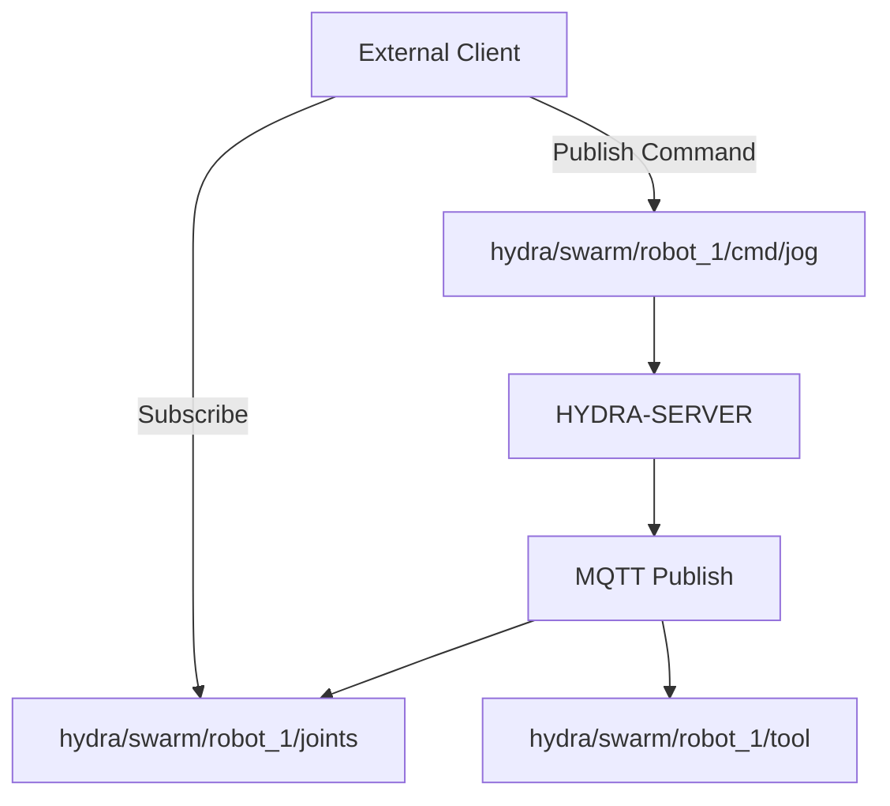

<p align="center">
  
</p>

# 📡 HYDRA-UMC-MQTT-BROKER

<p align="center"><a href="README.md">🇺🇸 English</a> | <a href="README_spa.md">🇪🇸 Español</a> | <a href="README_fra.md">🇫🇷 Français</a> | <a href="README_ita.md">🇮🇹 Italiano</a> | <a href="README_deu.md">🇩🇪 Deutsch</a> | <a href="README_zho.md">🇨🇳 简体中文</a> | 🇯🇵 <b>日本語</b></p>

### 🚀 IoT および外部統合向けの軽量テレメトリブリッジ

<p align="left">
  
  
  
</p>

---

## 1. 🛠️ 技術概要

**HYDRA-UMC-MQTT-BROKER** は、HYDRA-UMC エコシステム向けの軽量な非同期
メッセージングインターフェースを提供します。外部の IoT デバイス、
ダッシュボード、ホームオートメーションシステム（Home Assistant など）
がロボットのテレメトリを購読し、コマンドを発行できるようにします。

MQTT v5 標準を実装しており、最小限のオーバーヘッドで高効率なデータ
配信を提供します。モバイルアプリや低帯域幅のリモート監視に最適です。

### 主な機能：
* 🔌 **外部マシンブリッジ:** `HYDRA-UMC-BRIDGE-CNC`/`-LASER`/`-OPENPNP`/`-PRINTER3D`/`-ROS2` はそれぞれ、独自の `hydra/bridges/<name>/...` トピックを通じてこのブローカーに到達する —— `docs/BRIDGE_TOPICS.md` を参照。*(実装済み)*
* 📡 **パブリッシュ/サブスクライブ テレメトリ：** 関節角度、工具状態、システムの健全性のサブミリ秒単位の配信。
* 🛠️ **ディスカバリーサポート：** 統合された mDNS と Home Assistant 自動検出により、簡単にセットアップできます。
* 🔐 **トピックセキュリティ：** 特定のロボットトピックの読み書きに対する、クライアント ID プレフィックスごとの実際に検証可能な ACL——ワイルドカードを使った SUBSCRIBE が、そのルールより広いアクセス権を得ることは決してありません。*(実装済み)*
* 🪪 **クライアント認証：** 任意の MQTT CONNECT ユーザー名/パスワード認証（`MQTT_AUTH_JSON`）により、ACL に検証済みのセッション ID を提供します。*(実装済み。ACL と組み合わせて使用)*
* 📏 **ペイロードサイズ制限：** PUBLISH のペイロードサイズに対する実際のオプトイン方式の上限で、`MAX_PAYLOAD_BYTES` で設定可能です。*(実装済み)*
* ⚡ **WebSocket サポート：** ブラウザベースのクライアント向けに統合された MQTT over WebSocket。

---

## 2. 🔄 MQTT トピック構造



---

## 3. 🧱 アーキテクチャと設計上の決定

* **HYDRA-UMC-GATEWAY-INDUSTRIAL のサブモジュールではなく兄弟プロジェクトである理由。** 各プロトコルアダプターは個別にデプロイ/再起動可能なプロセスです——ブローカーの問題が、それと並行して動作する OPC-UA や MTConnect アダプターをダウンさせることは決してありません。
* **外部ブローカーに発行するクライアントではなく、実際の MQTT ブローカーである理由。** ブローカー自体を所有することで、このセル自身のイベントストリーム（ロボットの状態変化、アラーム）が、外部管理された別のブローカーが到達可能であることに依存することなく、工場ネットワーク上の任意の MQTT サブスクライバーに提供されます。
* **エントリポイントが今日は身元/バージョンのみを表示し、ヘルスチェックリスナーが起動した後で終了する理由。** 足場（アンダミアヘ、スキャフォールディング）段階にあり、親プロジェクト自身の README と同じ理由です——実際のブローカーはその性質上長時間稼働します。
* **エコシステムの他の部分との関係。** HYDRA-UMC-GATEWAY-INDUSTRIAL の下の兄弟サービスです——HYDRA-UMC-SERVER 自身のイベントストリームを実際の MQTT トピックへとブリッジします。
* **ここで実際のバグが発見され、修正されました：ブローカーは実際には一度もクライアントを受け入れていませんでした。** Aedes 1.x では永続化/mqemitter のセットアップが明示的な非同期ステップ `broker.listen()` に移されました（0.x のファクトリ関数形式からの実際の API 変更）。これを呼ばないと、実際の `CONNECT` は実際の TCP ソケット経由でブローカーに到達するものの、クライアント自身の connack タイムアウトが発火するまで静かにハングし続けます——ブローカーは「稼働中」に見えました（ポートは接続を受け付けていました）が、どのクライアントも実際にはセッションを完了できませんでした。これは本プロジェクト自身のテストで実際の `mqtt` クライアントがタイムアウトしたことから発見されたものであり、コードの検査によるものではありません。`tests/server.test.ts` は現在、実際の MQTT クライアントライブラリを実際のソケット経由で実際のブローカーに接続します——CONNECT、PUBLISH の配信、トピックの分離、保持メッセージ、すべて実際にテストされています。
* **トピック ACL がフィルターの重なりだけでなく、サブスクリプションの*スコープ*を検証する理由。** クライアント自身の SUBSCRIBE リクエストはそれ自体がフィルターであり、`+`/`#` のワイルドカードを含むことができます——「要求されたフィルターが許可されたフィルターと重なっているか」を単純に確認するだけでは、クライアントが自身のルールが実際に許可する範囲（例：`hydra/robots/+/status`）よりも広いワイルドカード（例：`hydra/robots/#`）でサブスクライブし、決して認可されていないトピックを気づかれずに閲覧できてしまいます。`src/acl.ts` の `isSubscriptionWithinScope()` は、その代わりに実際にセグメントごとの検証を行います——これは実際のテストで証明されており、その中にはロボット自身がワイルドカード SUBSCRIBE で自分のスコープを拡大しようとする試みが拒否されるテストも含まれています。
* **拒否された PUBLISH が、1 件のメッセージを NACK するだけでなく、接続全体を閉じる理由。** これは Aedes 自身の実際の挙動です（ドキュメントから推測したのではなく、実際のクライアントをそれに対して実行して検証済みです）——`authorizePublish` がエラーを返すと、クライアントの接続が破棄されます。ここでの ACL/ペイロード制限の設計は、この挙動に逆らうのではなく、それに合わせています。ACL 違反によって繰り返し切断されるクライアントは、そのデバイスの設定を修正すべきだという明確で分かりやすいシグナルであり、気づかれないまま静かに破棄されるメッセージではありません。
* **ACL/ペイロード制限の設定が、設定ファイルではなく環境変数（`MQTT_ACL_JSON`/`MAX_PAYLOAD_BYTES`）にある理由。** これは本プロジェクトの既存の `PORT` の慣例（`.env.example` を参照）や、実際のデプロイ方法（マウントされたファイルではなく、systemd/Docker の環境変数）に一致しています——`parseAclConfig()` は、不正な形式の JSON に対して静かに無防備なまま起動するのではなく、起動時に大きな失敗として検出します。

---

## 📂 リポジトリ構成

```text
HYDRA-UMC-MQTT-BROKER/
├── src/         # ソースコード（Node/TypeScript —— ブローカー、ブリッジ、セキュリティ）
├── tests/       # Vitest スイート —— ACL、認証、ブローカー/ブリッジの動作
├── docs/        # ドキュメントとトピックカタログ
├── build/       # コンパイル出力（npm run build）
├── images/      # メディアと図表
├── scripts/     # ユーティリティスクリプト（bump-version.mjs）
├── tools/       # ci_validate.py —— CI が使用する manifest/CHANGELOG/docs の検証
└── README.md
```

純粋なネットワークサービスであり、独自の専用ハードウェアを持ちません
——`hardware/`、`firmware/`、`os/` は元のプロジェクトテンプレートから
省略されており、リポジトリ構造ポリシーに従っています。

---

## 🛠️ 開発環境

### 必要条件
- [Node.js](https://nodejs.org/)（v18 以上を推奨）
- npm

### インストール
```bash
npm install
```

### 開発モード
`tsx` を使用してブローカーを直接実行します（バンドラーなし）：
- **Windows：** `dev.bat` をダブルクリックするか、`npm run dev` を実行
- **Linux/Mac：** `./dev.sh` または `npm run dev` を実行

### プロダクションビルド
esbuild を使用してブローカーを単一のデプロイ可能なファイルにバンドル
します：
- **Windows：** `build.bat` をダブルクリックするか、`npm run build` を実行
- **Linux/Mac：** `./build.sh` または `npm run build` を実行

その後、次のコマンドで起動します：
```bash
npm start
```

ブローカーは `0.0.0.0:1883`（プレーンな MQTT/TCP、IANA に登録された
デフォルトポート）でリッスンします——任意の MQTT クライアント
（`mosquitto_sub`、Home Assistant、MQTT Explorer など）を
`<host>:1883` に向けてください。

### バージョン管理
実際の `npm run build` のたびに、`package.json` 自身の `version` が
自動的に増加します（`scripts/bump-version.mjs`、`build` スクリプトの
最初のステップとして接続）——10 進法の「オドメーター」方式：ビルド
ごとに patch を +1 し、9 を超えると minor に繰り上がり（minor が 9 を
超えると major に繰り上がる）、2 桁のセグメントに到達することはあり
ません（`0.0.9` -> `0.1.0`、`0.0.10` にはなりません）。

---

## 🚀 ロードマップ
* **フェーズ 1：** 高速データ交換とレガシープロトコルブリッジングのための OPC-UA パブリッシュ/サブスクライブ実装。
* **フェーズ 2：** 大量の IoT デバイス管理と高い並行性のための MQTT Broker クラスター。
* **フェーズ 3：** マルチベンダーの CNC および PLC 機械統合のための MTConnect アダプターサポート。
* **フェーズ 4：** 産業用 IoT との整合性のための Sparkplug B 仕様サポートと統一テレメトリブリッジ。

---

## 🔗 関連プロジェクト

本プロジェクトは、同じ作者(JuanenRac / Electro Hobby 3D)による HYDRA-UMC ロボティクスエコシステムの一部です。リクエストが実はこの中のどれかについてのものである可能性があるため、知っておく価値があります。

**親プロジェクト**
- **[HYDRA-UMC-GATEWAY-INDUSTRIAL](https://github.com/JuanenRac/HYDRA-UMC-GATEWAY-INDUSTRIAL)** — 実際のコマンド許可リスト/バックプレッシャー層を持つ、産業用プロトコルへ中継する統合ハブ。本リポジトリは、その自身の産業用ゲートウェイ内における特定のプロトコルアダプターとして、この親の一部を成す。

**兄弟プロジェクト** —— HYDRA-UMC-GATEWAY-INDUSTRIAL 自身の産業用ゲートウェイにおける他のプロトコルアダプター
- **[HYDRA-UMC-OPCUA-SERVER](https://github.com/JuanenRac/HYDRA-UMC-OPCUA-SERVER)** — 実際のバイナリプロトコルクライアントセッションで検証された、実際の OPC-UA アドレス空間。
- **[HYDRA-UMC-MTCONNECT-ADAPTER](https://github.com/JuanenRac/HYDRA-UMC-MTCONNECT-ADAPTER)** — 縮退モード出力を備えた、実際の MTConnect `/probe` および `/current` XML エンドポイント。

**直接関連**
- **[HYDRA-UMC-SERVER](https://github.com/JuanenRac/HYDRA-UMC-SERVER)** — すべての制御クライアントが実際に通信する、本物のヘッドレスバックエンド(REST/WebSocket) ——本アダプターが公開する状態の情報源。
- **[HYDRA-UMC-BRIDGE-CNC](https://github.com/JuanenRac/HYDRA-UMC-BRIDGE-CNC)** — 実際の GRBL ステータス/制御バイトへのアクセスを持つ、CNC セルの高レベルコーディネーター ——それぞれが自身の `mqtt_transport.py` を備え、自身の `hydra/bridges/<name>/...` トピック経由でこのブローカーに到達する。実際の共有トピックカタログは本リポジトリ自身の `docs/BRIDGE_TOPICS.md` を参照。
- **[HYDRA-UMC-BRIDGE-LASER](https://github.com/JuanenRac/HYDRA-UMC-BRIDGE-LASER)** — 実際のキー/筐体/インターロック GPIO セーフガード 3 系統を読み取る、レーザーセルの安全コーディネーター ——それぞれが自身の `mqtt_transport.py` を備え、自身の `hydra/bridges/<name>/...` トピック経由でこのブローカーに到達する。実際の共有トピックカタログは本リポジトリ自身の `docs/BRIDGE_TOPICS.md` を参照。
- **[HYDRA-UMC-BRIDGE-OPENPNP](https://github.com/JuanenRac/HYDRA-UMC-BRIDGE-OPENPNP)** — OpenPnP ピックアンドプレースの基板フローを安全に統括する高レベルコーディネーター ——それぞれが自身の `mqtt_transport.py` を備え、自身の `hydra/bridges/<name>/...` トピック経由でこのブローカーに到達する。実際の共有トピックカタログは本リポジトリ自身の `docs/BRIDGE_TOPICS.md` を参照。
- **[HYDRA-UMC-BRIDGE-PRINTER3D](https://github.com/JuanenRac/HYDRA-UMC-BRIDGE-PRINTER3D)** — 実際にゲート制御されたジョブコマンドを持つ、Moonraker/Klipper 3D プリンター向けの安全な調整境界 ——それぞれが自身の `mqtt_transport.py` を備え、自身の `hydra/bridges/<name>/...` トピック経由でこのブローカーに到達する。実際の共有トピックカタログは本リポジトリ自身の `docs/BRIDGE_TOPICS.md` を参照。
- **[HYDRA-UMC-BRIDGE-ROS2](https://github.com/JuanenRac/HYDRA-UMC-BRIDGE-ROS2)** — 実際の遅延インポート rclpy ROS 2 トランスポートを持つ安全コーディネーター ——それぞれが自身の `mqtt_transport.py` を備え、自身の `hydra/bridges/<name>/...` トピック経由でこのブローカーに到達する。実際の共有トピックカタログは本リポジトリ自身の `docs/BRIDGE_TOPICS.md` を参照。
- **[HYDRA-UMC-BRIDGE-AMR](https://github.com/JuanenRac/HYDRA-UMC-BRIDGE-AMR)** — 実際の VDA 5050 MQTT パブリッシャーによる AGV/AMR フリートの調整境界 ——同じブローカーの別の実際のクライアント。`Vda5050Publisher` は、他のブリッジが使う `hydra/bridges/...` 方式ではなく VDA 5050 自体のトピック形式で、ゲートを通過済みのディスパッチを実際の VDA 5050 `order`/`instantActions` メッセージとして送信する。

**エコシステムの他のプロジェクト**

*コアハードウェア&プラットフォーム*
- **[HYDRA-UMC](https://github.com/JuanenRac/HYDRA-UMC)** — 実際のロボットアームのマザーボード——CM5 ホスト + デュアルコア STM32H745、CAN-OTA/SPI-OTA 経由で最大 8 本のツールアームを統括。
- **[HYDRA-UMC-OS](https://github.com/JuanenRac/HYDRA-UMC-OS)** — CM5 向けの再現可能な Raspberry Pi OS プロダクト層——読み取り専用エージェント、検証済み設定/プロファイル、WiFi 初回接続プロビジョニング。
- **[HYDRA-UMC-SDK](https://github.com/JuanenRac/HYDRA-UMC-SDK)** — すべてのブリッジが自身のコマンドを検証する共有 JSON-Schema 契約と安全ゲートの境界。

*コアバックエンド&クライアント*
- **[HYDRA-UMC-STUDIO](https://github.com/JuanenRac/HYDRA-UMC-STUDIO)** — リアルタイムのマルチロボット 3D 可視化を備えたウェブ制御ダッシュボード。
- **[HYDRA-UMC-SUITE](https://github.com/JuanenRac/HYDRA-UMC-SUITE)** — 複数のサーバーを同時に扱えるデスクトップ(PySide6)スウォームコマンドセンター、スタンドアロン実行ファイルとしてパッケージ化。
- **[HYDRA-UMC-ANDROID-CONTROL](https://github.com/JuanenRac/HYDRA-UMC-ANDROID-CONTROL)** — 生体認証ログインとペアリングされた Wear OS コンパニオンを備えたネイティブ Android 制御アプリ。
- **[HYDRA-UMC-IOS-CONTROL](https://github.com/JuanenRac/HYDRA-UMC-IOS-CONTROL)** — リアルタイム WebSocket 同期を備えた iOS/iPadOS 制御アプリ(Flutter)。
- **[HYDRA-UMC-DSI](https://github.com/JuanenRac/HYDRA-UMC-DSI)** — 本体搭載の 7 インチ DSI タッチスクリーン向けネイティブタッチ UI、CM5 自体に組み込み。
- **[HYDRA-UMC-EDITOR-URDF](https://github.com/JuanenRac/HYDRA-UMC-EDITOR-URDF)** — 完成したモデルを STUDIO 自身のカタログへ送信するデスクトップ用グラフィカル URDF 作成/編集ツール。
- **[HYDRA-UMC-BRIDGE-DROIDS](https://github.com/JuanenRac/HYDRA-UMC-BRIDGE-DROIDS)** — 実際の Boston Dynamics Spot コマンド送信機能を持つ、脚型/ヒューマノイドドロイドの調整境界。
- **[HYDRA-UMC-BRIDGE-UAV](https://github.com/JuanenRac/HYDRA-UMC-BRIDGE-UAV)** — 実際の MAVLink コマンド送信機能を持つ、カメラ搭載 UAV の調整境界。

*URTC ツールプラットフォーム*
- **[URTC](https://github.com/JuanenRac/URTC)** — 物理的な Universal Robot Tool Controller 基板向けファームウェア、CAN バス経由の 25 以上のツールプロファイル。
- **[URTC-FLASHER](https://github.com/JuanenRac/URTC-FLASHER)** — URTC 基板用のデスクトップ GUI 書き込みツール、CAN-OTA およびフルチップ SWD/JTAG。
- **[URTC-TESTER](https://github.com/JuanenRac/URTC-TESTER)** — URTC 基板向けのデスクトップ CAN バスライブ診断ツール、ツールプロファイルごとに 1 パネル。
- **[URTC-WEB-STUDIO](https://github.com/JuanenRac/URTC-WEB-STUDIO)** — Web Serial API を使ったブラウザベースの URTC-TESTER の代替、ローカルインストール不要。

*ビジョン AI ノード(Hailo-8)*
- **[HYDRA-UMC-VISION-NODE](https://github.com/JuanenRac/HYDRA-UMC-VISION-NODE)** — Hailo-8 ビジョンパイプラインの統合ハブ、段階ごとの実際のハードウェア準備状況チェック付き。
- **[HYDRA-UMC-DETECTION-HEF](https://github.com/JuanenRac/HYDRA-UMC-DETECTION-HEF)** — Hailo アーキテクチャ/チェックサムによる安全読み込み検証を備えた、実際のコンパイル済みモデルレジストリ。
- **[HYDRA-UMC-VISION-STREAMER](https://github.com/JuanenRac/HYDRA-UMC-VISION-STREAMER)** — 実際の HailoRT 統合境界を持つ、実際の GStreamer パイプライン + MediaMTX 設定生成器。
- **[HYDRA-UMC-VISUAL-SERVOING-API](https://github.com/JuanenRac/HYDRA-UMC-VISUAL-SERVOING-API)** — 上流のゾーン状態に応じて安全ゲート制御される、実際の Position-Based Visual Servoing 補正則。
- **[HYDRA-UMC-SAFETY-ZONES](https://github.com/JuanenRac/HYDRA-UMC-SAFETY-ZONES)** — キャリブレーションの鮮度を強制する、実際のゾーン侵入チェックと E-STOP 要求。

*コグニティブ AI ノード(Hailo-10)*
- **[HYDRA-UMC-COGNITIVE-NODE](https://github.com/JuanenRac/HYDRA-UMC-COGNITIVE-NODE)** — Hailo-10 コグニティブパイプライン(LLM/VLA/音声オーケストレーション)の統合ハブ。
- **[HYDRA-UMC-VLA-ENGINE](https://github.com/JuanenRac/HYDRA-UMC-VLA-ENGINE)** — Vision-Language-Action モデル向けの、実際のアクショントークンのエンコード/デコードと軌道生成。
- **[HYDRA-UMC-VOICE-UI](https://github.com/JuanenRac/HYDRA-UMC-VOICE-UI)** — 確認ゲート付きの限定的な Watch リレーを備えた、実際の音声フロントエンド(VAD + 意図解析)。
- **[HYDRA-UMC-SEMANTIC-PLANNER](https://github.com/JuanenRac/HYDRA-UMC-SEMANTIC-PLANNER)** — MCU エラーコードに対する、実際のルールベースのタスク分解と意味的エラー復旧。
- **[HYDRA-UMC-DOCS-QA](https://github.com/JuanenRac/HYDRA-UMC-DOCS-QA)** — このエコシステム自身の Markdown ドキュメントに対する、標準ライブラリのみの実際の TF-IDF 文書検索。

*オーケストレーション&スウォーム*
- **[HYDRA-UMC-ORCHESTRATOR](https://github.com/JuanenRac/HYDRA-UMC-ORCHESTRATOR)** — 実際の gRPC/Protobuf ヘルスレポート契約とミッションステートマシンを持つ統合ハブ。
- **[HYDRA-UMC-JOB-DISPATCHER](https://github.com/JuanenRac/HYDRA-UMC-JOB-DISPATCHER)** — 実際の HTTP API 上に構築された、優先度ベースの実際のジョブキュー(重複排除付き)。
- **[HYDRA-UMC-NODE-HEALING](https://github.com/JuanenRac/HYDRA-UMC-NODE-HEALING)** — リトライ/バックオフとアイデンティティ不一致検出を備えた、実際の gRPC ベースのフリートヘルスウォッチドッグ。
- **[HYDRA-UMC-PATH-PLANNER-3D](https://github.com/JuanenRac/HYDRA-UMC-PATH-PLANNER-3D)** — 実際の障害物/ワークスペース衝突検証を備えた、実際の RRT ベースの 3D 経路プランナー。
- **[HYDRA-UMC-SWARM-SYNC](https://github.com/JuanenRac/HYDRA-UMC-SWARM-SYNC)** — 複数セルの収束についてプロパティテストされた、実際の CRDT LWW-Element-Map 状態同期。

*デジタルツイン&シミュレーション*
- **[HYDRA-UMC-TWIN](https://github.com/JuanenRac/HYDRA-UMC-TWIN)** — 実際のバージョン互換性同期契約を持つ、デジタルツインエンジンの統合ハブ。
- **[HYDRA-UMC-HIL-BRIDGE](https://github.com/JuanenRac/HYDRA-UMC-HIL-BRIDGE)** — シミュレーションと実際のハードウェアの間でコマンドをルーティングする、実際のハードウェア・イン・ザ・ループ安全インターロック。
- **[HYDRA-UMC-PHYSICS-REPLICA](https://github.com/JuanenRac/HYDRA-UMC-PHYSICS-REPLICA)** — 実際の URDF サブセットに対する、実際の順運動学と関節限界検証。
- **[HYDRA-UMC-SYNTHETIC-DATA-GEN](https://github.com/JuanenRac/HYDRA-UMC-SYNTHETIC-DATA-GEN)** — YOLO/COCO アノテーションのエクスポート機能を持つ、実際のプロシージャル 2D シーンジェネレーター。

*データ&分析*
- **[HYDRA-UMC-DATALAKE](https://github.com/JuanenRac/HYDRA-UMC-DATALAKE)** — 実際の取り込み/クエリ HTTP API を備えた、実際の sqlite3 ベースの時系列ストア。
- **[HYDRA-UMC-ANOMALY-DETECTOR](https://github.com/JuanenRac/HYDRA-UMC-ANOMALY-DETECTOR)** — ドリフト監視を備えた、実際の FFT + 統計ベースラインによる異常検知器。
- **[HYDRA-UMC-PRODUCTION-REPORTS](https://github.com/JuanenRac/HYDRA-UMC-PRODUCTION-REPORTS)** — DATALAKE の履歴に対する実際の OEE/稼働率計算、再現可能な CSV エクスポート付き。
- **[HYDRA-UMC-TELEMETRY-COLLECTOR](https://github.com/JuanenRac/HYDRA-UMC-TELEMETRY-COLLECTOR)** — シーケンス重複排除機能を備えた、DATALAKE への実際の CAN/WebSocket 取り込みパイプライン。

*補完ツール&エコシステム運用*
- **[HYDRA-UMC-DASHBOARD-AI](https://github.com/JuanenRac/HYDRA-UMC-DASHBOARD-AI)** — 誠実な統計フォールバックを備えた、DATALAKE/ANOMALY-DETECTOR 上のスマートサマリーと異常ハイライトパネル。
- **[HYDRA-UMC-TOOL-CLI](https://github.com/JuanenRac/HYDRA-UMC-TOOL-CLI)** — 実際の安定した終了コード契約を持つフリート CLI、HYDRA-UMC-SERVER 自身の API の本物のライブクライアント。
- **[HYDRA-UMC-WATCH](https://github.com/JuanenRac/HYDRA-UMC-WATCH)** — 実際の触覚アラートとペアリングされたスマートフォンへの音声リレーを備えた WearOS コンパニオンアプリ。
- **[URTC-SMART-RACK](https://github.com/JuanenRac/URTC-SMART-RACK)** — 実際の工具 ID デコードと Smart Idle 予熱ロジックを備えた、基板搭載ラック用ファームウェア。
- **[URTC-VISION-TOOL](https://github.com/JuanenRac/URTC-VISION-TOOL)** — サーマル/RGB 検査ツールヘッド向けの、ファームウェアと実際の Python ビジョンコンパニオン。
- **[HYDRA-UMC-UPDATER](https://github.com/JuanenRac/HYDRA-UMC-UPDATER)** — このエコシステム内のすべてのリポジトリを検出・クローン・更新する、管理用デスクトップツール。


## 👤 作者
**JuanenRac** (Electro Hobby 3D)
📧 electrohobby3d@gmail.com
📺 [youtube.com/@electrohobby3d](https://youtube.com/@electrohobby3d)

## 📜 ライセンス
GPL-3.0 —— 詳細は LICENSE を参照してください。
