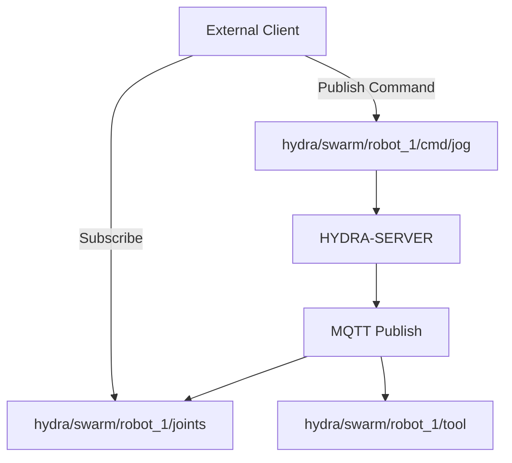

<p align="center">
  
</p>

# 📡 HYDRA-UMC-MQTT-BROKER

<p align="center"><a href="README.md">🇺🇸 English</a> | <a href="README_spa.md">🇪🇸 Español</a> | <a href="README_fra.md">🇫🇷 Français</a> | <a href="README_ita.md">🇮🇹 Italiano</a> | <a href="README_deu.md">🇩🇪 Deutsch</a> | <a href="README_zho.md">🇨🇳 简体中文</a> | 🇯🇵 <b>日本語</b></p>

### 🚀 IoT および外部統合向けの軽量テレメトリブリッジ

<p align="left">
  
  
  
</p>

---

## 1. 🛠️ 技術概要

**HYDRA-UMC-MQTT-BROKER** は、HYDRA-UMC エコシステム向けの軽量な非同期
メッセージングインターフェースを提供します。外部の IoT デバイス、
ダッシュボード、ホームオートメーションシステム（Home Assistant など）
がロボットのテレメトリを購読し、コマンドを発行できるようにします。

MQTT v5 標準を実装しており、最小限のオーバーヘッドで高効率なデータ
配信を提供します。モバイルアプリや低帯域幅のリモート監視に最適です。

### 主な機能：
* 📡 **パブリッシュ/サブスクライブ テレメトリ：** 関節角度、工具状態、システムの健全性のサブミリ秒単位の配信。
* 🛠️ **ディスカバリーサポート：** 統合された mDNS と Home Assistant 自動検出により、簡単にセットアップできます。
* 🔐 **トピックセキュリティ：** 特定のロボットトピックの読み書きに対する、クライアント ID プレフィックスごとの実際に検証可能な ACL——ワイルドカードを使った SUBSCRIBE が、そのルールより広いアクセス権を得ることは決してありません。*(実装済み)*
* 🪪 **クライアント認証：** 任意の MQTT CONNECT ユーザー名/パスワード認証（`MQTT_AUTH_JSON`）により、ACL に検証済みのセッション ID を提供します。*(実装済み。ACL と組み合わせて使用)*
* 📏 **ペイロードサイズ制限：** PUBLISH のペイロードサイズに対する実際のオプトイン方式の上限で、`MAX_PAYLOAD_BYTES` で設定可能です。*(実装済み)*
* ⚡ **WebSocket サポート：** ブラウザベースのクライアント向けに統合された MQTT over WebSocket。

---

## 2. 🔄 MQTT トピック構造



---

## 3. 🧱 アーキテクチャと設計上の決定

* **HYDRA-UMC-GATEWAY-INDUSTRIAL のサブモジュールではなく兄弟プロジェクトである理由。** 各プロトコルアダプターは個別にデプロイ/再起動可能なプロセスです——ブローカーの問題が、それと並行して動作する OPC-UA や MTConnect アダプターをダウンさせることは決してありません。
* **外部ブローカーに発行するクライアントではなく、実際の MQTT ブローカーである理由。** ブローカー自体を所有することで、このセル自身のイベントストリーム（ロボットの状態変化、アラーム）が、外部管理された別のブローカーが到達可能であることに依存することなく、工場ネットワーク上の任意の MQTT サブスクライバーに提供されます。
* **エントリポイントが今日は身元/バージョンのみを表示し、ヘルスチェックリスナーが起動した後で終了する理由。** 足場（アンダミアヘ、スキャフォールディング）段階にあり、親プロジェクト自身の README と同じ理由です——実際のブローカーはその性質上長時間稼働します。
* **エコシステムの他の部分との関係。** HYDRA-UMC-GATEWAY-INDUSTRIAL の下の兄弟サービスです——HYDRA-UMC-SERVER 自身のイベントストリームを実際の MQTT トピックへとブリッジします。
* **ここで実際のバグが発見され、修正されました：ブローカーは実際には一度もクライアントを受け入れていませんでした。** Aedes 1.x では永続化/mqemitter のセットアップが明示的な非同期ステップ `broker.listen()` に移されました（0.x のファクトリ関数形式からの実際の API 変更）。これを呼ばないと、実際の `CONNECT` は実際の TCP ソケット経由でブローカーに到達するものの、クライアント自身の connack タイムアウトが発火するまで静かにハングし続けます——ブローカーは「稼働中」に見えました（ポートは接続を受け付けていました）が、どのクライアントも実際にはセッションを完了できませんでした。これは本プロジェクト自身のテストで実際の `mqtt` クライアントがタイムアウトしたことから発見されたものであり、コードの検査によるものではありません。`tests/server.test.ts` は現在、実際の MQTT クライアントライブラリを実際のソケット経由で実際のブローカーに接続します——CONNECT、PUBLISH の配信、トピックの分離、保持メッセージ、すべて実際にテストされています。
* **トピック ACL がフィルターの重なりだけでなく、サブスクリプションの*スコープ*を検証する理由。** クライアント自身の SUBSCRIBE リクエストはそれ自体がフィルターであり、`+`/`#` のワイルドカードを含むことができます——「要求されたフィルターが許可されたフィルターと重なっているか」を単純に確認するだけでは、クライアントが自身のルールが実際に許可する範囲（例：`hydra/robots/+/status`）よりも広いワイルドカード（例：`hydra/robots/#`）でサブスクライブし、決して認可されていないトピックを気づかれずに閲覧できてしまいます。`src/acl.ts` の `isSubscriptionWithinScope()` は、その代わりに実際にセグメントごとの検証を行います——これは実際のテストで証明されており、その中にはロボット自身がワイルドカード SUBSCRIBE で自分のスコープを拡大しようとする試みが拒否されるテストも含まれています。
* **拒否された PUBLISH が、1 件のメッセージを NACK するだけでなく、接続全体を閉じる理由。** これは Aedes 自身の実際の挙動です（ドキュメントから推測したのではなく、実際のクライアントをそれに対して実行して検証済みです）——`authorizePublish` がエラーを返すと、クライアントの接続が破棄されます。ここでの ACL/ペイロード制限の設計は、この挙動に逆らうのではなく、それに合わせています。ACL 違反によって繰り返し切断されるクライアントは、そのデバイスの設定を修正すべきだという明確で分かりやすいシグナルであり、気づかれないまま静かに破棄されるメッセージではありません。
* **ACL/ペイロード制限の設定が、設定ファイルではなく環境変数（`MQTT_ACL_JSON`/`MAX_PAYLOAD_BYTES`）にある理由。** これは本プロジェクトの既存の `PORT` の慣例（`.env.example` を参照）や、実際のデプロイ方法（マウントされたファイルではなく、systemd/Docker の環境変数）に一致しています——`parseAclConfig()` は、不正な形式の JSON に対して静かに無防備なまま起動するのではなく、起動時に大きな失敗として検出します。

---

## 📂 リポジトリ構成

```text
HYDRA-UMC-MQTT-BROKER/
├── src/         # ソースコード（Node/TypeScript —— ブローカー、ブリッジ、セキュリティ）
├── docs/        # ドキュメントとトピックカタログ
├── build/       # コンパイル出力（npm run build）
├── images/      # メディアと図表
├── scripts/     # ユーティリティスクリプト（bump-version.mjs）
└── README.md
```

純粋なネットワークサービスであり、独自の専用ハードウェアを持ちません
——`hardware/`、`firmware/`、`os/` は元のプロジェクトテンプレートから
省略されており、リポジトリ構造ポリシーに従っています。

---

## 🛠️ 開発環境

### 必要条件
- [Node.js](https://nodejs.org/)（v18 以上を推奨）
- npm

### インストール
```bash
npm install
```

### 開発モード
`tsx` を使用してブローカーを直接実行します（バンドラーなし）：
- **Windows：** `dev.bat` をダブルクリックするか、`npm run dev` を実行
- **Linux/Mac：** `./dev.sh` または `npm run dev` を実行

### プロダクションビルド
esbuild を使用してブローカーを単一のデプロイ可能なファイルにバンドル
します：
- **Windows：** `build.bat` をダブルクリックするか、`npm run build` を実行
- **Linux/Mac：** `./build.sh` または `npm run build` を実行

その後、次のコマンドで起動します：
```bash
npm start
```

ブローカーは `0.0.0.0:1883`（プレーンな MQTT/TCP、IANA に登録された
デフォルトポート）でリッスンします——任意の MQTT クライアント
（`mosquitto_sub`、Home Assistant、MQTT Explorer など）を
`<host>:1883` に向けてください。

### バージョン管理
実際の `npm run build` のたびに、`package.json` 自身の `version` が
自動的に増加します（`scripts/bump-version.mjs`、`build` スクリプトの
最初のステップとして接続）——10 進法の「オドメーター」方式：ビルド
ごとに patch を +1 し、9 を超えると minor に繰り上がり（minor が 9 を
超えると major に繰り上がる）、2 桁のセグメントに到達することはあり
ません（`0.0.9` -> `0.1.0`、`0.0.10` にはなりません）。

---

## 🚀 ロードマップ
* **フェーズ 1：** 高速データ交換とレガシープロトコルブリッジングのための OPC-UA パブリッシュ/サブスクライブ実装。
* **フェーズ 2：** 大量の IoT デバイス管理と高い並行性のための MQTT Broker クラスター。
* **フェーズ 3：** マルチベンダーの CNC および PLC 機械統合のための MTConnect アダプターサポート。
* **フェーズ 4：** 産業用 IoT との整合性のための Sparkplug B 仕様サポートと統一テレメトリブリッジ。

---

## 🔗 関連プロジェクト

本プロジェクトは、同一著者（JuanenRac / Electro Hobby 3D）による、
ファームウェア、制御ソフトウェア、AI ノード、フリート管理ツールにまたがる、
より大きなロボティクスエコシステムの一部です。ご要望が実際にはこれらの
プロジェクトのいずれかに関するものであり、本リポジトリのものではない
可能性もあるため、知っておく価値があります。

### プロジェクトファミリー

**親プロジェクト：** **[HYDRA-UMC-GATEWAY-INDUSTRIAL](https://github.com/JuanenRac/HYDRA-UMC-GATEWAY-INDUSTRIAL)** —— 本 MQTT アダプターが接続する統合親プロジェクト。

**兄弟プロジェクト：**
- **[HYDRA-UMC-OPCUA-SERVER](https://github.com/JuanenRac/HYDRA-UMC-OPCUA-SERVER)** —— 同じ親プロジェクトを持つ兄弟プロトコルアダプター。
- **[HYDRA-UMC-MTCONNECT-ADAPTER](https://github.com/JuanenRac/HYDRA-UMC-MTCONNECT-ADAPTER)** —— 同じ親プロジェクトを持つ兄弟プロトコルアダプター。

### 直接関連（ファミリー外）

- **[HYDRA-UMC-SERVER](https://github.com/JuanenRac/HYDRA-UMC-SERVER)** —— 本アダプターが公開する状態の発生源。

### エコシステムのその他のプロジェクト

**HYDRA-UMC プラットフォーム** — マルチロボット・マイクロファクトリーセル
- **[HYDRA-UMC](https://github.com/JuanenRac/HYDRA-UMC)** — 最大 8 台のロボットアームを統括する CM5 + STM32H745 マザーボード。
- **[HYDRA-UMC-SERVER](https://github.com/JuanenRac/HYDRA-UMC-SERVER)** — すべての制御クライアントが接続する Express/WebSocket バックエンド。
- **[HYDRA-UMC-STUDIO](https://github.com/JuanenRac/HYDRA-UMC-STUDIO)** — Web ベースの制御ダッシュボード、マルチロボット 3D 可視化。
- **[HYDRA-UMC-ANDROID-CONTROL](https://github.com/JuanenRac/HYDRA-UMC-ANDROID-CONTROL)** — Wi-Fi/Bluetooth 経由の Android 制御アプリ。
- **[HYDRA-UMC-IOS-CONTROL](https://github.com/JuanenRac/HYDRA-UMC-IOS-CONTROL)** — Flutter で構築された iOS/iPadOS 制御アプリ。
- **[HYDRA-UMC-SUITE](https://github.com/JuanenRac/HYDRA-UMC-SUITE)** — デスクトップ版群制御コマンドセンター（Python/PySide6）。
- **[HYDRA-UMC-EDITOR-URDF](https://github.com/JuanenRac/HYDRA-UMC-EDITOR-URDF)** — ロボットカタログ向けのデスクトップ版 URDF モデルエディター。
- **[HYDRA-UMC-DSI](https://github.com/JuanenRac/HYDRA-UMC-DSI)** — 機載 DSI タッチスクリーン用のネイティブタッチ UI。

**URTC プラットフォーム** — すべての HYDRA-UMC ロボットアームが搭載するツールヘッドコントローラー
- **[URTC](https://github.com/JuanenRac/URTC)** — CAN バスツールヘッドコントローラー、25 種類のツールプロファイル。
- **[URTC-FLASHER](https://github.com/JuanenRac/URTC-FLASHER)** — デスクトップ版 CAN-OTA + SWD/JTAG フラッシュツール。
- **[URTC-TESTER](https://github.com/JuanenRac/URTC-TESTER)** — デスクトップ版ライブ CAN バス診断ツール。
- **[URTC-WEB-STUDIO](https://github.com/JuanenRac/URTC-WEB-STUDIO)** — Web Serial API によるブラウザベースの代替版。

**🎥 ビジョン AI ノード（Hailo-8）**
- [HYDRA-UMC-VISION-NODE](https://github.com/JuanenRac/HYDRA-UMC-VISION-NODE)
- [HYDRA-UMC-VISION-STREAMER](https://github.com/JuanenRac/HYDRA-UMC-VISION-STREAMER)
- [HYDRA-UMC-DETECTION-HEF](https://github.com/JuanenRac/HYDRA-UMC-DETECTION-HEF)
- [HYDRA-UMC-SAFETY-ZONES](https://github.com/JuanenRac/HYDRA-UMC-SAFETY-ZONES)
- [HYDRA-UMC-VISUAL-SERVOING-API](https://github.com/JuanenRac/HYDRA-UMC-VISUAL-SERVOING-API)

**🧠 認知 AI ノード（Hailo-10）**
- [HYDRA-UMC-COGNITIVE-NODE](https://github.com/JuanenRac/HYDRA-UMC-COGNITIVE-NODE)
- [HYDRA-UMC-VLA-ENGINE](https://github.com/JuanenRac/HYDRA-UMC-VLA-ENGINE)
- [HYDRA-UMC-VOICE-UI](https://github.com/JuanenRac/HYDRA-UMC-VOICE-UI)
- [HYDRA-UMC-SEMANTIC-PLANNER](https://github.com/JuanenRac/HYDRA-UMC-SEMANTIC-PLANNER)
- [HYDRA-UMC-DOCS-QA](https://github.com/JuanenRac/HYDRA-UMC-DOCS-QA)

**🐝 オーケストレーションと群制御**
- [HYDRA-UMC-ORCHESTRATOR](https://github.com/JuanenRac/HYDRA-UMC-ORCHESTRATOR)
- [HYDRA-UMC-SWARM-SYNC](https://github.com/JuanenRac/HYDRA-UMC-SWARM-SYNC)
- [HYDRA-UMC-PATH-PLANNER-3D](https://github.com/JuanenRac/HYDRA-UMC-PATH-PLANNER-3D)
- [HYDRA-UMC-JOB-DISPATCHER](https://github.com/JuanenRac/HYDRA-UMC-JOB-DISPATCHER)
- [HYDRA-UMC-NODE-HEALING](https://github.com/JuanenRac/HYDRA-UMC-NODE-HEALING)

**🎮 デジタルツインとシミュレーション**
- [HYDRA-UMC-TWIN](https://github.com/JuanenRac/HYDRA-UMC-TWIN)
- [HYDRA-UMC-PHYSICS-REPLICA](https://github.com/JuanenRac/HYDRA-UMC-PHYSICS-REPLICA)
- [HYDRA-UMC-HIL-BRIDGE](https://github.com/JuanenRac/HYDRA-UMC-HIL-BRIDGE)
- [HYDRA-UMC-SYNTHETIC-DATA-GEN](https://github.com/JuanenRac/HYDRA-UMC-SYNTHETIC-DATA-GEN)

**📊 データと分析**
- [HYDRA-UMC-DATALAKE](https://github.com/JuanenRac/HYDRA-UMC-DATALAKE)
- [HYDRA-UMC-TELEMETRY-COLLECTOR](https://github.com/JuanenRac/HYDRA-UMC-TELEMETRY-COLLECTOR)
- [HYDRA-UMC-ANOMALY-DETECTOR](https://github.com/JuanenRac/HYDRA-UMC-ANOMALY-DETECTOR)
- [HYDRA-UMC-PRODUCTION-REPORTS](https://github.com/JuanenRac/HYDRA-UMC-PRODUCTION-REPORTS)

**🛠️ 補完ツール**
- [URTC-SMART-RACK](https://github.com/JuanenRac/URTC-SMART-RACK)
- [URTC-VISION-TOOL](https://github.com/JuanenRac/URTC-VISION-TOOL)
- [HYDRA-UMC-WATCH](https://github.com/JuanenRac/HYDRA-UMC-WATCH)
- [HYDRA-UMC-TOOL-CLI](https://github.com/JuanenRac/HYDRA-UMC-TOOL-CLI)
- [HYDRA-UMC-DASHBOARD-AI](https://github.com/JuanenRac/HYDRA-UMC-DASHBOARD-AI)


## 👤 作者
**JuanenRac**（Electro Hobby 3D）
📧 electrohobby3d@gmail.com

## 📜 ライセンス
GPL-3.0 —— 詳細は LICENSE を参照してください。

## 🛠️ BUILD & RUN

リリースビルドの前に、バージョンを変更しないビルドチェックを使用してください。

| 操作 | Windows | Linux / macOS |
|---|---|---|
| ビルドチェック（バージョンと CHANGELOG を変更しない） | `build-test.bat` | `./build-test.sh` |
| 実行 / 開発（提供されている場合） | `run*.bat` または `dev*.bat` | `./run*.sh` または `./dev*.sh` |

`build-test.bat` と `build-test.sh` は、`hydra-umc.project.json` をインクリメントせず、`CHANGELOG.md` も変更せずにプロジェクトのスタックをコンパイルまたは検証します。通常のコンパイラ出力だけが作成される場合があります。既存の `build*.bat`、`build*.sh`、`run*`、`dev*` は、各プロジェクト固有のバージョン化または実行時の動作を維持します。その動作が必要な場合はそれらを使用してください。
