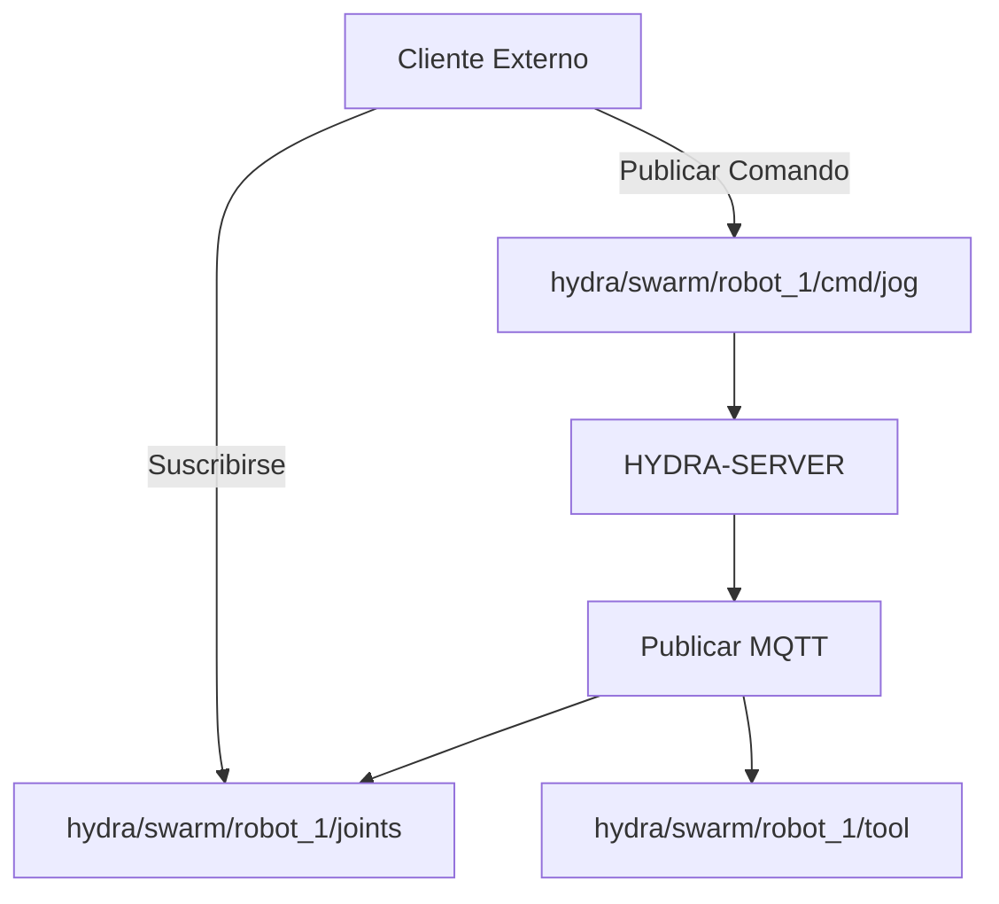

<p align="center">
  
</p>

# 📡 HYDRA-UMC-MQTT-BROKER

<p align="center"><a href="README.md">🇺🇸 English</a> | 🇪🇸 <b>Español</b> | <a href="README_fra.md">🇫🇷 Français</a> | <a href="README_ita.md">🇮🇹 Italiano</a> | <a href="README_deu.md">🇩🇪 Deutsch</a> | <a href="README_zho.md">🇨🇳 简体中文</a> | <a href="README_jpn.md">🇯🇵 日本語</a></p>

### 🚀 Puente de Telemetría Ligero para IoT e Integraciones Externas

<p align="left">
  
  
  
</p>

---

## 1. 🛠️ VISIÓN GENERAL TÉCNICA

**HYDRA-UMC-MQTT-BROKER** proporciona una interfaz de mensajería asíncrona y ligera para el ecosistema HYDRA-UMC. Permite que dispositivos IoT externos, dashboards y sistemas de automatización del hogar (como Home Assistant) se suscriban a la telemetría del robot y publiquen comandos.

Implementa el estándar MQTT v5, ofreciendo una distribución de datos de alta eficiencia con un overhead mínimo, lo que lo hace ideal para aplicaciones móviles o monitorización remota de bajo ancho de banda.

### Características Clave:
* 🔌 **Puentes de Máquinas Externas:** `HYDRA-UMC-BRIDGE-CNC`/`-LASER`/`-OPENPNP`/`-PRINTER3D`/`-ROS2` llegan cada uno a este broker por sus propios tópicos `hydra/bridges/<name>/...` - ver `docs/BRIDGE_TOPICS.md`. *(implementado)*
* 📡 **Telemetría Pub/Sub:** Distribución en menos de un milisegundo de ángulos de articulación, estados de herramienta y salud del sistema.
* 🛠️ **Soporte de Descubrimiento:** mDNS integrado y auto-descubrimiento de Home Assistant para una configuración fácil.
* 🔐 **Seguridad de Tópicos:** ACL real y verificable por prefijo de ID de cliente para leer y escribir en tópicos de robots específicos - un SUBSCRIBE con comodín nunca puede otorgar un acceso más amplio que su regla. *(implementado)*
* 🪪 **Autenticación de cliente:** La autenticación MQTT real y opcional de usuario/contraseña durante CONNECT (`MQTT_AUTH_JSON`) da a la ACL una identidad de sesión verificada. *(implementada; usar junto con ACL)*
* 📏 **Límite de Tamaño de Payload:** Un límite real y opcional sobre el tamaño del payload de PUBLISH, configurable mediante `MAX_PAYLOAD_BYTES`. *(implementado)*
* ⚡ **Soporte de Websockets:** MQTT-sobre-WebSockets integrado para clientes basados en navegador.

---

## 2. 🔄 ESTRUCTURA DE TÓPICOS MQTT



---

## 3. 🧱 ARQUITECTURA Y DECISIONES DE DISEÑO

* **Por qué es hermano, no un submódulo, de HYDRA-UMC-GATEWAY-INDUSTRIAL.** Cada adaptador de protocolo es un proceso desplegable/reiniciable por separado - un problema en el broker nunca tumba los adaptadores de OPC-UA o MTConnect que corren junto a él.
* **Por qué un broker MQTT real, en vez de solo un cliente publicando a uno externo.** Poseer el broker significa que el propio flujo de eventos de esta célula (cambios de estado de robot, alarmas) está disponible para cualquier suscriptor MQTT de la red de planta sin depender de que un broker externo, gestionado aparte, esté alcanzable.
* **Por qué el punto de entrada solo imprime identidad/versión, y termina tras levantar un listener de health-check.** Etapa de andamiaje, mismo motivo que el propio README del padre - un broker real es de larga duración por naturaleza.
* **Cómo encaja en el resto del ecosistema.** Un servicio hermano bajo HYDRA-UMC-GATEWAY-INDUSTRIAL - conecta el propio flujo de eventos de HYDRA-UMC-SERVER con temas MQTT reales.
* **Aquí se encontró y arregló un bug real: el broker nunca aceptaba clientes de verdad.** Aedes 1.x movió la configuración de persistencia/mqemitter a un paso async explícito `broker.listen()` (un cambio real de API respecto a la forma de fábrica de la 0.x); sin él, un `CONNECT` real llegaba al broker por un socket TCP real pero se colgaba en silencio hasta que el propio timeout de connack del cliente saltaba - el broker parecía "arriba" (el puerto aceptaba conexiones) pero ningún cliente podía completar una sesión jamás. Encontrado con un cliente `mqtt` real haciendo timeout en los propios tests de este proyecto, no por inspección. `tests/server.test.ts` ahora conecta una librería de cliente MQTT real contra un broker real por un socket real - CONNECT, entrega de PUBLISH, aislamiento de temas y mensajes retenidos, todo probado de verdad.
* **Por qué la ACL de tópicos comprueba el *alcance* de la suscripción, no solo el solapamiento del filtro.** La propia solicitud SUBSCRIBE de un cliente es en sí misma un filtro y puede llevar comodines `+`/`#` - comprobar ingenuamente si "el filtro solicitado se solapa con el permitido" dejaría que un cliente se suscribiera con un comodín más amplio (p. ej. `hydra/robots/#`) del que su regla realmente concede (p. ej. `hydra/robots/+/status`) y viera en silencio tópicos para los que nunca estuvo autorizado. `src/acl.ts`, con su función `isSubscriptionWithinScope()`, hace en su lugar una comprobación real, segmento por segmento - demostrado con tests reales, incluyendo uno en el que el propio intento de un robot de escalar su alcance con un SUBSCRIBE de comodín es denegado.
* **Por qué un PUBLISH denegado cierra toda la conexión, en vez de solo hacer NACK a un mensaje.** Este es el comportamiento real propio de Aedes (verificado ejecutando un cliente real contra él, no asumido de la documentación) - `authorizePublish` al devolver un error destruye la conexión del cliente. El diseño de la ACL/límite de payload aquí trabaja con eso, no en contra: un cliente que sigue siendo desconectado por violar su ACL es una señal clara y evidente para corregir la configuración de ese dispositivo, no un mensaje silenciosamente descartado que quizá nunca note.
* **Por qué la configuración de la ACL/límite de payload vive en variables de entorno (`MQTT_ACL_JSON`/`MAX_PAYLOAD_BYTES`), no en un archivo de configuración.** Coincide con la convención existente de `PORT` en este proyecto (ver `.env.example`) y con cómo se despliega realmente (entorno systemd/Docker, no un archivo montado) - `parseAclConfig()` falla el arranque de forma ruidosa ante un JSON malformado en vez de ejecutarse en silencio sin protección.

---

## 📂 ESTRUCTURA DE DIRECTORIOS

```text
HYDRA-UMC-MQTT-BROKER/
├── src/         # Código fuente (Node/TypeScript - Broker, Puente, Seguridad)
├── tests/       # Suite Vitest - ACL, autenticación y comportamiento de broker/puente
├── docs/        # Documentación y catálogo de tópicos
├── build/       # Salida compilada (npm run build)
├── images/      # Medios y diagramas
├── scripts/     # Scripts de utilidad (bump-version.mjs)
├── tools/       # ci_validate.py - validación de manifest/CHANGELOG/docs usada por la CI
└── README.md
```

Servicio de red puro, sin hardware propio - `hardware/`, `firmware/` y
`os/` se omiten según la política de estructura del repositorio.

---

## 🛠️ ENTORNO DE DESARROLLO

### Requisitos
- [Node.js](https://nodejs.org/) (v18 o superior recomendado)
- npm

### Instalación
```bash
npm install
```

### Modo Desarrollo
Ejecuta el broker directamente con `tsx` (sin bundler):
- **Windows:** doble clic en `dev.bat` o ejecutar `npm run dev`
- **Linux/Mac:** ejecutar `./dev.sh` o `npm run dev`

### Build de Producción
Empaqueta el broker en un único archivo desplegable con esbuild:
- **Windows:** doble clic en `build.bat` o ejecutar `npm run build`
- **Linux/Mac:** ejecutar `./build.sh` o `npm run build`

Luego arráncalo con:
```bash
npm start
```

El broker escucha en `0.0.0.0:1883` (MQTT/TCP plano, el puerto por defecto
registrado en IANA) - apunta cualquier cliente MQTT (`mosquitto_sub`, Home
Assistant, MQTT Explorer, ...) a `<host>:1883`.

### Versionado
Cada `npm run build` real incrementa automáticamente el `version` de
`package.json` (`scripts/bump-version.mjs`, primer paso del script
`build`) - un "cuentakilómetros" en base 10: patch +1 por build, con
acarreo a minor (y de minor a major) al pasar de 9 en vez de llegar nunca
a un segmento de dos dígitos (`0.0.9` -> `0.1.0`, no `0.0.10`).

---

## 🚀 HOJA DE RUTA
* **Fase 1:** Implementación de OPC-UA Pub/Sub para intercambio de datos de alta velocidad y puente de protocolos heredados.
* **Fase 2:** Clúster de Broker MQTT para gestión masiva de dispositivos IoT y alta concurrencia.
* **Fase 3:** Soporte del adaptador MTConnect para integración de maquinaria CNC y PLC multi-vendedor.
* **Fase 4:** Soporte para la especificación Sparkplug B para alineación con IoT industrial y puente de telemetría unificado.

---

## 🔗 Proyectos Relacionados

Este proyecto forma parte de un ecosistema de robótica más amplio del mismo autor (JuanenRac / Electro Hobby 3D), que abarca firmware, software de control, nodos de IA y herramientas de flota. Vale la pena conocerlo, ya que una petición podría en realidad ser sobre uno de estos proyectos en vez de sobre este repositorio.

### Familia

**Padre:** **[HYDRA-UMC-GATEWAY-INDUSTRIAL](https://github.com/JuanenRac/HYDRA-UMC-GATEWAY-INDUSTRIAL)** — el padre de integración al que se conecta este adaptador MQTT.

**Hermanos:**
- **[HYDRA-UMC-OPCUA-SERVER](https://github.com/JuanenRac/HYDRA-UMC-OPCUA-SERVER)** — adaptador de protocolo hermano, mismo padre.
- **[HYDRA-UMC-MTCONNECT-ADAPTER](https://github.com/JuanenRac/HYDRA-UMC-MTCONNECT-ADAPTER)** — adaptador de protocolo hermano, mismo padre.

### Relación Directa (fuera de la familia)

- **[HYDRA-UMC-SERVER](https://github.com/JuanenRac/HYDRA-UMC-SERVER)** — la fuente del estado que expone este adaptador.
- **[HYDRA-UMC-BRIDGE-CNC](https://github.com/JuanenRac/HYDRA-UMC-BRIDGE-CNC)**, **[-LASER](https://github.com/JuanenRac/HYDRA-UMC-BRIDGE-LASER)**, **[-OPENPNP](https://github.com/JuanenRac/HYDRA-UMC-BRIDGE-OPENPNP)**, **[-PRINTER3D](https://github.com/JuanenRac/HYDRA-UMC-BRIDGE-PRINTER3D)**, **[-ROS2](https://github.com/JuanenRac/HYDRA-UMC-BRIDGE-ROS2)** — cada uno incluye su propio `mqtt_transport.py` que llega a este broker por sus propios tópicos `hydra/bridges/<name>/...`; ver `docs/BRIDGE_TOPICS.md` en este repositorio para el catálogo real y compartido de tópicos.
- **[HYDRA-UMC-BRIDGE-AMR](https://github.com/JuanenRac/HYDRA-UMC-BRIDGE-AMR)** — un cliente real distinto de este mismo broker: `Vda5050Publisher` envía despachos ya validados como mensajes VDA 5050 `order`/`instantActions` reales, con el esquema de tópicos propio de VDA 5050 en vez del esquema `hydra/bridges/...` de arriba.

### Resto del Ecosistema

**Plataforma HYDRA-UMC** — la célula de micro-fábrica multi-robot
- **[HYDRA-UMC](https://github.com/JuanenRac/HYDRA-UMC)** — la placa base CM5 + STM32H745 que orquesta hasta 8 brazos robóticos.
- **[HYDRA-UMC-SERVER](https://github.com/JuanenRac/HYDRA-UMC-SERVER)** — el backend Express/WebSocket con el que habla cada cliente de control.
- **[HYDRA-UMC-STUDIO](https://github.com/JuanenRac/HYDRA-UMC-STUDIO)** — panel de control web, visualización 3D multi-robot.
- **[HYDRA-UMC-ANDROID-CONTROL](https://github.com/JuanenRac/HYDRA-UMC-ANDROID-CONTROL)** — app de control Android por Wi-Fi/Bluetooth.
- **[HYDRA-UMC-IOS-CONTROL](https://github.com/JuanenRac/HYDRA-UMC-IOS-CONTROL)** — app de control iOS/iPadOS construida en Flutter.
- **[HYDRA-UMC-SUITE](https://github.com/JuanenRac/HYDRA-UMC-SUITE)** — centro de mando de enjambre de escritorio (Python/PySide6).
- **[HYDRA-UMC-EDITOR-URDF](https://github.com/JuanenRac/HYDRA-UMC-EDITOR-URDF)** — editor de modelos URDF de escritorio para el catálogo de robots.
- **[HYDRA-UMC-DSI](https://github.com/JuanenRac/HYDRA-UMC-DSI)** — interfaz táctil nativa para la pantalla DSI integrada.

**Plataforma URTC** — el controlador de cabezal de herramienta que lleva cada brazo HYDRA-UMC
- **[URTC](https://github.com/JuanenRac/URTC)** — controlador de cabezal de herramienta CAN, 25 perfiles de herramienta.
- **[URTC-FLASHER](https://github.com/JuanenRac/URTC-FLASHER)** — herramienta de escritorio de flasheo CAN-OTA + SWD/JTAG.
- **[URTC-TESTER](https://github.com/JuanenRac/URTC-TESTER)** — herramienta de escritorio de diagnóstico CAN en vivo.
- **[URTC-WEB-STUDIO](https://github.com/JuanenRac/URTC-WEB-STUDIO)** — alternativa basada en navegador vía Web Serial API.

**🎥 Nodo de IA de Visión (Hailo-8)**
- [HYDRA-UMC-VISION-NODE](https://github.com/JuanenRac/HYDRA-UMC-VISION-NODE)
- [HYDRA-UMC-VISION-STREAMER](https://github.com/JuanenRac/HYDRA-UMC-VISION-STREAMER)
- [HYDRA-UMC-DETECTION-HEF](https://github.com/JuanenRac/HYDRA-UMC-DETECTION-HEF)
- [HYDRA-UMC-SAFETY-ZONES](https://github.com/JuanenRac/HYDRA-UMC-SAFETY-ZONES)
- [HYDRA-UMC-VISUAL-SERVOING-API](https://github.com/JuanenRac/HYDRA-UMC-VISUAL-SERVOING-API)

**🧠 Nodo de IA Cognitiva (Hailo-10)**
- [HYDRA-UMC-COGNITIVE-NODE](https://github.com/JuanenRac/HYDRA-UMC-COGNITIVE-NODE)
- [HYDRA-UMC-VLA-ENGINE](https://github.com/JuanenRac/HYDRA-UMC-VLA-ENGINE)
- [HYDRA-UMC-VOICE-UI](https://github.com/JuanenRac/HYDRA-UMC-VOICE-UI)
- [HYDRA-UMC-SEMANTIC-PLANNER](https://github.com/JuanenRac/HYDRA-UMC-SEMANTIC-PLANNER)
- [HYDRA-UMC-DOCS-QA](https://github.com/JuanenRac/HYDRA-UMC-DOCS-QA)

**🐝 Orquestación y Enjambre**
- [HYDRA-UMC-ORCHESTRATOR](https://github.com/JuanenRac/HYDRA-UMC-ORCHESTRATOR)
- [HYDRA-UMC-SWARM-SYNC](https://github.com/JuanenRac/HYDRA-UMC-SWARM-SYNC)
- [HYDRA-UMC-PATH-PLANNER-3D](https://github.com/JuanenRac/HYDRA-UMC-PATH-PLANNER-3D)
- [HYDRA-UMC-JOB-DISPATCHER](https://github.com/JuanenRac/HYDRA-UMC-JOB-DISPATCHER)
- [HYDRA-UMC-NODE-HEALING](https://github.com/JuanenRac/HYDRA-UMC-NODE-HEALING)

**🎮 Gemelo Digital y Simulación**
- [HYDRA-UMC-TWIN](https://github.com/JuanenRac/HYDRA-UMC-TWIN)
- [HYDRA-UMC-PHYSICS-REPLICA](https://github.com/JuanenRac/HYDRA-UMC-PHYSICS-REPLICA)
- [HYDRA-UMC-HIL-BRIDGE](https://github.com/JuanenRac/HYDRA-UMC-HIL-BRIDGE)
- [HYDRA-UMC-SYNTHETIC-DATA-GEN](https://github.com/JuanenRac/HYDRA-UMC-SYNTHETIC-DATA-GEN)

**📊 Datos y Analítica**
- [HYDRA-UMC-DATALAKE](https://github.com/JuanenRac/HYDRA-UMC-DATALAKE)
- [HYDRA-UMC-TELEMETRY-COLLECTOR](https://github.com/JuanenRac/HYDRA-UMC-TELEMETRY-COLLECTOR)
- [HYDRA-UMC-ANOMALY-DETECTOR](https://github.com/JuanenRac/HYDRA-UMC-ANOMALY-DETECTOR)
- [HYDRA-UMC-PRODUCTION-REPORTS](https://github.com/JuanenRac/HYDRA-UMC-PRODUCTION-REPORTS)

**🛠️ Herramientas Complementarias**
- [URTC-SMART-RACK](https://github.com/JuanenRac/URTC-SMART-RACK)
- [URTC-VISION-TOOL](https://github.com/JuanenRac/URTC-VISION-TOOL)
- [HYDRA-UMC-WATCH](https://github.com/JuanenRac/HYDRA-UMC-WATCH)
- [HYDRA-UMC-TOOL-CLI](https://github.com/JuanenRac/HYDRA-UMC-TOOL-CLI)
- [HYDRA-UMC-DASHBOARD-AI](https://github.com/JuanenRac/HYDRA-UMC-DASHBOARD-AI)


## 👤 AUTOR
**JuanenRac** (Electro Hobby 3D)
📧 electrohobby3d@gmail.com
📺 [youtube.com/@electrohobby3d](https://youtube.com/@electrohobby3d)

## 📜 LICENCIA
GPL-3.0 - Ver archivo LICENSE para más detalles.
