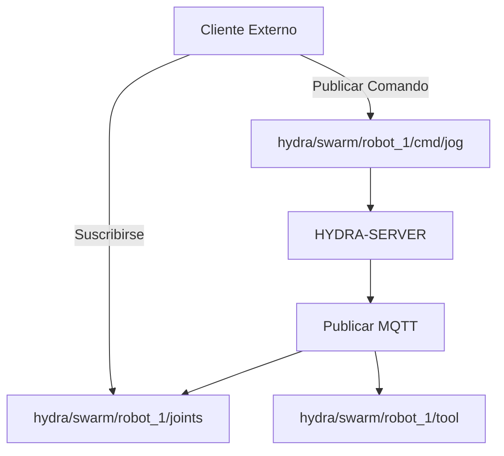

<p align="center">
  
</p>

# 📡 HYDRA-UMC-MQTT-BROKER

<p align="center"><a href="README.md">🇺🇸 English</a> | 🇪🇸 <b>Español</b> | <a href="README_fra.md">🇫🇷 Français</a> | <a href="README_ita.md">🇮🇹 Italiano</a> | <a href="README_deu.md">🇩🇪 Deutsch</a> | <a href="README_zho.md">🇨🇳 简体中文</a> | <a href="README_jpn.md">🇯🇵 日本語</a></p>

### 🚀 Puente de Telemetría Ligero para IoT e Integraciones Externas

<p align="left">
  
  
  
</p>

---

## 1. 🛠️ VISIÓN GENERAL TÉCNICA

**HYDRA-UMC-MQTT-BROKER** proporciona una interfaz de mensajería asíncrona y ligera para el ecosistema HYDRA-UMC. Permite que dispositivos IoT externos, dashboards y sistemas de automatización del hogar (como Home Assistant) se suscriban a la telemetría del robot y publiquen comandos.

Implementa el estándar MQTT 3.1.1 (vía Aedes, verificado en vivo - ver Arquitectura más abajo), ofreciendo una distribución de datos de alta eficiencia con un overhead mínimo, lo que lo hace ideal para aplicaciones móviles o monitorización remota de bajo ancho de banda.

### Características Clave:
* 🔌 **Puentes de Máquinas Externas:** `HYDRA-UMC-BRIDGE-CNC`/`-LASER`/`-OPENPNP`/`-PRINTER3D`/`-ROS2` llegan cada uno a este broker por sus propios tópicos `hydra/bridges/<name>/...` - ver `docs/BRIDGE_TOPICS.md`. *(implementado)*
* 📡 **Telemetría Pub/Sub:** Distribución en menos de un milisegundo de ángulos de articulación, estados de herramienta y salud del sistema.
* 🛠️ **Soporte de Descubrimiento:** mDNS y auto-descubrimiento de Home Assistant para una configuración fácil. *(planeado - aún no implementado; `src/server.ts` es hoy un simple listener TCP, sin ningún servicio de descubrimiento)*
* 🔐 **Seguridad de Tópicos:** ACL real y verificable por prefijo de ID de cliente para leer y escribir en tópicos de robots específicos - un SUBSCRIBE con comodín nunca puede otorgar un acceso más amplio que su regla. *(implementado)*
* 🪪 **Autenticación de cliente:** La autenticación MQTT real y opcional de usuario/contraseña durante CONNECT (`MQTT_AUTH_JSON`) da a la ACL una identidad de sesión verificada. *(implementada; usar junto con ACL)*
* 📏 **Límite de Tamaño de Payload:** Un límite real y opcional sobre el tamaño del payload de PUBLISH, configurable mediante `MAX_PAYLOAD_BYTES`. *(implementado)*
* ⚡ **Soporte de Websockets:** MQTT-sobre-WebSockets para clientes basados en navegador. *(planeado - aún no implementado; solo TCP plano en el puerto 1883 está conectado hoy, ver `package.json` - todavía no hay dependencia `ws`/websocket)*

---

## 2. 🔄 ESTRUCTURA DE TÓPICOS MQTT



**Nota de honestidad:** el esquema de tema `hydra/swarm/...` de arriba
ilustra la forma *prevista* una vez que el estado propio de
HYDRA-UMC-SERVER se conecte a MQTT - esa conexión aún no está hecha
(`src/server.ts` lo dice en su propio comentario de cabecera: "lands once
that wiring is defined"), así que hoy nada publica en `hydra/swarm/...`.
Los temas que sí son reales y están conectados hoy son el espacio de
nombres `hydra/bridges/<name>/...` de los 5 puentes de máquina externos
(ver `docs/BRIDGE_TOPICS.md`) y el propio esquema de temas VDA 5050 de
HYDRA-UMC-BRIDGE-AMR.

---

## 3. 🧱 ARQUITECTURA Y DECISIONES DE DISEÑO

* **Por qué es hermano, no un submódulo, de HYDRA-UMC-GATEWAY-INDUSTRIAL.** Cada adaptador de protocolo es un proceso desplegable/reiniciable por separado - un problema en el broker nunca tumba los adaptadores de OPC-UA o MTConnect que corren junto a él.
* **Por qué un broker MQTT real, en vez de solo un cliente publicando a uno externo.** Poseer el broker significa que el propio flujo de eventos de esta célula (cambios de estado de robot, alarmas) está disponible para cualquier suscriptor MQTT de la red de planta sin depender de que un broker externo, gestionado aparte, esté alcanzable.
* **Por qué el punto de entrada solo imprime identidad/versión, y termina tras levantar un listener de health-check.** Etapa de andamiaje, mismo motivo que el propio README del padre - un broker real es de larga duración por naturaleza.
* **Cómo encaja en el resto del ecosistema.** Un servicio hermano bajo HYDRA-UMC-GATEWAY-INDUSTRIAL - conecta el propio flujo de eventos de HYDRA-UMC-SERVER con temas MQTT reales.
* **Aquí se encontró y arregló un bug real: el broker nunca aceptaba clientes de verdad.** Aedes 1.x movió la configuración de persistencia/mqemitter a un paso async explícito `broker.listen()` (un cambio real de API respecto a la forma de fábrica de la 0.x); sin él, un `CONNECT` real llegaba al broker por un socket TCP real pero se colgaba en silencio hasta que el propio timeout de connack del cliente saltaba - el broker parecía "arriba" (el puerto aceptaba conexiones) pero ningún cliente podía completar una sesión jamás. Encontrado con un cliente `mqtt` real haciendo timeout en los propios tests de este proyecto, no por inspección. `tests/server.test.ts` ahora conecta una librería de cliente MQTT real contra un broker real por un socket real - CONNECT, entrega de PUBLISH, aislamiento de temas y mensajes retenidos, todo probado de verdad.
* **Por qué la ACL de tópicos comprueba el *alcance* de la suscripción, no solo el solapamiento del filtro.** La propia solicitud SUBSCRIBE de un cliente es en sí misma un filtro y puede llevar comodines `+`/`#` - comprobar ingenuamente si "el filtro solicitado se solapa con el permitido" dejaría que un cliente se suscribiera con un comodín más amplio (p. ej. `hydra/robots/#`) del que su regla realmente concede (p. ej. `hydra/robots/+/status`) y viera en silencio tópicos para los que nunca estuvo autorizado. `src/acl.ts`, con su función `isSubscriptionWithinScope()`, hace en su lugar una comprobación real, segmento por segmento - demostrado con tests reales, incluyendo uno en el que el propio intento de un robot de escalar su alcance con un SUBSCRIBE de comodín es denegado.
* **Por qué un PUBLISH denegado cierra toda la conexión, en vez de solo hacer NACK a un mensaje.** Este es el comportamiento real propio de Aedes (verificado ejecutando un cliente real contra él, no asumido de la documentación) - `authorizePublish` al devolver un error destruye la conexión del cliente. El diseño de la ACL/límite de payload aquí trabaja con eso, no en contra: un cliente que sigue siendo desconectado por violar su ACL es una señal clara y evidente para corregir la configuración de ese dispositivo, no un mensaje silenciosamente descartado que quizá nunca note.
* **Por qué la configuración de la ACL/límite de payload vive en variables de entorno (`MQTT_ACL_JSON`/`MAX_PAYLOAD_BYTES`), no en un archivo de configuración.** Coincide con la convención existente de `PORT` en este proyecto (ver `.env.example`) y con cómo se despliega realmente (entorno systemd/Docker, no un archivo montado) - `parseAclConfig()` falla el arranque de forma ruidosa ante un JSON malformado en vez de ejecutarse en silencio sin protección.
* **Por qué este broker habla MQTT 3.1.1, no MQTT v5.** `aedes@1.1.1` (la dependencia fijada) solo implementa MQTT 3.1/3.1.1 - verificado en vivo conectando un cliente `mqtt` real con `protocolVersion: 5`, que el broker rechaza activamente (`Connection refused: Unacceptable protocol version`), y confirmado contra la propia documentación upstream de Aedes (el soporte de MQTT 5.0 vive en una rama separada, no publicada). Todos los clientes de este ecosistema (los bridges `mqtt_transport.py`, `Vda5050Publisher`, los propios tests de este repo) ya negocian solo 3.1.1, así que esto es una corrección de documentación, no un cambio de comportamiento.

---

## 📂 ESTRUCTURA DE DIRECTORIOS

```text
HYDRA-UMC-MQTT-BROKER/
├── src/         # Código fuente (Node/TypeScript - Broker, Puente, Seguridad)
├── tests/       # Suite Vitest - ACL, autenticación y comportamiento de broker/puente
├── docs/        # Documentación y catálogo de tópicos
├── build/       # Salida compilada (npm run build)
├── images/      # Medios y diagramas
├── scripts/     # Scripts de utilidad (bump-version.mjs)
├── tools/       # ci_validate.py - validación de manifest/CHANGELOG/docs usada por la CI
└── README.md
```

Servicio de red puro, sin hardware propio - `hardware/`, `firmware/` y
`os/` se omiten según la política de estructura del repositorio.

---

## 🛠️ ENTORNO DE DESARROLLO

### Requisitos
- [Node.js](https://nodejs.org/) (v18 o superior recomendado)
- npm

### Instalación
```bash
npm install
```

### Modo Desarrollo
Ejecuta el broker directamente con `tsx` (sin bundler):
- **Windows:** doble clic en `dev.bat` o ejecutar `npm run dev`
- **Linux/Mac:** ejecutar `./dev.sh` o `npm run dev`

### Build de Producción
Empaqueta el broker en un único archivo desplegable con esbuild:
- **Windows:** doble clic en `build.bat` o ejecutar `npm run build`
- **Linux/Mac:** ejecutar `./build.sh` o `npm run build`

Luego arráncalo con:
```bash
npm start
```

El broker escucha en `0.0.0.0:1883` (MQTT/TCP plano, el puerto por defecto
registrado en IANA) - apunta cualquier cliente MQTT (`mosquitto_sub`, Home
Assistant, MQTT Explorer, ...) a `<host>:1883`.

### Versionado
Cada `npm run build` real incrementa automáticamente el `version` de
`package.json` (`scripts/bump-version.mjs`, primer paso del script
`build`) - un "cuentakilómetros" en base 10: patch +1 por build, con
acarreo a minor (y de minor a major) al pasar de 9 en vez de llegar nunca
a un segmento de dos dígitos (`0.0.9` -> `0.1.0`, no `0.0.10`).

---

## 🚀 HOJA DE RUTA
* **Fase 1:** Implementación de OPC-UA Pub/Sub para intercambio de datos de alta velocidad y puente de protocolos heredados.
* **Fase 2:** Clúster de Broker MQTT para gestión masiva de dispositivos IoT y alta concurrencia.
* **Fase 3:** Soporte del adaptador MTConnect para integración de maquinaria CNC y PLC multi-vendedor.
* **Fase 4:** Soporte para la especificación Sparkplug B para alineación con IoT industrial y puente de telemetría unificado.

---

## 🔗 Proyectos Relacionados

Este proyecto es parte del ecosistema de robótica HYDRA-UMC del mismo autor (JuanenRac / Electro Hobby 3D). Vale la pena conocerlo, ya que una petición podría en realidad ser sobre alguno de estos en vez de sobre este repositorio.

**Proyecto Padre**
- **[HYDRA-UMC-GATEWAY-INDUSTRIAL](https://github.com/JuanenRac/HYDRA-UMC-GATEWAY-INDUSTRIAL)** — nodo de integración que retransmite a protocolos industriales, con una capa real de lista blanca de comandos/contrapresión; el padre del que este repositorio es un adaptador de protocolo específico, dentro de su propia pasarela industrial.

**Proyectos Hermanos** — los demás adaptadores de protocolo de la propia pasarela industrial de HYDRA-UMC-GATEWAY-INDUSTRIAL
- **[HYDRA-UMC-OPCUA-SERVER](https://github.com/JuanenRac/HYDRA-UMC-OPCUA-SERVER)** — espacio de direcciones OPC-UA real, verificado con una sesión de cliente real del protocolo binario.
- **[HYDRA-UMC-MTCONNECT-ADAPTER](https://github.com/JuanenRac/HYDRA-UMC-MTCONNECT-ADAPTER)** — endpoints XML reales `/probe` y `/current` de MTConnect, con salida en modo degradado.

**Directamente Relacionados**
- **[HYDRA-UMC-SERVER](https://github.com/JuanenRac/HYDRA-UMC-SERVER)** — el backend headless real (REST/WebSocket) con el que habla de verdad cada cliente de control — la fuente del estado que expone este adaptador.
- **[HYDRA-UMC-BRIDGE-CNC](https://github.com/JuanenRac/HYDRA-UMC-BRIDGE-CNC)** — coordinador de alto nivel para celdas CNC con acceso real a estado/bytes de control GRBL — incluye su propio `mqtt_transport.py` que alcanza este broker a través de sus propios tópicos `hydra/bridges/<nombre>/...`; ver el propio `docs/BRIDGE_TOPICS.md` de este repositorio para el catálogo de tópicos real y compartido.
- **[HYDRA-UMC-BRIDGE-LASER](https://github.com/JuanenRac/HYDRA-UMC-BRIDGE-LASER)** — coordinador de seguridad para celdas láser que lee 3 salvaguardas GPIO reales de llave/carcasa/enclavamiento — incluye su propio `mqtt_transport.py` que alcanza este broker a través de sus propios tópicos `hydra/bridges/<nombre>/...`; ver el propio `docs/BRIDGE_TOPICS.md` de este repositorio para el catálogo de tópicos real y compartido.
- **[HYDRA-UMC-BRIDGE-OPENPNP](https://github.com/JuanenRac/HYDRA-UMC-BRIDGE-OPENPNP)** — coordinador de alto nivel seguro para el flujo de placas de pick-and-place OpenPnP — incluye su propio `mqtt_transport.py` que alcanza este broker a través de sus propios tópicos `hydra/bridges/<nombre>/...`; ver el propio `docs/BRIDGE_TOPICS.md` de este repositorio para el catálogo de tópicos real y compartido.
- **[HYDRA-UMC-BRIDGE-PRINTER3D](https://github.com/JuanenRac/HYDRA-UMC-BRIDGE-PRINTER3D)** — barrera de coordinación segura para impresoras 3D Moonraker/Klipper, con comandos de trabajo reales y controlados — incluye su propio `mqtt_transport.py` que alcanza este broker a través de sus propios tópicos `hydra/bridges/<nombre>/...`; ver el propio `docs/BRIDGE_TOPICS.md` de este repositorio para el catálogo de tópicos real y compartido.
- **[HYDRA-UMC-BRIDGE-ROS2](https://github.com/JuanenRac/HYDRA-UMC-BRIDGE-ROS2)** — coordinador de seguridad con un transporte ROS 2 rclpy real, importado de forma perezosa — incluye su propio `mqtt_transport.py` que alcanza este broker a través de sus propios tópicos `hydra/bridges/<nombre>/...`; ver el propio `docs/BRIDGE_TOPICS.md` de este repositorio para el catálogo de tópicos real y compartido.
- **[HYDRA-UMC-BRIDGE-AMR](https://github.com/JuanenRac/HYDRA-UMC-BRIDGE-AMR)** — barrera de coordinación para flotas AGV/AMR mediante un publicador MQTT VDA 5050 real — un cliente real distinto de este mismo broker: `Vda5050Publisher` envía despachos ya validados como mensajes VDA 5050 `order`/`instantActions` reales, con la forma de tópico propia de VDA 5050 en vez del esquema `hydra/bridges/...` que usan los demás bridges.

**También Forma Parte del Ecosistema**

*Hardware y Plataforma Base*
- **[HYDRA-UMC](https://github.com/JuanenRac/HYDRA-UMC)** — la placa madre física del brazo robótico: host CM5 + coprocesador STM32H745 de doble núcleo, coordinando hasta 8 brazos herramienta por CAN-OTA/SPI-OTA.
- **[HYDRA-UMC-OS](https://github.com/JuanenRac/HYDRA-UMC-OS)** — capa de producto reproducible sobre Raspberry Pi OS para el CM5: agente de solo lectura, config/perfiles validados, aprovisionamiento WiFi de primer contacto.
- **[HYDRA-UMC-SDK](https://github.com/JuanenRac/HYDRA-UMC-SDK)** — el contrato JSON-Schema compartido y la barrera de seguridad contra la que cada bridge valida sus comandos.

*Backend Central y Clientes*
- **[HYDRA-UMC-STUDIO](https://github.com/JuanenRac/HYDRA-UMC-STUDIO)** — panel de control web con visualización 3D multi-robot en tiempo real.
- **[HYDRA-UMC-SUITE](https://github.com/JuanenRac/HYDRA-UMC-SUITE)** — centro de mando de enjambre de escritorio (PySide6) para varios servidores a la vez, empaquetado como ejecutable independiente.
- **[HYDRA-UMC-ANDROID-CONTROL](https://github.com/JuanenRac/HYDRA-UMC-ANDROID-CONTROL)** — app nativa de control para Android con inicio de sesión biométrico y un compañero Wear OS emparejado.
- **[HYDRA-UMC-IOS-CONTROL](https://github.com/JuanenRac/HYDRA-UMC-IOS-CONTROL)** — app de control para iOS/iPadOS (Flutter) con sincronización en tiempo real por WebSocket.
- **[HYDRA-UMC-DSI](https://github.com/JuanenRac/HYDRA-UMC-DSI)** — interfaz táctil nativa para la pantalla táctil DSI de 7" a bordo, embebida en el propio CM5.
- **[HYDRA-UMC-EDITOR-URDF](https://github.com/JuanenRac/HYDRA-UMC-EDITOR-URDF)** — creador/editor gráfico de URDF de escritorio que envía los modelos terminados al propio catálogo de STUDIO.
- **[HYDRA-UMC-BRIDGE-DROIDS](https://github.com/JuanenRac/HYDRA-UMC-BRIDGE-DROIDS)** — barrera de coordinación para droides con patas/humanoides, con un emisor de comandos real para Boston Dynamics Spot.
- **[HYDRA-UMC-BRIDGE-UAV](https://github.com/JuanenRac/HYDRA-UMC-BRIDGE-UAV)** — barrera de coordinación para UAV equipados con cámara, con un emisor de comandos MAVLink real.

*Plataforma de Herramientas URTC*
- **[URTC](https://github.com/JuanenRac/URTC)** — firmware para la placa física del Universal Robot Tool Controller, más de 25 perfiles de herramienta por bus CAN.
- **[URTC-FLASHER](https://github.com/JuanenRac/URTC-FLASHER)** — herramienta de escritorio con GUI para flashear placas URTC, CAN-OTA más SWD/JTAG de chip completo.
- **[URTC-TESTER](https://github.com/JuanenRac/URTC-TESTER)** — herramienta de escritorio de diagnóstico CAN-bus en vivo para placas URTC, un panel por perfil de herramienta.
- **[URTC-WEB-STUDIO](https://github.com/JuanenRac/URTC-WEB-STUDIO)** — alternativa basada en navegador a URTC-TESTER mediante la Web Serial API, sin instalación local.

*Nodo IA de Visión (Hailo-8)*
- **[HYDRA-UMC-VISION-NODE](https://github.com/JuanenRac/HYDRA-UMC-VISION-NODE)** — nodo de integración para el pipeline de visión Hailo-8, con una comprobación real de disponibilidad de hardware por etapa.
- **[HYDRA-UMC-DETECTION-HEF](https://github.com/JuanenRac/HYDRA-UMC-DETECTION-HEF)** — registro real de modelos compilados con verificación de carga segura por arquitectura Hailo/checksum.
- **[HYDRA-UMC-VISION-STREAMER](https://github.com/JuanenRac/HYDRA-UMC-VISION-STREAMER)** — generador real de pipeline GStreamer + config MediaMTX, con una frontera de integración HailoRT real.
- **[HYDRA-UMC-VISUAL-SERVOING-API](https://github.com/JuanenRac/HYDRA-UMC-VISUAL-SERVOING-API)** — ley de corrección real de Position-Based Visual Servoing, con puerta de seguridad según el estado de zona previo.
- **[HYDRA-UMC-SAFETY-ZONES](https://github.com/JuanenRac/HYDRA-UMC-SAFETY-ZONES)** — comprobación real de invasión de zona y solicitud de E-STOP, con exigencia de vigencia de calibración.

*Nodo IA Cognitivo (Hailo-10)*
- **[HYDRA-UMC-COGNITIVE-NODE](https://github.com/JuanenRac/HYDRA-UMC-COGNITIVE-NODE)** — nodo de integración para el pipeline cognitivo Hailo-10 (orquestación de LLM/VLA/voz).
- **[HYDRA-UMC-VLA-ENGINE](https://github.com/JuanenRac/HYDRA-UMC-VLA-ENGINE)** — codificación/decodificación real de tokens de acción y generación de trayectoria para un modelo Vision-Language-Action.
- **[HYDRA-UMC-VOICE-UI](https://github.com/JuanenRac/HYDRA-UMC-VOICE-UI)** — front-end de voz real (VAD + analizador de intención) con un relé a Watch acotado y con confirmación.
- **[HYDRA-UMC-SEMANTIC-PLANNER](https://github.com/JuanenRac/HYDRA-UMC-SEMANTIC-PLANNER)** — descomposición real de tareas basada en reglas y recuperación semántica de errores sobre códigos de error del MCU.
- **[HYDRA-UMC-DOCS-QA](https://github.com/JuanenRac/HYDRA-UMC-DOCS-QA)** — búsqueda real de documentos TF-IDF (solo librería estándar) sobre los propios documentos Markdown de este ecosistema.

*Orquestación y Enjambre*
- **[HYDRA-UMC-ORCHESTRATOR](https://github.com/JuanenRac/HYDRA-UMC-ORCHESTRATOR)** — nodo de integración con un contrato real de informe de salud gRPC/Protobuf y una máquina de estados de misión.
- **[HYDRA-UMC-JOB-DISPATCHER](https://github.com/JuanenRac/HYDRA-UMC-JOB-DISPATCHER)** — cola de trabajos real basada en prioridad con deduplicación, sobre una API HTTP real.
- **[HYDRA-UMC-NODE-HEALING](https://github.com/JuanenRac/HYDRA-UMC-NODE-HEALING)** — watchdog de salud de flota real basado en gRPC, con reintento/backoff y detección de discrepancia de identidad.
- **[HYDRA-UMC-PATH-PLANNER-3D](https://github.com/JuanenRac/HYDRA-UMC-PATH-PLANNER-3D)** — planificador de rutas 3D real basado en RRT, con validación real de colisión de obstáculos/espacio de trabajo.
- **[HYDRA-UMC-SWARM-SYNC](https://github.com/JuanenRac/HYDRA-UMC-SWARM-SYNC)** — sincronización de estado real mediante CRDT LWW-Element-Map, con pruebas de propiedades para convergencia multi-celda.

*Gemelo Digital y Simulación*
- **[HYDRA-UMC-TWIN](https://github.com/JuanenRac/HYDRA-UMC-TWIN)** — nodo de integración para el motor de gemelo digital, con un contrato real de sincronización por compatibilidad de versión.
- **[HYDRA-UMC-HIL-BRIDGE](https://github.com/JuanenRac/HYDRA-UMC-HIL-BRIDGE)** — enclavamiento de seguridad real hardware-in-the-loop que enruta comandos entre simulación y hardware real.
- **[HYDRA-UMC-PHYSICS-REPLICA](https://github.com/JuanenRac/HYDRA-UMC-PHYSICS-REPLICA)** — cinemática directa real y validación de límites articulares sobre un subconjunto real de URDF.
- **[HYDRA-UMC-SYNTHETIC-DATA-GEN](https://github.com/JuanenRac/HYDRA-UMC-SYNTHETIC-DATA-GEN)** — generador real de escenas 2D procedurales con exportación de anotaciones YOLO/COCO.

*Datos y Analítica*
- **[HYDRA-UMC-DATALAKE](https://github.com/JuanenRac/HYDRA-UMC-DATALAKE)** — almacén de series temporales real respaldado por sqlite3, con una API HTTP real de ingesta/consulta.
- **[HYDRA-UMC-ANOMALY-DETECTOR](https://github.com/JuanenRac/HYDRA-UMC-ANOMALY-DETECTOR)** — detector de anomalías real basado en FFT + línea base estadística, con monitorización de deriva.
- **[HYDRA-UMC-PRODUCTION-REPORTS](https://github.com/JuanenRac/HYDRA-UMC-PRODUCTION-REPORTS)** — cálculo real de OEE/disponibilidad sobre el histórico de DATALAKE, con exportación CSV reproducible.
- **[HYDRA-UMC-TELEMETRY-COLLECTOR](https://github.com/JuanenRac/HYDRA-UMC-TELEMETRY-COLLECTOR)** — pipeline real de ingesta CAN/WebSocket hacia DATALAKE, con deduplicación por secuencia.

*Herramientas Complementarias y Operaciones del Ecosistema*
- **[HYDRA-UMC-DASHBOARD-AI](https://github.com/JuanenRac/HYDRA-UMC-DASHBOARD-AI)** — paneles de Resúmenes Inteligentes y Resaltado de Anomalías sobre DATALAKE/ANOMALY-DETECTOR, con un respaldo estadístico honesto.
- **[HYDRA-UMC-TOOL-CLI](https://github.com/JuanenRac/HYDRA-UMC-TOOL-CLI)** — CLI de flota con un contrato real y estable de códigos de salida, cliente real y en vivo de la propia API de HYDRA-UMC-SERVER.
- **[HYDRA-UMC-WATCH](https://github.com/JuanenRac/HYDRA-UMC-WATCH)** — app compañera de WearOS con alertas hápticas reales y un relé de voz al teléfono emparejado.
- **[URTC-SMART-RACK](https://github.com/JuanenRac/URTC-SMART-RACK)** — firmware para un rack de montaje de placas con decodificación real de ID de herramienta y lógica de precalentamiento Smart Idle.
- **[URTC-VISION-TOOL](https://github.com/JuanenRac/URTC-VISION-TOOL)** — firmware más un compañero de visión real en Python para un cabezal de inspección térmica/RGB.
- **[HYDRA-UMC-UPDATER](https://github.com/JuanenRac/HYDRA-UMC-UPDATER)** — herramienta administrativa de escritorio que descubre, clona y actualiza cada repositorio de este ecosistema.
- **[HYDRA-UMC-OS-REBUILDER](https://github.com/JuanenRac/HYDRA-UMC-OS-REBUILDER)** — herramienta de escritorio Windows/Linux que construye una imagen de la CM5 lista para grabar, precargada con las versiones más actuales del ecosistema, con configuración de primer arranque de Wi-Fi/usuario/SSH al estilo de Raspberry Pi Imager.


---

## 📚 Documentación y Comunidad

- **[docs/BRIDGE_TOPICS.md](docs/BRIDGE_TOPICS.md)** — el catálogo real y compartido de temas `hydra/bridges/<name>/...` que usa de verdad cada puente de máquina externo (CNC/Laser/OpenPnP/Printer3D/ROS2) contra este broker.
- **[CONTRIBUTING.md](CONTRIBUTING.md)** — stack tecnológico y pautas de codificación para un pull request.
- **[CODE_OF_CONDUCT.md](CODE_OF_CONDUCT.md)** — los estándares de comportamiento esperados en esta comunidad.
- **[SECURITY.md](SECURITY.md)** — cómo reportar una vulnerabilidad, y las áreas reales de enfoque en seguridad de este proyecto.
- **[SUPPORT.md](SUPPORT.md)** — dónde hacer preguntas y reportar errores.
- **[LICENSE.md](LICENSE.md)** — la licencia propia de este proyecto.

## 👤 AUTOR
**JuanenRac** (Electro Hobby 3D)
📧 electrohobby3d@gmail.com
📺 [youtube.com/@electrohobby3d](https://youtube.com/@electrohobby3d)

## 📜 LICENCIA
GPL-3.0 - Ver archivo LICENSE para más detalles.
