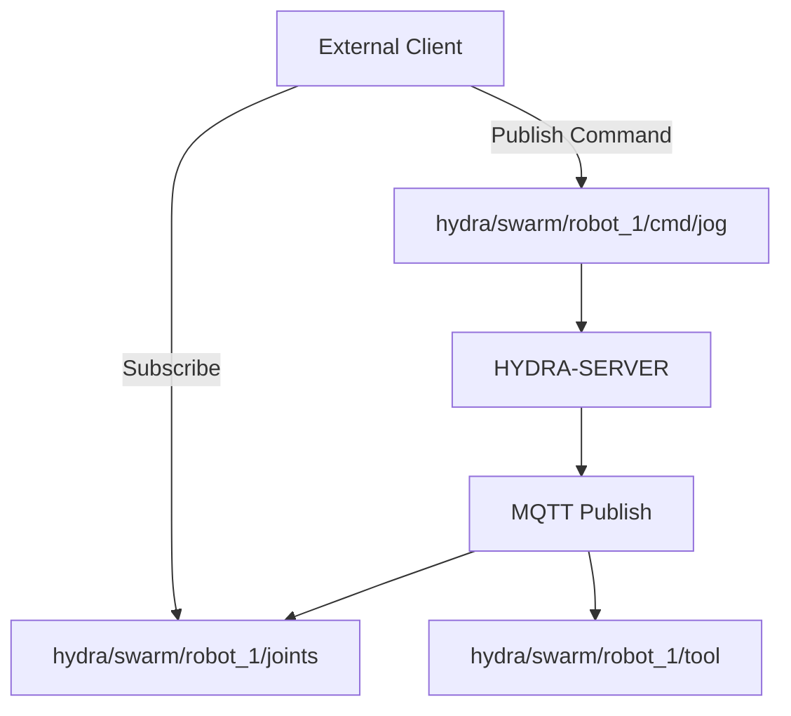

<p align="center">
  
</p>

# 📡 HYDRA-UMC-MQTT-BROKER

<p align="center"><a href="README.md">🇺🇸 English</a> | <a href="README_spa.md">🇪🇸 Español</a> | <a href="README_fra.md">🇫🇷 Français</a> | <a href="README_ita.md">🇮🇹 Italiano</a> | <a href="README_deu.md">🇩🇪 Deutsch</a> | 🇨🇳 <b>简体中文</b> | <a href="README_jpn.md">🇯🇵 日本語</a></p>

### 🚀 面向 IoT 和外部集成的轻量级遥测桥接

<p align="left">
  
  
  
</p>

---

## 1. 🛠️ 技术概述

**HYDRA-UMC-MQTT-BROKER** 为 HYDRA-UMC 生态系统提供了一个轻量级的异步
消息传递接口。它使外部 IoT 设备、仪表盘和家庭自动化系统（如 Home
Assistant）能够订阅机器人遥测数据并发布指令。

它实现了 MQTT v5 标准，以最小的开销提供高效的数据分发，非常适合移动
应用程序或低带宽的远程监控。

### 关键特性：
* 📡 **发布/订阅遥测：** 关节角度、工具状态和系统健康状况的亚毫秒级分发。
* 🛠️ **发现支持：** 集成的 mDNS 和 Home Assistant 自动发现，便于设置。
* 🔐 **主题安全：** 真实、可验证的按客户端 ID 前缀划分的 ACL，用于读写特定的机器人主题——带通配符的 SUBSCRIBE 永远无法获得比其规则更宽的访问权限。*(已实现)*
* 🪪 **客户端认证：** 可选的真实 MQTT CONNECT 用户名/密码认证（`MQTT_AUTH_JSON`）为 ACL 提供经过验证的会话身份。*(已实现；应与 ACL 配合使用)*
* 📏 **载荷大小限制：** 对 PUBLISH 载荷大小的真实、可选的上限，可通过 `MAX_PAYLOAD_BYTES` 配置。*(已实现)*
* ⚡ **WebSocket 支持：** 面向浏览器端客户端的集成 MQTT over WebSocket。

---

## 2. 🔄 MQTT 主题结构



---

## 3. 🧱 架构与设计决策

* **为何这是 HYDRA-UMC-GATEWAY-INDUSTRIAL 的兄弟项目，而非子模块。** 每个协议适配器都是可独立部署/重启的进程——一次 Broker 问题永远不会导致与其并行运行的 OPC-UA 或 MTConnect 适配器宕机。
* **为何是一个真实的 MQTT Broker，而非仅仅是向外部 Broker 发布消息的客户端。** 拥有该 Broker 意味着该单元自身的事件流（机器人状态变化、告警）可供工厂网络上的任何 MQTT 订阅者使用，而无需依赖某个独立的、外部管理的 Broker 是否可达。
* **为何入口点今天只打印身份/版本，在健康检查监听器启动后才退出。** 处于脚手架（scaffolding）阶段，与父项目自身 README 中的理由相同——一个真正的 Broker 本质上是长期运行的。
* **这如何融入生态系统的其余部分。** 作为 HYDRA-UMC-GATEWAY-INDUSTRIAL 下的同级服务——将 HYDRA-UMC-SERVER 自身的事件流桥接到真实的 MQTT 主题上。
* **在这里发现并修复了一个真实的 bug：broker 实际上从未真正接受过任何客户端。** Aedes 1.x 将持久化/mqemitter 的初始化移到了一个显式的异步步骤 `broker.listen()` 中（相对于 0.x 的工厂函数形式，这是一次真实的 API 变更）——如果没有这一步，一个真实的 `CONNECT` 会通过真实的 TCP 套接字到达 broker，但会静默挂起，直到客户端自身的 connack 超时触发为止——broker 看起来是“正常”的（端口能接受连接），但没有任何客户端能真正完成会话。这是通过一个真实的 `mqtt` 客户端在本项目自己的测试中超时而发现的，而非通过代码审查。`tests/server.test.ts` 现在使用真实的 MQTT 客户端库，通过真实的套接字连接真实的 broker——CONNECT、PUBLISH 投递、主题隔离、保留消息，全部都是真实测试。
* **为何主题 ACL 检查的是订阅的*范围*，而不仅仅是过滤器的重叠。** 客户端自身的 SUBSCRIBE 请求本身就是一个过滤器，可以携带 `+`/`#` 通配符——如果简单地检查“请求的过滤器是否与允许的过滤器重叠”，就会让客户端用比其规则实际授予的（例如 `hydra/robots/+/status`）更宽的通配符（例如 `hydra/robots/#`）进行订阅，从而在不知情的情况下看到从未被授权访问的主题。`src/acl.ts` 中的 `isSubscriptionWithinScope()` 函数改为执行真实的、逐段的检查——并通过真实测试得到验证，其中一个测试正是机器人自身尝试用通配符 SUBSCRIBE 扩大其访问范围，结果被拒绝。
* **为何被拒绝的 PUBLISH 会关闭整个连接，而不仅仅是对单条消息做 NACK。** 这是 Aedes 自身真实的行为（通过针对它运行真实客户端验证得出，而非从文档中假设的）——`authorizePublish` 返回错误会直接销毁该客户端的连接。这里的 ACL/载荷限制设计正是顺应这一行为而非绕开它：一个因违反其 ACL 而不断被断开连接的客户端，是一个清晰、响亮的信号，提示需要修正该设备的配置，而不是一条可能永远不会被注意到、被静默丢弃的消息。
* **为何 ACL/载荷限制的配置存放在环境变量（`MQTT_ACL_JSON`/`MAX_PAYLOAD_BYTES`）中，而非配置文件里。** 这与本项目现有的 `PORT` 约定保持一致（参见 `.env.example`），也符合其实际部署方式（systemd/Docker 环境，而非挂载文件）——`parseAclConfig()` 在遇到格式错误的 JSON 时会大声地使启动失败，而不是悄悄地在无保护状态下运行。

---

## 📂 目录结构

```text
HYDRA-UMC-MQTT-BROKER/
├── src/         # 源代码（Node/TypeScript —— Broker、桥接、安全）
├── docs/        # 文档与主题目录
├── build/       # 编译输出（npm run build）
├── images/      # 媒体与图表
├── scripts/     # 实用脚本（bump-version.mjs）
└── README.md
```

纯网络服务，没有自己专属的硬件——`hardware/`、`firmware/` 和 `os/`
已根据仓库结构策略从项目模板中省略。

---

## 🛠️ 开发环境

### 前提条件
- [Node.js](https://nodejs.org/)（建议 v18 或更高版本）
- npm

### 安装
```bash
npm install
```

### 开发模式
使用 `tsx` 直接运行 Broker（无需打包器）：
- **Windows：** 双击 `dev.bat` 或运行 `npm run dev`
- **Linux/Mac：** 运行 `./dev.sh` 或 `npm run dev`

### 生产构建
使用 esbuild 将 Broker 打包为单个可部署文件：
- **Windows：** 双击 `build.bat` 或运行 `npm run build`
- **Linux/Mac：** 运行 `./build.sh` 或 `npm run build`

然后启动它：
```bash
npm start
```

Broker 监听 `0.0.0.0:1883`（纯 MQTT/TCP，IANA 注册的默认端口）——将
任何 MQTT 客户端（`mosquitto_sub`、Home Assistant、MQTT Explorer……）
指向 `<host>:1883`。

### 版本管理
每次真实的 `npm run build` 都会自动递增 `package.json` 自身的
`version`（`scripts/bump-version.mjs`，作为 `build` 脚本的第一步接入）
——一种十进制"里程表"方案：每次构建 patch +1，超过 9 时进位到 minor
（minor 超过 9 时进位到 major），而不会到达两位数段（`0.0.9` ->
`0.1.0`，而非 `0.0.10`）。

---

## 🚀 路线图
* **第一阶段：** OPC-UA 发布/订阅实现，用于高速数据交换和传统协议桥接。
* **第二阶段：** 用于海量 IoT 设备管理和高并发的 MQTT Broker 集群。
* **第三阶段：** MTConnect 适配器支持，用于多厂商 CNC 和 PLC 机械集成。
* **第四阶段：** 支持 Sparkplug B 规范，以实现工业 IoT 对齐和统一遥测桥接。

---

## 🔗 相关项目

本项目是同一作者（JuanenRac / Electro Hobby 3D）打造的更大规模机器人生态
系统的一部分，涵盖固件、控制软件、AI 节点和车队工具。值得了解，因为某个
需求实际上可能是关于这些项目之一，而非本仓库。

### 项目族

**父项目：** **[HYDRA-UMC-GATEWAY-INDUSTRIAL](https://github.com/JuanenRac/HYDRA-UMC-GATEWAY-INDUSTRIAL)** —— 本 MQTT 适配器所接入的集成父项目。

**同族项目：**
- **[HYDRA-UMC-OPCUA-SERVER](https://github.com/JuanenRac/HYDRA-UMC-OPCUA-SERVER)** —— 同级协议适配器，同一父项目。
- **[HYDRA-UMC-MTCONNECT-ADAPTER](https://github.com/JuanenRac/HYDRA-UMC-MTCONNECT-ADAPTER)** —— 同级协议适配器，同一父项目。

### 直接相关（项目族之外）

- **[HYDRA-UMC-SERVER](https://github.com/JuanenRac/HYDRA-UMC-SERVER)** —— 本适配器所暴露状态的来源。

### 生态系统的其余部分

**HYDRA-UMC 平台** —— 多机器人微工厂单元
- **[HYDRA-UMC](https://github.com/JuanenRac/HYDRA-UMC)** —— 协调最多 8 条机械臂的 CM5 + STM32H745 主板。
- **[HYDRA-UMC-SERVER](https://github.com/JuanenRac/HYDRA-UMC-SERVER)** —— 每个控制客户端所对接的 Express/WebSocket 后端。
- **[HYDRA-UMC-STUDIO](https://github.com/JuanenRac/HYDRA-UMC-STUDIO)** —— 基于 Web 的控制仪表盘，多机器人 3D 可视化。
- **[HYDRA-UMC-ANDROID-CONTROL](https://github.com/JuanenRac/HYDRA-UMC-ANDROID-CONTROL)** —— 通过 Wi-Fi/蓝牙的 Android 控制应用。
- **[HYDRA-UMC-IOS-CONTROL](https://github.com/JuanenRac/HYDRA-UMC-IOS-CONTROL)** —— 基于 Flutter 构建的 iOS/iPadOS 控制应用。
- **[HYDRA-UMC-SUITE](https://github.com/JuanenRac/HYDRA-UMC-SUITE)** —— 桌面端集群指挥中心（Python/PySide6）。
- **[HYDRA-UMC-EDITOR-URDF](https://github.com/JuanenRac/HYDRA-UMC-EDITOR-URDF)** —— 用于机器人目录的桌面端 URDF 模型编辑器。
- **[HYDRA-UMC-DSI](https://github.com/JuanenRac/HYDRA-UMC-DSI)** —— 机载 DSI 触摸屏的原生触控 UI。

**URTC 平台** —— 每台 HYDRA-UMC 机械臂搭载的工具头控制器
- **[URTC](https://github.com/JuanenRac/URTC)** —— CAN 总线工具头控制器，25 种工具配置。
- **[URTC-FLASHER](https://github.com/JuanenRac/URTC-FLASHER)** —— 桌面端 CAN-OTA + SWD/JTAG 刷写工具。
- **[URTC-TESTER](https://github.com/JuanenRac/URTC-TESTER)** —— 桌面端实时 CAN 总线诊断工具。
- **[URTC-WEB-STUDIO](https://github.com/JuanenRac/URTC-WEB-STUDIO)** —— 通过 Web Serial API 的浏览器端替代方案。

**🎥 视觉 AI 节点（Hailo-8）**
- [HYDRA-UMC-VISION-NODE](https://github.com/JuanenRac/HYDRA-UMC-VISION-NODE)
- [HYDRA-UMC-VISION-STREAMER](https://github.com/JuanenRac/HYDRA-UMC-VISION-STREAMER)
- [HYDRA-UMC-DETECTION-HEF](https://github.com/JuanenRac/HYDRA-UMC-DETECTION-HEF)
- [HYDRA-UMC-SAFETY-ZONES](https://github.com/JuanenRac/HYDRA-UMC-SAFETY-ZONES)
- [HYDRA-UMC-VISUAL-SERVOING-API](https://github.com/JuanenRac/HYDRA-UMC-VISUAL-SERVOING-API)

**🧠 认知 AI 节点（Hailo-10）**
- [HYDRA-UMC-COGNITIVE-NODE](https://github.com/JuanenRac/HYDRA-UMC-COGNITIVE-NODE)
- [HYDRA-UMC-VLA-ENGINE](https://github.com/JuanenRac/HYDRA-UMC-VLA-ENGINE)
- [HYDRA-UMC-VOICE-UI](https://github.com/JuanenRac/HYDRA-UMC-VOICE-UI)
- [HYDRA-UMC-SEMANTIC-PLANNER](https://github.com/JuanenRac/HYDRA-UMC-SEMANTIC-PLANNER)
- [HYDRA-UMC-DOCS-QA](https://github.com/JuanenRac/HYDRA-UMC-DOCS-QA)

**🐝 编排与集群**
- [HYDRA-UMC-ORCHESTRATOR](https://github.com/JuanenRac/HYDRA-UMC-ORCHESTRATOR)
- [HYDRA-UMC-SWARM-SYNC](https://github.com/JuanenRac/HYDRA-UMC-SWARM-SYNC)
- [HYDRA-UMC-PATH-PLANNER-3D](https://github.com/JuanenRac/HYDRA-UMC-PATH-PLANNER-3D)
- [HYDRA-UMC-JOB-DISPATCHER](https://github.com/JuanenRac/HYDRA-UMC-JOB-DISPATCHER)
- [HYDRA-UMC-NODE-HEALING](https://github.com/JuanenRac/HYDRA-UMC-NODE-HEALING)

**🎮 数字孪生与仿真**
- [HYDRA-UMC-TWIN](https://github.com/JuanenRac/HYDRA-UMC-TWIN)
- [HYDRA-UMC-PHYSICS-REPLICA](https://github.com/JuanenRac/HYDRA-UMC-PHYSICS-REPLICA)
- [HYDRA-UMC-HIL-BRIDGE](https://github.com/JuanenRac/HYDRA-UMC-HIL-BRIDGE)
- [HYDRA-UMC-SYNTHETIC-DATA-GEN](https://github.com/JuanenRac/HYDRA-UMC-SYNTHETIC-DATA-GEN)

**📊 数据与分析**
- [HYDRA-UMC-DATALAKE](https://github.com/JuanenRac/HYDRA-UMC-DATALAKE)
- [HYDRA-UMC-TELEMETRY-COLLECTOR](https://github.com/JuanenRac/HYDRA-UMC-TELEMETRY-COLLECTOR)
- [HYDRA-UMC-ANOMALY-DETECTOR](https://github.com/JuanenRac/HYDRA-UMC-ANOMALY-DETECTOR)
- [HYDRA-UMC-PRODUCTION-REPORTS](https://github.com/JuanenRac/HYDRA-UMC-PRODUCTION-REPORTS)

**🛠️ 配套工具**
- [URTC-SMART-RACK](https://github.com/JuanenRac/URTC-SMART-RACK)
- [URTC-VISION-TOOL](https://github.com/JuanenRac/URTC-VISION-TOOL)
- [HYDRA-UMC-WATCH](https://github.com/JuanenRac/HYDRA-UMC-WATCH)
- [HYDRA-UMC-TOOL-CLI](https://github.com/JuanenRac/HYDRA-UMC-TOOL-CLI)
- [HYDRA-UMC-DASHBOARD-AI](https://github.com/JuanenRac/HYDRA-UMC-DASHBOARD-AI)


## 👤 作者
**JuanenRac**（Electro Hobby 3D）
📧 electrohobby3d@gmail.com

## 📜 许可证
GPL-3.0 —— 详见 LICENSE。
