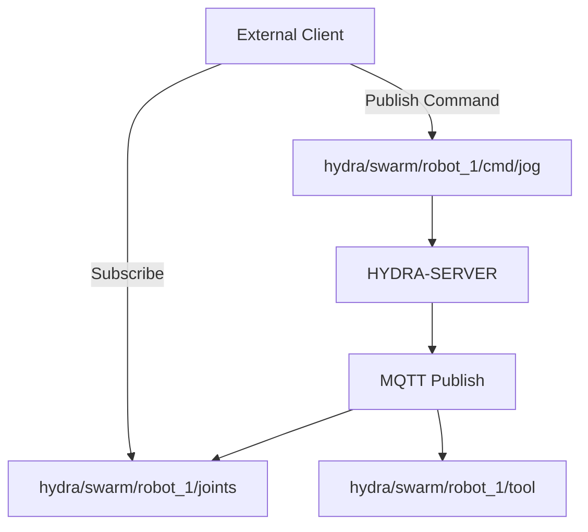

<p align="center">
  
</p>

# 📡 HYDRA-UMC-MQTT-BROKER

<p align="center"><a href="README.md">🇺🇸 English</a> | <a href="README_spa.md">🇪🇸 Español</a> | <a href="README_fra.md">🇫🇷 Français</a> | <a href="README_ita.md">🇮🇹 Italiano</a> | <a href="README_deu.md">🇩🇪 Deutsch</a> | 🇨🇳 <b>简体中文</b> | <a href="README_jpn.md">🇯🇵 日本語</a></p>

### 🚀 面向 IoT 和外部集成的轻量级遥测桥接

<p align="left">
  
  
  
</p>

---

## 1. 🛠️ 技术概述

**HYDRA-UMC-MQTT-BROKER** 为 HYDRA-UMC 生态系统提供了一个轻量级的异步
消息传递接口。它使外部 IoT 设备、仪表盘和家庭自动化系统（如 Home
Assistant）能够订阅机器人遥测数据并发布指令。

它实现了 MQTT 3.1.1 标准（通过 Aedes，已实测验证——见下方"架构"部分），以最小的开销提供高效的数据分发，非常适合移动
应用程序或低带宽的远程监控。

### 关键特性：
* 🔌 **外部机器桥接:** `HYDRA-UMC-BRIDGE-CNC`/`-LASER`/`-OPENPNP`/`-PRINTER3D`/`-ROS2` 各自通过自己的 `hydra/bridges/<name>/...` 主题连接到本代理——参见 `docs/BRIDGE_TOPICS.md`。*(已实现)*
* 📡 **发布/订阅遥测：** 关节角度、工具状态和系统健康状况的亚毫秒级分发。
* 🛠️ **发现支持：** mDNS 和 Home Assistant 自动发现，便于设置。*（计划中——尚未实现；`src/server.ts` 目前只是一个纯 TCP 监听器，没有任何发现服务）*
* 🔐 **主题安全：** 真实、可验证的按客户端 ID 前缀划分的 ACL，用于读写特定的机器人主题——带通配符的 SUBSCRIBE 永远无法获得比其规则更宽的访问权限。*(已实现)*
* 🪪 **客户端认证：** 可选的真实 MQTT CONNECT 用户名/密码认证（`MQTT_AUTH_JSON`）为 ACL 提供经过验证的会话身份。*(已实现；应与 ACL 配合使用)*
* 📏 **载荷大小限制：** 对 PUBLISH 载荷大小的真实、可选的上限，可通过 `MAX_PAYLOAD_BYTES` 配置。*(已实现)*
* ⚡ **WebSocket 支持：** 面向浏览器端客户端的 MQTT over WebSocket。*（计划中——尚未实现；目前只接通了 1883 端口的纯 TCP，见 `package.json`——尚无 `ws`/websocket 依赖）*

---

## 2. 🔄 MQTT 主题结构



**诚实说明：** 上面的 `hydra/swarm/...` 主题结构展示的是一旦
HYDRA-UMC-SERVER 自身状态被接入 MQTT 之后*预期*的形态——这个接入目前
还没有接通（`src/server.ts` 自己的头部注释写明："lands once that
wiring is defined"），所以今天没有任何东西发布到 `hydra/swarm/...`。
今天真正接通、真实存在的主题是 5 个外部机器桥接自己的
`hydra/bridges/<name>/...` 命名空间（见 `docs/BRIDGE_TOPICS.md`），
以及 HYDRA-UMC-BRIDGE-AMR 自己的 VDA 5050 主题结构。

---

## 3. 🧱 架构与设计决策

* **为何这是 HYDRA-UMC-GATEWAY-INDUSTRIAL 的兄弟项目，而非子模块。** 每个协议适配器都是可独立部署/重启的进程——一次 Broker 问题永远不会导致与其并行运行的 OPC-UA 或 MTConnect 适配器宕机。
* **为何是一个真实的 MQTT Broker，而非仅仅是向外部 Broker 发布消息的客户端。** 拥有该 Broker 意味着该单元自身的事件流（机器人状态变化、告警）可供工厂网络上的任何 MQTT 订阅者使用，而无需依赖某个独立的、外部管理的 Broker 是否可达。
* **为何入口点今天只打印身份/版本，在健康检查监听器启动后才退出。** 处于脚手架（scaffolding）阶段，与父项目自身 README 中的理由相同——一个真正的 Broker 本质上是长期运行的。
* **这如何融入生态系统的其余部分。** 作为 HYDRA-UMC-GATEWAY-INDUSTRIAL 下的同级服务——将 HYDRA-UMC-SERVER 自身的事件流桥接到真实的 MQTT 主题上。
* **在这里发现并修复了一个真实的 bug：broker 实际上从未真正接受过任何客户端。** Aedes 1.x 将持久化/mqemitter 的初始化移到了一个显式的异步步骤 `broker.listen()` 中（相对于 0.x 的工厂函数形式，这是一次真实的 API 变更）——如果没有这一步，一个真实的 `CONNECT` 会通过真实的 TCP 套接字到达 broker，但会静默挂起，直到客户端自身的 connack 超时触发为止——broker 看起来是“正常”的（端口能接受连接），但没有任何客户端能真正完成会话。这是通过一个真实的 `mqtt` 客户端在本项目自己的测试中超时而发现的，而非通过代码审查。`tests/server.test.ts` 现在使用真实的 MQTT 客户端库，通过真实的套接字连接真实的 broker——CONNECT、PUBLISH 投递、主题隔离、保留消息，全部都是真实测试。
* **为何主题 ACL 检查的是订阅的*范围*，而不仅仅是过滤器的重叠。** 客户端自身的 SUBSCRIBE 请求本身就是一个过滤器，可以携带 `+`/`#` 通配符——如果简单地检查“请求的过滤器是否与允许的过滤器重叠”，就会让客户端用比其规则实际授予的（例如 `hydra/robots/+/status`）更宽的通配符（例如 `hydra/robots/#`）进行订阅，从而在不知情的情况下看到从未被授权访问的主题。`src/acl.ts` 中的 `isSubscriptionWithinScope()` 函数改为执行真实的、逐段的检查——并通过真实测试得到验证，其中一个测试正是机器人自身尝试用通配符 SUBSCRIBE 扩大其访问范围，结果被拒绝。
* **为何被拒绝的 PUBLISH 会关闭整个连接，而不仅仅是对单条消息做 NACK。** 这是 Aedes 自身真实的行为（通过针对它运行真实客户端验证得出，而非从文档中假设的）——`authorizePublish` 返回错误会直接销毁该客户端的连接。这里的 ACL/载荷限制设计正是顺应这一行为而非绕开它：一个因违反其 ACL 而不断被断开连接的客户端，是一个清晰、响亮的信号，提示需要修正该设备的配置，而不是一条可能永远不会被注意到、被静默丢弃的消息。
* **为何 ACL/载荷限制的配置存放在环境变量（`MQTT_ACL_JSON`/`MAX_PAYLOAD_BYTES`）中，而非配置文件里。** 这与本项目现有的 `PORT` 约定保持一致（参见 `.env.example`），也符合其实际部署方式（systemd/Docker 环境，而非挂载文件）——`parseAclConfig()` 在遇到格式错误的 JSON 时会大声地使启动失败，而不是悄悄地在无保护状态下运行。
* **为何这个 broker 说的是 MQTT 3.1.1，而不是 MQTT v5。** `aedes@1.1.1`（锁定的依赖版本）只实现了 MQTT 3.1/3.1.1——通过实测验证：用真实的 `mqtt` 客户端以 `protocolVersion: 5` 连接时，broker 会主动拒绝（`Connection refused: Unacceptable protocol version`），这也与 Aedes 自身的上游文档一致（MQTT 5.0 支持存在于一个尚未发布的独立分支上）。本生态系统中的每一个客户端（`mqtt_transport.py` 系列桥接、`Vda5050Publisher`、本仓库自己的测试）本来就只协商 3.1.1，因此这只是一次文档修正，而非行为变更。

---

## 📂 目录结构

```text
HYDRA-UMC-MQTT-BROKER/
├── src/         # 源代码（Node/TypeScript —— Broker、桥接、安全）
├── tests/       # Vitest 测试套件——ACL、认证与 broker/桥接行为
├── docs/        # 文档与主题目录
├── build/       # 编译输出（npm run build）
├── images/      # 媒体与图表
├── scripts/     # 实用脚本（bump-version.mjs）
├── tools/       # ci_validate.py——CI 使用的 manifest/CHANGELOG/docs 校验
└── README.md
```

纯网络服务，没有自己专属的硬件——`hardware/`、`firmware/` 和 `os/`
已根据仓库结构策略从项目模板中省略。

---

## 🛠️ 开发环境

### 前提条件
- [Node.js](https://nodejs.org/)（建议 v18 或更高版本）
- npm

### 安装
```bash
npm install
```

### 开发模式
使用 `tsx` 直接运行 Broker（无需打包器）：
- **Windows：** 双击 `dev.bat` 或运行 `npm run dev`
- **Linux/Mac：** 运行 `./dev.sh` 或 `npm run dev`

### 生产构建
使用 esbuild 将 Broker 打包为单个可部署文件：
- **Windows：** 双击 `build.bat` 或运行 `npm run build`
- **Linux/Mac：** 运行 `./build.sh` 或 `npm run build`

然后启动它：
```bash
npm start
```

Broker 监听 `0.0.0.0:1883`（纯 MQTT/TCP，IANA 注册的默认端口）——将
任何 MQTT 客户端（`mosquitto_sub`、Home Assistant、MQTT Explorer……）
指向 `<host>:1883`。

### 版本管理
每次真实的 `npm run build` 都会自动递增 `package.json` 自身的
`version`（`scripts/bump-version.mjs`，作为 `build` 脚本的第一步接入）
——一种十进制"里程表"方案：每次构建 patch +1，超过 9 时进位到 minor
（minor 超过 9 时进位到 major），而不会到达两位数段（`0.0.9` ->
`0.1.0`，而非 `0.0.10`）。

---

## 🚀 路线图
* **第一阶段：** OPC-UA 发布/订阅实现，用于高速数据交换和传统协议桥接。
* **第二阶段：** 用于海量 IoT 设备管理和高并发的 MQTT Broker 集群。
* **第三阶段：** MTConnect 适配器支持，用于多厂商 CNC 和 PLC 机械集成。
* **第四阶段：** 支持 Sparkplug B 规范，以实现工业 IoT 对齐和统一遥测桥接。

---

## 🔗 相关项目

本项目是同一作者(JuanenRac / Electro Hobby 3D)打造的 HYDRA-UMC 机器人生态系统的一部分。值得了解,因为某个请求实际上可能是关于这些项目之一,而非本仓库本身。

**父项目**
- **[HYDRA-UMC-GATEWAY-INDUSTRIAL](https://github.com/JuanenRac/HYDRA-UMC-GATEWAY-INDUSTRIAL)** — 具备真实指令白名单/背压控制层的、中继至工业协议的集成中枢;本仓库是其自身工业网关中一个具体协议适配器所属的父项目。

**兄弟项目** —— HYDRA-UMC-GATEWAY-INDUSTRIAL 自身工业网关中的其他协议适配器
- **[HYDRA-UMC-OPCUA-SERVER](https://github.com/JuanenRac/HYDRA-UMC-OPCUA-SERVER)** — 经真实二进制协议客户端会话验证的真实 OPC-UA 地址空间。
- **[HYDRA-UMC-MTCONNECT-ADAPTER](https://github.com/JuanenRac/HYDRA-UMC-MTCONNECT-ADAPTER)** — 具备降级模式输出的真实 MTConnect `/probe` 与 `/current` XML 端点。

**直接相关**
- **[HYDRA-UMC-SERVER](https://github.com/JuanenRac/HYDRA-UMC-SERVER)** — 每个控制客户端真正通信的真实无头后端(REST/WebSocket) —— 本适配器所暴露状态的来源。
- **[HYDRA-UMC-BRIDGE-CNC](https://github.com/JuanenRac/HYDRA-UMC-BRIDGE-CNC)** — 具备真实 GRBL 状态/控制字节访问能力的高层 CNC 单元协调器 —— 各自搭载自己的 `mqtt_transport.py`,通过各自的 `hydra/bridges/<name>/...` 主题接入本代理;真实的共享主题目录详见本仓库自身的 `docs/BRIDGE_TOPICS.md`。
- **[HYDRA-UMC-BRIDGE-LASER](https://github.com/JuanenRac/HYDRA-UMC-BRIDGE-LASER)** — 读取 3 项真实钥匙/外壳/联锁 GPIO 安全信号的激光单元安全协调器 —— 各自搭载自己的 `mqtt_transport.py`,通过各自的 `hydra/bridges/<name>/...` 主题接入本代理;真实的共享主题目录详见本仓库自身的 `docs/BRIDGE_TOPICS.md`。
- **[HYDRA-UMC-BRIDGE-OPENPNP](https://github.com/JuanenRac/HYDRA-UMC-BRIDGE-OPENPNP)** — 面向 OpenPnP 贴片机板级流程的安全高层协调器 —— 各自搭载自己的 `mqtt_transport.py`,通过各自的 `hydra/bridges/<name>/...` 主题接入本代理;真实的共享主题目录详见本仓库自身的 `docs/BRIDGE_TOPICS.md`。
- **[HYDRA-UMC-BRIDGE-PRINTER3D](https://github.com/JuanenRac/HYDRA-UMC-BRIDGE-PRINTER3D)** — 面向 Moonraker/Klipper 3D 打印机的安全协调边界，具备真实的受控作业指令 —— 各自搭载自己的 `mqtt_transport.py`,通过各自的 `hydra/bridges/<name>/...` 主题接入本代理;真实的共享主题目录详见本仓库自身的 `docs/BRIDGE_TOPICS.md`。
- **[HYDRA-UMC-BRIDGE-ROS2](https://github.com/JuanenRac/HYDRA-UMC-BRIDGE-ROS2)** — 具备真实的惰性导入 rclpy ROS 2 传输层的安全协调器 —— 各自搭载自己的 `mqtt_transport.py`,通过各自的 `hydra/bridges/<name>/...` 主题接入本代理;真实的共享主题目录详见本仓库自身的 `docs/BRIDGE_TOPICS.md`。
- **[HYDRA-UMC-BRIDGE-AMR](https://github.com/JuanenRac/HYDRA-UMC-BRIDGE-AMR)** — 通过真实的 VDA 5050 MQTT 发布者为 AGV/AMR 车队提供的协调边界 —— 同一代理的另一个真实客户端:`Vda5050Publisher` 以 VDA 5050 自身的主题格式(而非其他桥接使用的 `hydra/bridges/...` 方案)发送已通过门限的调度,作为真实的 VDA 5050 `order`/`instantActions` 消息。

**生态系统中的其他项目**

*核心硬件与平台*
- **[HYDRA-UMC](https://github.com/JuanenRac/HYDRA-UMC)** — 机器人手臂的真实主板——CM5 主机 + 双核 STM32H745，通过 CAN-OTA/SPI-OTA 协调最多 8 条工具臂。
- **[HYDRA-UMC-OS](https://github.com/JuanenRac/HYDRA-UMC-OS)** — 面向 CM5 的可复现 Raspberry Pi OS 产品层——只读代理、经过验证的配置/配置文件、WiFi 首次配网。
- **[HYDRA-UMC-SDK](https://github.com/JuanenRac/HYDRA-UMC-SDK)** — 每个桥接都据此校验自身指令的共享 JSON-Schema 契约与安全门限边界。

*核心后端与客户端*
- **[HYDRA-UMC-STUDIO](https://github.com/JuanenRac/HYDRA-UMC-STUDIO)** — 具有实时多机器人 3D 可视化的网页控制面板。
- **[HYDRA-UMC-SUITE](https://github.com/JuanenRac/HYDRA-UMC-SUITE)** — 面向多台服务器的桌面(PySide6)集群指挥中心，打包为独立可执行文件。
- **[HYDRA-UMC-ANDROID-CONTROL](https://github.com/JuanenRac/HYDRA-UMC-ANDROID-CONTROL)** — 具有生物识别登录和配对 Wear OS 伴侣应用的原生 Android 控制应用。
- **[HYDRA-UMC-IOS-CONTROL](https://github.com/JuanenRac/HYDRA-UMC-IOS-CONTROL)** — 具有实时 WebSocket 同步的 iOS/iPadOS 控制应用(Flutter)。
- **[HYDRA-UMC-DSI](https://github.com/JuanenRac/HYDRA-UMC-DSI)** — 面向机载 7 英寸 DSI 触摸屏的原生触控界面，直接嵌入 CM5 本体。
- **[HYDRA-UMC-EDITOR-URDF](https://github.com/JuanenRac/HYDRA-UMC-EDITOR-URDF)** — 将完成的模型推送到 STUDIO 自身目录的桌面版图形化 URDF 创建/编辑工具。
- **[HYDRA-UMC-BRIDGE-DROIDS](https://github.com/JuanenRac/HYDRA-UMC-BRIDGE-DROIDS)** — 面向足式/人形机器人的协调边界，具备真实的 Boston Dynamics Spot 指令发送器。
- **[HYDRA-UMC-BRIDGE-UAV](https://github.com/JuanenRac/HYDRA-UMC-BRIDGE-UAV)** — 面向搭载摄像头的无人机的协调边界，具备真实的 MAVLink 指令发送器。

*URTC 工具平台*
- **[URTC](https://github.com/JuanenRac/URTC)** — 面向实体 Universal Robot Tool Controller 板卡的固件，通过 CAN 总线支持 25 种以上工具配置。
- **[URTC-FLASHER](https://github.com/JuanenRac/URTC-FLASHER)** — 面向 URTC 板卡的桌面图形烧录工具，支持 CAN-OTA 以及全芯片 SWD/JTAG。
- **[URTC-TESTER](https://github.com/JuanenRac/URTC-TESTER)** — 面向 URTC 板卡的桌面实时 CAN 总线诊断工具，每种工具配置对应一个面板。
- **[URTC-WEB-STUDIO](https://github.com/JuanenRac/URTC-WEB-STUDIO)** — 通过 Web Serial API 实现的浏览器版 URTC-TESTER 替代方案，无需本地安装。

*视觉 AI 节点(Hailo-8)*
- **[HYDRA-UMC-VISION-NODE](https://github.com/JuanenRac/HYDRA-UMC-VISION-NODE)** — 面向 Hailo-8 视觉流水线的集成中枢，具备逐阶段的真实硬件就绪检测。
- **[HYDRA-UMC-DETECTION-HEF](https://github.com/JuanenRac/HYDRA-UMC-DETECTION-HEF)** — 具备 Hailo 架构/校验和安全加载验证的真实编译模型注册表。
- **[HYDRA-UMC-VISION-STREAMER](https://github.com/JuanenRac/HYDRA-UMC-VISION-STREAMER)** — 具备真实 HailoRT 集成边界的真实 GStreamer 流水线 + MediaMTX 配置生成器。
- **[HYDRA-UMC-VISUAL-SERVOING-API](https://github.com/JuanenRac/HYDRA-UMC-VISUAL-SERVOING-API)** — 具备真实 Position-Based Visual Servoing 修正律，并依据上游区域状态进行安全门控。
- **[HYDRA-UMC-SAFETY-ZONES](https://github.com/JuanenRac/HYDRA-UMC-SAFETY-ZONES)** — 具备校准新鲜度强制检查的真实区域入侵检测与 E-STOP 请求。

*认知 AI 节点(Hailo-10)*
- **[HYDRA-UMC-COGNITIVE-NODE](https://github.com/JuanenRac/HYDRA-UMC-COGNITIVE-NODE)** — 面向 Hailo-10 认知流水线(LLM/VLA/语音编排)的集成中枢。
- **[HYDRA-UMC-VLA-ENGINE](https://github.com/JuanenRac/HYDRA-UMC-VLA-ENGINE)** — 面向 Vision-Language-Action 模型的真实动作 token 编解码与轨迹生成。
- **[HYDRA-UMC-VOICE-UI](https://github.com/JuanenRac/HYDRA-UMC-VOICE-UI)** — 具备受限、需确认的 Watch 中继的真实语音前端(VAD + 意图解析)。
- **[HYDRA-UMC-SEMANTIC-PLANNER](https://github.com/JuanenRac/HYDRA-UMC-SEMANTIC-PLANNER)** — 基于真实规则的任务分解，以及针对 MCU 错误码的语义化错误恢复。
- **[HYDRA-UMC-DOCS-QA](https://github.com/JuanenRac/HYDRA-UMC-DOCS-QA)** — 面向本生态系统自身 Markdown 文档的真实纯标准库 TF-IDF 文档检索。

*编排与集群*
- **[HYDRA-UMC-ORCHESTRATOR](https://github.com/JuanenRac/HYDRA-UMC-ORCHESTRATOR)** — 具备真实 gRPC/Protobuf 健康报告契约与任务状态机的集成中枢。
- **[HYDRA-UMC-JOB-DISPATCHER](https://github.com/JuanenRac/HYDRA-UMC-JOB-DISPATCHER)** — 基于真实 HTTP API 的真实优先级任务队列，支持去重。
- **[HYDRA-UMC-NODE-HEALING](https://github.com/JuanenRac/HYDRA-UMC-NODE-HEALING)** — 具备重试/退避与身份不匹配检测的真实基于 gRPC 的车队健康看门狗。
- **[HYDRA-UMC-PATH-PLANNER-3D](https://github.com/JuanenRac/HYDRA-UMC-PATH-PLANNER-3D)** — 具备真实障碍物/工作空间碰撞校验的真实基于 RRT 的三维路径规划器。
- **[HYDRA-UMC-SWARM-SYNC](https://github.com/JuanenRac/HYDRA-UMC-SWARM-SYNC)** — 经过多单元收敛属性测试的真实 CRDT LWW-Element-Map 状态同步。

*数字孪生与仿真*
- **[HYDRA-UMC-TWIN](https://github.com/JuanenRac/HYDRA-UMC-TWIN)** — 面向数字孪生引擎的集成中枢，具备真实的版本兼容性同步契约。
- **[HYDRA-UMC-HIL-BRIDGE](https://github.com/JuanenRac/HYDRA-UMC-HIL-BRIDGE)** — 在仿真与真实硬件之间路由指令的真实硬件在环安全联锁。
- **[HYDRA-UMC-PHYSICS-REPLICA](https://github.com/JuanenRac/HYDRA-UMC-PHYSICS-REPLICA)** — 面向真实 URDF 子集的真实正向运动学与关节限位校验。
- **[HYDRA-UMC-SYNTHETIC-DATA-GEN](https://github.com/JuanenRac/HYDRA-UMC-SYNTHETIC-DATA-GEN)** — 具备 YOLO/COCO 标注导出功能的真实程序化 2D 场景生成器。

*数据与分析*
- **[HYDRA-UMC-DATALAKE](https://github.com/JuanenRac/HYDRA-UMC-DATALAKE)** — 具备真实数据摄入/查询 HTTP API 的真实 sqlite3 时序数据存储。
- **[HYDRA-UMC-ANOMALY-DETECTOR](https://github.com/JuanenRac/HYDRA-UMC-ANOMALY-DETECTOR)** — 具备漂移监测能力的真实 FFT + 统计基线异常检测器。
- **[HYDRA-UMC-PRODUCTION-REPORTS](https://github.com/JuanenRac/HYDRA-UMC-PRODUCTION-REPORTS)** — 基于 DATALAKE 历史数据的真实 OEE/可用率计算，支持可复现的 CSV 导出。
- **[HYDRA-UMC-TELEMETRY-COLLECTOR](https://github.com/JuanenRac/HYDRA-UMC-TELEMETRY-COLLECTOR)** — 面向 DATALAKE 的真实 CAN/WebSocket 数据摄入管道，支持序列去重。

*辅助工具与生态系统运维*
- **[HYDRA-UMC-DASHBOARD-AI](https://github.com/JuanenRac/HYDRA-UMC-DASHBOARD-AI)** — 基于 DATALAKE/ANOMALY-DETECTOR 的智能摘要与异常高亮面板，具备诚实的统计回退机制。
- **[HYDRA-UMC-TOOL-CLI](https://github.com/JuanenRac/HYDRA-UMC-TOOL-CLI)** — 具备真实、稳定退出码契约的车队 CLI，是 HYDRA-UMC-SERVER 自身 API 的真实在线客户端。
- **[HYDRA-UMC-WATCH](https://github.com/JuanenRac/HYDRA-UMC-WATCH)** — 具备真实触觉提醒与配对手机语音中继功能的 WearOS 伴侣应用。
- **[URTC-SMART-RACK](https://github.com/JuanenRac/URTC-SMART-RACK)** — 面向板卡安装机架的固件，具备真实的工具 ID 解码与 Smart Idle 预热逻辑。
- **[URTC-VISION-TOOL](https://github.com/JuanenRac/URTC-VISION-TOOL)** — 面向热成像/RGB 检测工具头的固件及真实 Python 视觉伴侣程序。
- **[HYDRA-UMC-UPDATER](https://github.com/JuanenRac/HYDRA-UMC-UPDATER)** — 发现、克隆并更新本生态系统中每个仓库的管理类桌面工具。


---

## 📚 文档与社区

- **[docs/BRIDGE_TOPICS.md](docs/BRIDGE_TOPICS.md)** —— 每个外部机器桥接（CNC/Laser/OpenPnP/Printer3D/ROS2）针对本 broker 实际使用的、真实共享的 `hydra/bridges/<name>/...` 主题目录。
- **[CONTRIBUTING.md](CONTRIBUTING.md)** —— 提交 Pull Request 所需的技术栈和编码规范。
- **[CODE_OF_CONDUCT.md](CODE_OF_CONDUCT.md)** —— 本社区所期望的行为准则。
- **[SECURITY.md](SECURITY.md)** —— 如何报告漏洞，以及本项目真实的安全关注重点。
- **[SUPPORT.md](SUPPORT.md)** —— 在哪里提问和报告缺陷。
- **[LICENSE.md](LICENSE.md)** —— 本项目自身的许可证。

## 👤 作者
**JuanenRac** (Electro Hobby 3D)
📧 electrohobby3d@gmail.com
📺 [youtube.com/@electrohobby3d](https://youtube.com/@electrohobby3d)

## 📜 许可证
GPL-3.0 —— 详见 LICENSE。
